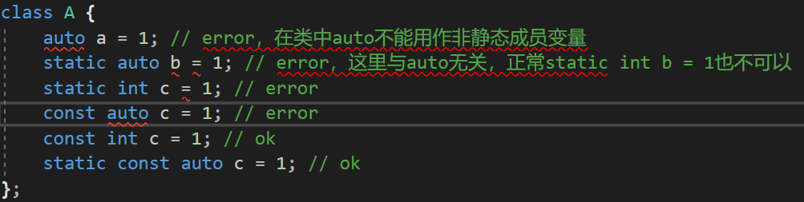
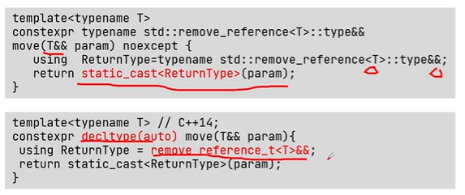
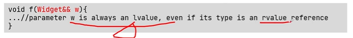
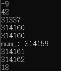

# using namespace std  

## 命名空间

​       在编程语言中，命名空间是一种特殊的作用域，它包含了处于该作用域中的所有标示符，而且其本身也是由标示符表示的。命名空间的使用目的是为了将逻辑相关的标示符限定在一起，组成相应的命名空间，可使整个系统更加模块化，最重要的是它可以防止命名冲突。就好比在两个函数或类中定义相同名字的对象一样，利用作用域标示符限定该对象是哪个类里定义的。

**std命名空间是C++中标准库类型对象的命名空间**。

在标准C++以前，都是用#include<iostream.h>这样的写法的，因为要包含进来的头文件名就是iostream.h。标准C++引入了名字空间的概念，并把iostream等标准库中的东东封装到了std名字空间中，同时为了不与原来的头文件混淆，规定标准C++使用一套新的头文件，这套头文件的文件名后不加.h扩展名，如iostream、string等等，并且把原来C标准库的头文件也重新命名，如原来的string.h 就改成cstring(就是把.h去掉，前面加上字母c)，所以头文件包含的写法也就变成了**#include <iostream>**。

并不是写了#include<iostream>就必须用using namespace std;我们通常这样的写的原因是为了一下子把std名字空间的东东全部暴露到全局域中（就像是直接包含了iostream.h这种没有名字空间的头文件一样），使标准C++库用起来与传统的iostream.h一样方便，但并不建议这样做，因为使用using namespace std;的话就没有起到命名空间的作用。再次回到了如同没有涉及命名空间时，所有标示符都定义在全局作用于中的混乱情况，不利于程序员创建新对象。

**如果不用using namespace std;使用标准库时就得时时带上名字空间的全名，如std::cout << "hello" << std::endl;**


当使用<iostream.h>时，相当于在c中调用库函数，使用的是**全局命名空间**，也就是早期的c++实现；

当使用<iostream>的时候，该头文件没有定义全局命名空间，必须使用namespace std；这样才能正确使用cout。


## 命名空间实质上是一个作用域

例如：

在x.h中的内容为

```cpp
// x.h 
namespace MyNamespace1 
{ 
    class MyClass 
    { 
    public: 
        void f(); 
    private: 
        int m; 
    } 
};
```

在y.h中的内容为

```cpp
// y.h 
namespace MyNamespace2 
{ 
    class MyClass 
    { 
    public: 
        void f(); 
    private: 
        int m; 
    }
};
```

然后在z.cpp中引入x.h和y.h

```cpp
// z.cpp 
#include "x.h" 
#include "y.h"

void z::f() 
{ 
    //声明一个文件x.h中类MyClass的实例x 
    MyNamespace1::MyClass x; 
    //声明一个文件x.h中类MyClass的实例x 
    MyNamespace2::MyClass y;

    //调用文件x.h中的函数f 
    x.f(); 
    //调用文件y.h中的函数f 
    y.f(); 
}
```


# C++11 新特性

[c++11新特性，所有知识点都在这了！ - 知乎 (zhihu.com)](https://zhuanlan.zhihu.com/p/139515439)


## 1)auto & decltype

关于C++11新特性，最先提到的肯定是类型推导，C++11引入了auto和decltype关键字，使用他们可以在编译期就推导出变量或者表达式的类型，方便开发者编码也简化了代码。

- auto：让编译器在编译器就推导出变量的类型，可以通过=右边的类型推导出变量的类型。

```cpp
auto a = 10; // 10是int型，可以自动推导出a是int
```

- decltype：相对于auto用于推导变量类型，而decltype则用于推导表达式类型，这里只用于编译器分析表达式的类型，表达式实际不会进行运算。

```cpp
cont int &i = 1;
int a = 2;
decltype(i) b = 2; // b是const int&
```

代码1：

```cpp
int i = 10;
auto a = i, &b = i, *c = &i; // a是int，b是i的引用，c是i的指针，auto就相当于int
auto d = 0, f = 1.0; // error，0和1.0类型不同，对于编译器有二义性，没法推导
auto e; // error，使用auto必须马上初始化，否则无法推导类型
```

代码2：

```cpp
void func(auto value) {} // error，auto不能用作函数参数

class A {
    auto a = 1; // error，在类中auto不能用作非静态成员变量
    static auto b = 1; // error，这里与auto无关，正常static int b = 1也不可以
    static const auto c = 1; // ok
};

void func2() {
    int a[10] = {0};
    auto b = a; // ok
    auto c[10] = a; // error，auto不能定义数组，可以定义指针
    
    -
    vector<int> d;
    vector<auto> f = d; // error，auto无法推导出模板参数
}
```



- ***C++类允许有static const静态常量***


总结一下auto的限制：

- auto的使用必须马上初始化，否则无法推导出类型
- auto在一行定义多个变量时，各个变量的推导不能产生二义性，否则编译失败

- **auto不能用作函数参数**
- **在类中auto不能用作非静态成员变量**

- auto不能定义数组，可以定义指针
- auto无法推导出模板参数


### auto和decltype的配合使用

auto和decltype一般配合使用在推导函数返回值的类型问题上。

下面这段代码

```cpp
template<typename T, typename U>
return_value add(T t, U u) { // t和v类型不确定，无法推导出return_value类型
    return t + u;
}
```

上面代码由于t和u类型不确定，那如何推导出返回值类型呢，我们可能会想到这种

```cpp
template<typename T, typename U>
decltype(t + u) add(T t, U u) { // t和u尚未定义
    return t + u;
}
```

这段代码在C++11上是编译不过的，因为在decltype(t +u)推导时，t和u尚未定义，就会编译出错，所以有了下面的叫做返回类型后置的配合使用方法：

```cpp
template<typename T, typename U>
auto add(T t, U u) -> decltype(t + u) {
    return t + u;
}
```

返回值后置类型语法就是为了解决函数返回制类型依赖于参数但却难以确定返回值类型的问题。


### template模板

```cpp
template<typename T, typename U>
auto add(T t, U u) -> decltype(t + u) {
    return t + u;
}
```


## 2)左值右值

众所周知C++11新增了右值引用，这里涉及到很多概念：

- **左值：可以取地址并且有名字的东西就是左值。**
- **右值：不能取地址的没有名字的东西就是右值。**
- 纯右值：运算表达式产生的临时变量、不和对象关联的原始字面量、非引用返回的临时变量、lambda表达式等都是纯右值。
- 将亡值：可以理解为即将要销毁的值。
- 左值引用：对左值进行引用的类型。
- 右值引用：对右值进行引用的类型。
- 移动语义：转移资源所有权，类似于转让或者资源窃取的意思，对于那块资源，转为自己所拥有，别人不再拥有也不会再使用。
- 完美转发：可以写一个接受任意实参的函数模板，并转发到其它函数，目标函数会收到与转发函数完全相同的实参。
- 返回值优化：当函数需要返回一个对象实例时候，就会创建一个临时对象并通过复制构造函数将目标对象复制到临时对象，这里有复制构造函数和析构函数会被多余的调用到，有代价，而通过返回值优化，C++标准允许省略调用这些复制构造函数。


### 左值

```cpp
int a = b + c; 
```

a是左值，a有变量名，也可以取地址，可以放到等号左边, 表达式b+c的返回值是右值，没有名字且不能取地址，&(b+c)不能通过编译，而且也不能放到等号左边。

```cpp
int a = 4; // a是左值，4作为普通字面量是右值
```

左值一般有：

- 函数名和变量名
- 返回左值引用的函数调用
- **前置自增自减表达式++i、--i**
- 由赋值表达式或赋值运算符连接的表达式(a=b, a += b等)


### **纯右值**

运算表达式产生的临时变量、不和对象关联的原始字面量、非引用返回的临时变量、lambda表达式等都是纯右值。

举例：

- 除字符串字面值外的字面值
- 返回非引用类型的函数调用
- **后置自增自减表达式i++、i--**
- 算术表达式(a+b, a*b, a&&b, a==b等)
- 取地址表达式等(&a)


**比如说 ++i 先将 i 所存放的数加一,再返回i,即&(++i)是有意义的,可以作为一个左值,而 i++ 将 i的值加一,并且返回没有增加前的i,（i++先保存i原来的 值 ，再将i的值加一， 然后返回未加一之前的 值）这个时候这个(i++)是一个数字,没有固定的存放地址，所以只能作为右值了**


### **左值引用**

看代码：

```cpp
int a = 5;
int &b = a; // b是左值引用
b = 4;
int &c = 10; // error，10无法取地址，无法进行引用
const int &d = 10; // ok，因为是常引用，引用常量数字，这个常量数字会存储在内存中，可以取地址
```

可以得出结论：对于左值引用，等号右边的值必须可以取地址，如果不能取地址，则会编译失败，或者可以使用const引用形式，但这样就只能通过引用来读取输出，不能修改数组，因为是常量引用。


### **右值引用**

如果使用右值引用，那表达式等号右边的值需要时右值，可以使用std::move函数强制把左值转换为右值。

```cpp
int a = 4;
int &&b = a; // error, a是左值
int &&c = std::move(a); // ok
```


### 移动语义

移动语义，可以理解为转移所有权，之前的拷贝是对于别人的资源，自己重新分配一块内存存储复制过来的资源，而对于**移动语义，类似于转让或者资源窃取的意思，对于那块资源，转为自己所拥有，别人不再拥有也不会再使用**，通过C++11新增的移动语义可以省去很多拷贝负担，怎么利用移动语义呢，是通过移动构造函数

```cpp
class A {
public:
    A(int size) : size_(size) {
        data_ = new int[size];
    }
    A(){}
    A(const A& a) {
        size_ = a.size_;
        data_ = new int[size_];
        // need memcpy
        cout << "copy " << endl;
    }
    A(A&& a) { // 移动构造函数 右值
        this->data_ = a.data_;
        a.data_ = nullptr;
        cout << "move " << endl;
    }
    ~A() {
        if (data_ != nullptr) {
            delete[] data_;
        }
    }
    int *data_;
    int size_;
};
int main() {
    A a(10);
    A b = a;
    A c = std::move(a); // 调用移动构造函数   move将左值转为右值
    return 0;
}
```


### std:move()



std::move函数可以以非常简单的方式**将左值转换为右值引用**。
通过std::move，可以避免不必要的拷贝操作。
std::move是为性能而生。

```cpp
int main()
{
	string str = "Hello";//这里假设我们只需要将str的内容放到vector中，完成以后永远都不需要再用到str
	vector<string> v;
	//调用常规的拷贝构造函数，新建字符数组，拷贝数据
	v.push_back(str);
	cout << "After copy, str is :" << str << endl;
	//先把str转为右值引用，然后调用移动构造函数转交所有权
	v.push_back(move(str));
	cout << "After move, str is:" << str << endl;
	cout << "The contents of the vector are:{" << v[0]
		<< "," << v[1] << "}"<<endl;

	system("pause");
	return 0;
}
```


### 完美转发

完美转发指可以写一个接受任意实参的函数模板，并转发到其它函数，目标函数会收到与转发函数完全相同的实参，转发函数实参是左值那目标函数实参也是左值，转发函数实参是右值那目标函数实参也是右值。那如何实现完美转发呢，答案是使用std::forward()。

```cpp
void PrintV(int &t) {
    cout << "lvalue" << endl;
}

void PrintV(int &&t) {
    cout << "rvalue" << endl;
}

template<typename T>
void Test(T &&t) {
    PrintV(t);
    PrintV(std::forward<T>(t));

    PrintV(std::move(t));
}

int main() {
    Test(1); // lvalue rvalue rvalue
    int a = 1;
    Test(a); // lvalue lvalue rvalue
    Test(std::forward<int>(a)); // lvalue rvalue rvalue
    Test(std::forward<int&>(a)); // lvalue lvalue rvalue
    Test(std::forward<int&&>(a)); // lvalue rvalue rvalue
    return 0;
}
```

- Test(1)：1是右值，模板中T &&t这种为万能引用，右值1传到Test函数中变成了右值引用，**但是调用PrintV()时候，t变成了左值，因为它变成了一个拥有名字的变量，所以打印lvalue**(可以取地址)，而PrintV(std::forward(t))时候，会进行完美转发，按照原来的类型转发，所以打印rvalue，PrintV(std::move(t))毫无疑问会打印rvalue。
- 
- Test(a)：a是左值，模板中T &&这种为万能引用，左值a传到Test函数中变成了左值引用，所以有代码中打印。
- Test(std::forward(a))：转发为左值还是右值，依赖于T，T是左值那就转发为左值，T是右值那就转发为右值。


### std::forward

std::forward通常是用于完美转发的，它会将输入的参数原封不动地传递到下一个函数中，这个“原封不动”指的是，如果输入的参数是左值，那么传递给下一个函数的参数的也是左值；如果输入的参数是右值，那么传递给下一个函数的参数的也是右值。


### 对const的修改

[C语言const是如何保证变量不被修改的? - 知乎 (zhihu.com)](https://zhuanlan.zhihu.com/p/362747502)

```c
#include <stdio.h>
const int a=10; // 全局变量 数据区   编译器会对被声明为全局变量的const int a进行优化，把它放到只读内存区内
int main()
{
	int *p=&a;
	printf("initial: %d\n",a);
	*p=1;
	printf("modified: %d\n",a);
	return 0;
}
```

```c
#include <stdio.h>
int main()
{
	const int a=10; // 局部变量  栈
	int *p=&a;
	printf("initial: %d\n",a);
	*p=1;
	printf("modified: %d\n",a);
	return 0;
}
```

结合以上两个例子，我们可以得出以下**推测**：

*const*只是C语言中的一种对变量的修饰符，例子中的*a*，**与其说是“常量”，不如说是“不打算修改的变量”。**它只是**语法上的一种声明**，它的作用就是告诉编译器“我不想修改它”，因此编译器会**从语法上检查**程序中是否有修改它的语句（例如“a=1;”），一旦发现这种“**违背初衷”**的语句，就会报错阻止你。

然而，编译器**所阻止的仅仅是对\*a\*这个符号**对应值的修改而已，**却并不阻止对这个地址**的值的修改，源文件“const2.c”之所以能顺利通过编译且正常运行，就是因为它利用一个名字**不叫\*a\*的指针**指向它，从而**绕过了编译器的语法检查。**

打个比方，周树人的笔名叫鲁迅，警察只知道要抓鲁迅，这时候他就可以用一句“**你们抓鲁迅跟我周树人有什么关系？**”来骗过他们。

**从这个角度来说，\*const\*的作用是靠编译器仅仅从语法检查来实现的，**因此存在运行时的漏洞。


**那么为什么“const1.c”就不能正常运行呢？**


仔细看这两个源程序，区别仅仅在于，在“const1.c”中，*a*被声明为**全局变量**，而在“const2.c”中，它被声明为main函数中的一个**局部变量**。全局变量与局部变量的区别在于，前者会在程序开始运行之前就被加载，加载后会一直留在内存中，且加载的位置在数据区，直到程序退出；后者只有在运行到它时才会被加载，且加载的位置是运行时的栈帧，一旦超出作用于就会被回收。

因此，**编译器会对被声明为全局变量的\*const int a\*进行优化**，把它放到**只读内存区内**，这一内存区的权限是**“read only”**，权限信息**由操作系统所维护的段表**来保存，程序每访问某地址时，操作系统都会检测其访问权限是否合法。“const2.c”中企图用“写”的方式来访问“只读”的段，自然会报出“segment fault"的错了。

从这个角度来说，当*a*是全局变量时，编译器把原本只是“不打算修改的变量”优化成了“真正的常量”，然后交给操作系统去维持其不变属性。


综上所述，**C的初衷只是让编译器去保证\*const\*的不变属性，这一属性有漏洞（可以用指针去骗过编译器修改它），所以当\*const\*修饰的对象是全局变量时（全局变量很重要，因为很多源文件都要访问它，牵一发而动全身，所以不应轻易更改），编译器知道自己的能力有限，只能管得了编译，管不了运行时如何，所以优化了语句把它编程真正的常量，让操作系统的内存保护功能来履行这一职责。**


1.1）**通过内存(指针)可以修改位于栈区的const变量**，语法合乎规定，编译运行不会报错，但是在编译的时候所有用到该常量的地方全部被替换成了定义时所赋予的值，然后再运行的时候无法使用通过指针修改后的值。
1.2）**通过内存(指针)修改位于静态存储区的的const变量，语法上没有报错，编译不会出错，一旦运行就会报告异常**。

注：**通过指针修改在全局区上的const变量，编译可通过，运行就会报异常。


## 3)列表初始化

在C++11中可以直接在变量名后面加上初始化列表来进行对象的初始化

```cpp
struct A {
public:
    A(int) {}
private:
    A(const A&) {}
};
int main() {
    A a(123);
    A b = 123; // error
    A c = { 123 };
    A d{123}; // c++11

    int e = {123};
    int f{123}; // c++11

    return 0;
}
```

列表初始化也可以用在函数的返回值上

```cpp
std::vector<int> func() {
    return {};
}
```


### **列表初始化的一些规则**：

首先说下聚合类型可以进行直接列表初始化，这里需要了解什么是聚合类型：

1. 类型是一个普通数组，如int[5]，char[]，double[]等
2. 类型是一个类，且满足以下条件：
    - 没有用户声明的构造函数
    - 没有用户提供的构造函数(允许显示预置或弃置的构造函数)
    - 没有私有或保护的非静态数据成员
    - 没有基类
    - 没有虚函数
    - 没有{}和=直接初始化的非静态数据成员
    - 没有默认成员初始化器

```cpp
struct A {
    int a;
    int b;
    int c;
    A(int, int){}
};
int main() {
    A a{1, 2, 3};// error，A有自定义的构造函数，不能列表初始化
}
```

上述代码类A不是聚合类型，无法进行列表初始化，必须以自定义的构造函数来构造对象。

```cpp
struct A {
    int a;
    int b;
    virtual void func() {} // 含有虚函数，不是聚合类
};

struct Base {};
struct B : public Base { // 有基类，不是聚合类
      int a;
    int b;
};

struct C {
    int a;
    int b = 10; // 有等号初始化，不是聚合类
};

struct D {
    int a;
    int b;
private:
    int c; // 含有私有的非静态数据成员，不是聚合类
};

struct E {
      int a;
    int b;
    E() : a(0), b(0) {} // 含有默认成员初始化器，不是聚合类
};
```

上面列举了一些不是聚合类的例子，对于一个聚合类型，使用列表初始化相当于对其中的每个元素分别赋值；对于非聚合类型，需要先自定义一个对应的构造函数，此时列表初始化将调用相应的构造函数。


### **std::initializer_list**

我们平时开发使用STL过程中可能发现它的初始化列表可以是任意长度，大家有没有想过它是怎么实现的呢，答案是std::initializer_list，看下面这段示例代码：

```cpp
struct CustomVec {
    std::vector<int> data;
    CustomVec(std::initializer_list<int> list) {
        for (auto iter = list.begin(); iter != list.end(); ++iter) {
            data.push_back(*iter);
        }
    }
};
```

我想通过上面这段代码大家可能已经知道STL是如何实现的任意长度初始化了吧，这个std::initializer_list其实也可以作为函数参数。

注意：std::initializer_list，它可以接收任意长度的初始化列表，但是里面必须是相同类型T，或者都可以转换为T。


**列表初始化的好处**

个人认为列表初始化的好处如下：

1. 方便，且基本上可以替代括号初始化
2. 可以使用初始化列表接受任意长度
3. **可以防止类型窄化，避免精度丢失的隐式类型转换**

什么是类型窄化，列表初始化通过禁止下列转换，对隐式转化加以限制：

- **从浮点类型到整数类型的转换**
- 从 long double 到 double 或 float 的转换，以及从 double 到 float 的转换，除非源是常量表达式且不发生溢出
- 从整数类型到浮点类型的转换，除非源是其值能完全存储于目标类型的常量表达式
- 从整数或无作用域枚举类型到不能表示原类型所有值的整数类型的转换，除非源是其值能完全存储于目标类型的常量表达式

示例：

```cpp
int main() {
    int a = 1.2; // ok
    int b = {1.2}; // error

    float c = 1e70; // ok
    float d = {1e70}; // error

    float e = (unsigned long long)-1; // ok
    float f = {(unsigned long long)-1}; // error
    float g = (unsigned long long)1; // ok
    float h = {(unsigned long long)1}; // ok

    const int i = 1000;
    const int j = 2;
    char k = i; // ok
    char l = {i}; // error

    char m = j; // ok
    char m = {j}; // ok，因为是const类型，这里如果去掉const属性，也会报错
}
```


## 4)std::function & std::bind & std::placeholders & lambda表达式

c++11新增了std::function、std::bind、lambda表达式等封装使函数调用更加方便

### std::function

讲std::function前首先需要了解下什么是可调用对象

满足以下条件之一就可称为可调用对象：

- 是一个函数指针
- 是一个具有operator()成员函数的类对象(传说中的仿函数)，lambda表达式

- 是一个可被转换为函数指针的类对象
- 是一个类成员(函数)指针

- bind表达式或其它函数对象

而std::function就是上面这种可调用对象的封装器，可以把std::function看做一个函数对象，用于表示函数这个抽象概念。std::function的实例可以存储、复制和调用任何可调用对象，存储的可调用对象称为std::function的目标，若std::function不含目标，则称它为空，调用空的std::function的目标会抛出std::bad_function_call异常。

使用参考如下实例代码：

```cpp
std::function<void(int)> f; // 这里表示function的对象f的参数是int，返回值是void
#include <functional>
#include <iostream>

struct Foo {
    Foo(int num) : num_(num) {}
    void print_add(int i) const { std::cout << num_ + i << '\n'; }
    int num_;
};

void print_num(int i) { std::cout << i << '\n'; }

struct PrintNum {
    void operator()(int i) const { std::cout << i << '\n'; }
};

int main() {
    // 存储自由函数
    std::function<void(int)> f_display = print_num;
    f_display(-9);

    // 存储 lambda
    std::function<void()> f_display_42 = []() { print_num(42); };
    f_display_42();

    // 存储到 std::bind 调用的结果
    std::function<void()> f_display_31337 = std::bind(print_num, 31337);
    f_display_31337();

    // 存储到成员函数的调用
    std::function<void(const Foo&, int)> f_add_display = &Foo::print_add;
    const Foo foo(314159);
    f_add_display(foo, 1);
    f_add_display(314159, 1);

    // 存储到数据成员访问器的调用
    std::function<int(Foo const&)> f_num = &Foo::num_;
    std::cout << "num_: " << f_num(foo) << '\n';

    // 存储到成员函数及对象的调用
    using std::placeholders::_1;
    std::function<void(int)> f_add_display2 = std::bind(&Foo::print_add, foo, _1);
    f_add_display2(2);

    // 存储到成员函数和对象指针的调用
    std::function<void(int)> f_add_display3 = std::bind(&Foo::print_add, &foo, _1);
    f_add_display3(3);

    // 存储到函数对象的调用
    std::function<void(int)> f_display_obj = PrintNum();
    f_display_obj(18);
}
```



从上面可以看到std::function的使用方法，当给std::function填入合适的参数表和返回值后，它就变成了可以容纳所有这一类调用方式的函数封装器。std::function还可以用作回调函数，或者在C++里如果需要使用回调那就一定要使用std::function，特别方便，这方面的使用方式大家可以读下我之前写的关于线程池和定时器相关的文章。


### std::bind

使用std::bind可以将可调用对象和参数一起绑定，绑定后的结果使用std::function进行保存，并延迟调用到任何我们需要的时候。

std::bind通常有两大作用：

- 将可调用对象与参数一起绑定为另一个std::function供调用
- 将n元可调用对象转成m(m < n)元可调用对象，绑定一部分参数，这里需要使用std::placeholders

具体示例：

```cpp
#include <functional>
#include <iostream>
#include <memory>

void f(int n1, int n2, int n3, const int& n4, int n5) {
    std::cout << n1 << ' ' << n2 << ' ' << n3 << ' ' << n4 << ' ' << n5 << std::endl;
}

int g(int n1) { return n1; }

struct Foo {
    void print_sum(int n1, int n2) { std::cout << n1 + n2 << std::endl; }
    int data = 10;
};

int main() {
    using namespace std::placeholders;  // 针对 _1, _2, _3...

    // 演示参数重排序和按引用传递
    int n = 7;
    // （ _1 与 _2 来自 std::placeholders ，并表示将来会传递给 f1 的参数）
    auto f1 = std::bind(f, _2, 42, _1, std::cref(n), n);
    n = 10;
    f1(1, 2, 1001);  // 1 为 _1 所绑定， 2 为 _2 所绑定，不使用 1001
                     // 进行到 f(2, 42, 1, n, 7) 的调用

    // 嵌套 bind 子表达式共享占位符
    auto f2 = std::bind(f, _3, std::bind(g, _3), _3, 4, 5);
    f2(10, 11, 12);  // 进行到 f(12, g(12), 12, 4, 5); 的调用

    // 绑定指向成员函数指针
    Foo foo;
    auto f3 = std::bind(&Foo::print_sum, &foo, 95, _1);
    f3(5);

    // 绑定指向数据成员指针
    auto f4 = std::bind(&Foo::data, _1);
    std::cout << f4(foo) << std::endl;

    // 智能指针亦能用于调用被引用对象的成员
    std::cout << f4(std::make_shared<Foo>(foo)) << std::endl;
}
```


### std::placeholders

绑定普通函数

绑定函数：

```cpp
c(int a, char c, float f)
{
    std::cout << a << std::endl;
    std::cout << c << std::endl;
    std::cout << f << std::endl;
    return a;
}

auto fun1 = std::bind(TestFunc, std::placeholders::_1, std::placeholders::_2, std::placeholders::_3);
auto fun2 = std::bind(TestFunc, std::placeholders::_2, std::placeholders::_3, std::placeholders::_1);
auto fun3 = std::bind(TestFunc, std::placeholders::_1, std::placeholders::_2, 98.77);
```

使用：

```cpp
  fun1(30, 'C',100.1);
  fun2(100.1, 30, 'C');
  fun3(30,'C');
```


说明：
fun1说明)
	占位符->第一个参数和函数第一个参数匹配（int）,第二个参数和第二个参数匹配（char）,第三个参数和第三个参数匹配
fun2说明)
	显然，可以通过占位符调整顺序，fun2绑定说明
	占位符->第二个参数和函数第一个参数匹配（int）,第三个参数和第二个参数匹配（char）,第一个参数和第三个参数匹配
fun3说明：
	占位符->第一个参数和函数第一个参数匹配（int）,第二个参数和第二个参数匹配（char）,第三个参数默认为98.77
	如果第三个参数也要填的话，会被忽略掉

```cpp
  fun3(30,'C',8.9);
```

上面的参数8.9将会忽略掉

原文链接：https://blog.csdn.net/weixin_43333380/article/details/82935291


### lambda表达式

lambda表达式可以说是c++11引用的最重要的特性之一，它定义了一个匿名函数，可以捕获一定范围的变量在函数内部使用，一般有如下语法形式：

```cpp
auto func = [capture] (params) opt -> ret { func_body; };
```

其中func是可以当作lambda表达式的名字，作为一个函数使用，capture是捕获列表，params是参数表，opt是函数选项(mutable之类)， ret是返回值类型，func_body是函数体。

一个完整的lambda表达式：

```cpp
auto func1 = [](int a) -> int { return a + 1; };
auto func2 = [](int a) { return a + 2; };
cout << func1(1) << " " << func2(2) << endl;
```

如上代码，很多时候lambda表达式返回值是很明显的，c++11允许省略表达式的返回值定义。

lambda表达式允许捕获一定范围内的变量：

- []不捕获任何变量
- [&]引用捕获，捕获外部作用域所有变量，在函数体内当作引用使用

- [=]值捕获，捕获外部作用域所有变量，在函数内内有个副本使用
- [=, &a]值捕获外部作用域所有变量，按引用捕获a变量

- [a]只值捕获a变量，不捕获其它变量
- [this]捕获当前类中的this指针

lambda表达式示例代码：

```cpp
int a = 0;
auto f1 = [=](){ return a; }; // 值捕获a
cout << f1() << endl;

auto f2 = [=]() { return a++; }; // 修改按值捕获的外部变量，error
auto f3 = [=]() mutable { return a++; };
```

代码中的f2是编译不过的，因为我们修改了按值捕获的外部变量，其实lambda表达式就相当于是一个仿函数，仿函数是一个有operator()成员函数的类对象，这个operator()默认是const的，所以不能修改成员变量，而加了mutable，就是去掉const属性。

还可以使用lambda表达式自定义stl的规则，例如自定义sort排序规则：

```cpp
struct A {
    int a;
    int b;
};

int main() {
    vector<A> vec;
    std::sort(vec.begin(), vec.end(), [](const A &left, const A &right) { return left.a < right.a; });
}
```

### 总结

std::function和std::bind使得我们平时编程过程中封装函数更加的方便，而lambda表达式将这种方便发挥到了极致，可以在需要的时间就地定义匿名函数，不再需要定义类或者函数等，在自定义STL规则时候也非常方便，让代码更简洁，更灵活，提高开发效率。


## 5)模板的改进

- 模板的右尖括号
- 模板的别名
- 函数模板的默认模板参数

### 模板的右尖括号

C++11之前是不允许两个右尖括号出现的，会被认为是右移操作符，所以需要中间加个空格进行分割，避免发生编译错误。

```cpp
int main() {
    std::vector<std::vector<int>> a; // error
    std::vector<std::vector<int> > b; // ok
}
```

这个我之前都不知道，我开始学编程的时候就已经是C++11的时代啦。

### 模板的别名

C++11引入了using，可以轻松的定义别名，而不是使用繁琐的typedef。

```cpp
typedef std::vector<std::vector<int>> vvi; // before c++11
using vvi = std::vector<std::vector<int>>; // c++11

template<class T>
struct Alloc { };
template<class T>
using Vec = vector<T, Alloc<T>>; // 类型标识为 vector<T, Alloc<T>>
Vec<int> v; // Vec<int> 同 vector<int, Alloc<int>>
```

使用using明显简洁并且易读，大家可能之前也见过使用typedef定义函数指针之类的操作，那烂代码我就不列出来了，反正我是看不懂也不想看...以后都可以使用using，额还是列出来吧。

```cpp
typedef void (*func)(int, int); // 啥玩意，看不懂
using func = void (*)(int, int); // 起码比typedef容易看的懂吧
```

上面的代码使用using起码比typedef容易看的懂一些吧，但是我还是看不懂，因为我从来不用这种来表示函数指针，用std::function()、std::bind()、std::placeholder()、lambda表达式它不香吗。

### 函数模板的默认模板参数

C++11之前只有类模板支持默认模板参数，函数模板是不支持默认模板参数的，C++11后都支持。

```cpp
template <typename T, typename U=int>
class A {
    T value;  
};

template <typename T=int, typename U> // error
class A {
    T value;  
};
```

类模板的默认模板参数必须从右往左定义，而函数模板则没有这个限制。

```cpp
template <typename R, typename U=int>
R func1(U val) {
    return val;
}

template <typename R=int, typename U>
R func2(U val) {
    return val;
}

int main() {
    cout << func1<int, double>(99.9) << endl; // 99
    cout << func1<double, double>(99.9) << endl; // 99.9
    cout << func1<double>(99.9) << endl; // 99.9
    cout << func1<int>(99.9) << endl; // 99
    cout << func2<int, double>(99.9) << endl; // 99
    cout << func1<double, double>(99.9) << endl; // 99.9
    cout << func2<double>(99.9) << endl; // 99.9
    cout << func2<int>(99.9) << endl; // 99
    return 0;
}
```

对于函数模板，参数的填充顺序是从左到右的。

同时C++11支持变长参数模板：

```cpp
template <typename T>
void func(const T& t){
    cout << t << '\n';
}

template <typename T, typename ... Args>
void func(const T& t, Args ... args){
    cout << t << ',';
    func(args...);
}
```


## 6)并发

- std::thread相关
- std::mutex相关
- std::lock相关
- std::atomic相关
- std::call_once相关
- volatile相关
- std::condition_variable相关
- std::future相关
- async相关


