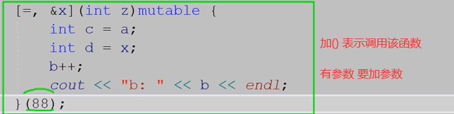

# 爱编程的大丙C++11新特性

https://subingwen.cn/cplusplus/

## 1. 稳定性和兼容性


### 原始字面量

定义方式为：R “xxx(原始字符串)xxx”      其中（）两边的字符串可以省略。

强调一个细节：在R “xxx(raw string)xxx” 中，原始字符串必须用括号（）括起来，括号的前后可以加其他字符串，所加的字符串会被忽略，并且加的字符串必须在括号两边同时出现。

原始字面量R可以直接表示字符串的实际含义，而不需要额外对字符串做转义或连接等操作。

```c++
#include<iostream>
#include<string>
using namespace std;
int main()
{
    string str = "D:\hello\world\test.text";
    cout << str << endl;
    string str1 = "D:\\hello\\world\\test.text";
    cout << str1 << endl;
    string str2 = R"(D:\hello\world\test.text)";
    cout << str2 << endl;
    return 0;
}
```

```C++
输出的结果为:

1 D:helloworld    est.text
2 D:\hello\world\test.text
3 D:\hello\world\test.text
```

在D:\hello\world\test.text中\h和\w转义失败，对应的字符会原样输出
在D:\\hello\\world\\test.text中路径的间隔符为\但是这个字符又是转义字符，因此需要使用转义字符将其转义，最终才能得到一个没有特殊含义的普通字符\
在R"(D:\hello\world\test.text)"使用了原始字面量R（）中的内容就是描述路径的原始字符串，无需做任何处理


### long long 整形

```C++
long long - 对应类型的数值可以使用 LL (大写) 或者 ll (小写) 后缀

C++
1 long long num1 = 123456789LL;
2 long long num2 = 123456789ll;
```

```C++

unsigned long long - 对应类型的数值可以使用 ULL (大写) 或者 ull (小写) 或者 Ull、uLL (等大小写混合)后缀

C++
1 unsigned long long num1 = 123456789ULL;
2 unsigned long long num2 = 123456789ull;
3 unsigned long long num3 = 123456789uLL;
4 unsigned long long num4 = 123456789Ull;
```


### 类成员的快速初始化

```C++
class Test
{
private:
    int a = 9;     // C++11 对非静态成员变量进行初始化，在初始化的时候可以使用等号 = 也可以使用花括号 {}
    int b = {5};   // C++98 非静态成员变量的初始化则必须在构造函数中进行。
    int c{12};
    double array[4] = { 3.14, 3.15, 3.16, 3.17};
    double array1[4] { 3.14, 3.15, 3.16, 3.17 };
    string s1("hello");     // error    不能使用小括号() 初始化对象，应该使用花括号{}
    string s2{ "hello, world" };
};
```

同时在类内部对非静态成员变量就地初始化和在初始化列表中进行初始化会怎么样呢？

```C++
class Init
{
public:
    Init(int x, int y, int z) :a(x), b(y), c(z) {}

    int a = 1;
    int b = 2;
    int c = 3;
};

int main()
{
    Init tmp(10, 20, 30);
    cout << "a: " << tmp.a << ", b: " << tmp.b << ", c: " << tmp.c << endl;
    return 0;
}
```

结果：a: 10, b: 20, c: 30

我们可以从函数的打印输出中看到，在类内部就地初始化和初始化列表并不冲突（程序可以正常运行）。程序员可以为同一成员变量既在类内部就地初始化，又在初始化列表中进行初始化，只不过初始化列表总是看起来后作用于非静态成员。也就是说，通过初始化列表指定的值会覆盖就地初始化时指定的值。


### final和override

#### final

final关键字来限制某个类不能被继承，或者某个虚函数不能被重写

```C++
// 1）修饰函数
class Base
{
public:
    virtual void test()
    {
        cout << "Base class...";
    }
};

class Child : public Base
{
public:
    void test() final
    {
        cout << "Child class...";
    }
};

class GrandChild : public Child
{
public:
    // 语法错误, 不允许重写
    void test()
    {
        cout << "GrandChild class...";
    }
};


// 2）修饰类
class Base
{
public:
    virtual void test()
    {
        cout << "Base class...";
    }
};

class Child final: public Base
{
public:
    void test()
    {
        cout << "Child class...";
    }
};

// error, 语法错误
class GrandChild : public Child
{
public:
};
```


#### override

override关键字确保在派生类中声明的重写函数与基类的虚函数有相同的签名，同时也明确表明将会重写基类的虚函数，这样就可以保证重写的虚函数的正确性，也提高了代码的可读性，和final一样这个关键字要写到方法的后面。


### 模板的优化

在泛型编程中，模板实例化有一个非常繁琐的地方，那就是连续的**两个右尖括号（>>）会被编译器解析成右移操作符**，而不是模板参数表的结束。

#### 默认模板参数

在C++98/03标准中，类模板可以有默认的模板参数：

```C++
#include <iostream>
using namespace std;

template <typename T=int, T t=520>
class Test
{
public:
    void print()
    {
        cout << "current value: " << t << endl;
    }
};

int main()
{
    Test<> t;
    t.print();

    Test<int, 1024> t1;
    t1.print();

    return 0;
}
```

但是不支持函数的默认模板参数，在C++11中添加了对函数模板默认参数的支持:

```C++
#include <iostream>
using namespace std;

template <typename T=int>	// C++98/03不支持这种写法, C++11中支持这种写法
void func(T t)
{
    cout << "current value: " << t << endl;
}

int main()
{
    func(100);
    return 0;
}
```

通过上面的例子可以得到如下结论：当所有模板参数都有默认参数时，函数模板的调用如同一个普通函数。但**对于类模板而言，哪怕所有参数都有默认参数，在使用时也必须在模板名后跟随<>来实例化。**

另外：函数模板的默认模板参数在使用规则上和其他的默认参数也有一些不同，它没有必须写在参数表最后的限制。这样当默认模板参数和模板参数自动推导结合起来时，书写就显得非常灵活了。


当默认模板参数和模板参数自动推导同时使用时（优先级从高到低）：

1. 如果可以推导出参数类型则使用推导出的类型

2. 如果函数模板无法推导出参数类型，那么编译器会使用默认模板参数
3. 如果无法推导出模板参数类型并且没有设置默认模板参数，编译器就会报错。


### 数值类型和字符串之间的转换

#### 1. 数值转换为字符串

```C++
// 头文件 <string>
string to_string (int val);
string to_string (long val);
string to_string (long long val);
string to_string (unsigned val);
string to_string (unsigned long val);
string to_string (unsigned long long val);
string to_string (float val);
string to_string (double val);
string to_string (long double val);
```

#### 2. 字符串转换为数值

```C++
// 定义于头文件 <string>
int       stoi( const std::string& str, std::size_t* pos = 0, int base = 10 );
long      stol( const std::string& str, std::size_t* pos = 0, int base = 10 );
long long stoll( const std::string& str, std::size_t* pos = 0, int base = 10 );

unsigned long      stoul( const std::string& str, std::size_t* pos = 0, int base = 10 );
unsigned long long stoull( const std::string& str, std::size_t* pos = 0, int base = 10 );

float       stof( const std::string& str, std::size_t* pos = 0 );
double      stod( const std::string& str, std::size_t* pos = 0 );
long double stold( const std::string& str, std::size_t* pos = 0 );
```

1. str：要转换的字符串

2. pos：传出参数, 记录从哪个字符开始无法继续进行解析, 比如: 123abc, 传出的位置为3
3. base：若 base 为 0 ，则自动检测数值进制：若前缀为 0 ，则为八进制，若前缀为 0x 或 0X，则为十六进制，否则为十进制。

### 静态断言 static_assert

#### 1. 断言

断言（assertion）是一种编程中常用的手段。在通常情况下，断言就是将一个返回值总是需要为真的判断表达式放在语句中，用于排除在设计的逻辑上不应该产生的情况。

比如：一个函数总需要输入在一定的范围内的参数，那么程序员就可以对该参数使用断言，以迫使在该参数发生异常的时候程序退出，从而避免程序陷入逻辑的混乱。


从一些意义上讲，断言并不是正常程序所必需的，不过对于程序调试来说，通常断言能够帮助程序开发者快速定位那些违反了某些前提条件的程序错误。

如果我们要在C++程序中使用断言，需要在程序中包含头文件**<cassert>或<assert.h>**，头文件中为我们提供了 assert 宏，用于在运行时进行断言。举例说明：

```C++
#include <iostream>
#include <cassert>
using namespace std;

// 创建一个指定大小的 char 类型数组
char* createArray(int size)
{
    // 通过断言判断数组大小是否大于0
    assert(size > 0);	// 必须大于0, 否则程序中断
    char* array = new char[size];
    return array;
}

int main()
{
    char* buf = createArray(0);
    // 此处使用的是vs提供的安全函数, 也可以使用 strcpy
    strcpy_s(buf, 16, "hello, world!");
    cout << "buf = " << buf << endl;
    delete[]buf;
    return 0;
}
```

在程序的第9行，使用了断言assert(expression) ，这是一个宏，它的参数是一个表达式，这个表达式通常返回一个布尔类型的值，并且要求表达式必须为 true 程序才能继续向下执行，否则会直接中断。

#### 2. 静态断言

在上面的例子中我们使用了断言 assert。但 assert是一个运行时断言，也就是说它只有在程序运行时才能起作用 。这意味着不运行程序我们将无法得知某些条件是否是成立的。
比如：我们想知道当前是32位还是64位平台，对于这个需求我们应该是在程序运行之前就应该得到结果，如果使用断言显然是无法做到的，对于这种情况我们就需要使用C++11提供的静态断言了。

静态断言static_assert，所谓静态就是在编译时就能够进行检查的断言，使用时不需要引用头文件。静态断言的另一个好处是，可以自定义违反断言时的错误提示信息。静态断言使用起来非常简单，它接收两个参数：

参数1：断言表达式，这个表达式通常需要返回一个 bool值
参数2：警告信息，它通常就是一段字符串，**在违反断言（表达式为false）时提示该信息**

```C++
// assert.cpp
#include <iostream>                                         
using namespace std;
  
int main()
{
    // 字体原因看起来是一个=, 其实这是两个=
    static_assert(sizeof(long) == 4, "错误, 不是32位平台...");
    cout << "64bit Linux 指针大小: " << sizeof(char*) << endl;
    cout << "64bit Linux long 大小: " << sizeof(long) <<endl;
  
    return 0;
}
```


### noexcept

#### 1 基本语法

异常通常用于处理逻辑上可能发生的错误，在C++98中为我们提供了一套完善的异常处理机制，我们可以直接在程序中将各种类型的异常抛出，从而强制终止程序的运行。


```C++
int main()
{ 
    try
    {
        throw -1; 
    } 
    catch (int e)
    { 
        cout << "int exception, value: " << e << endl; 
    } 
    cout << "That's ok!" << endl; 
    return 0; 
}
```

#### 2 异常接口声明

##### 2.1显示指定可以抛出的异常类型

```C++
struct MyException
{
    MyException(string s) :msg(s) {}
    string msg;
};

double divisionMethod(int a, int b) throw(MyException, int)
{
    if (b == 0)
    {
        throw MyException("division by zero!!!");
        // throw 100;
    }
    return a / b;
}

int main()
{
    try
    {	
        double v = divisionMethod(100, 0);
        cout << "value: " << v << endl;
    }
    catch (int e)
    {
        cout << "catch except: "  << e << endl;
    }
    catch (MyException e)
    {
        cout << "catch except: " << e.msg << endl;
    }
    return 0;
}
```

第7行代码在divisionMethod函数后添加了throw异常接口声明，其参数表示可以抛出的异常类型，分别为int 和MyException 类型。

##### 2.2抛出任意异常类型

```C++
struct MyException
{
    MyException(string s) :msg(s) {}
    string msg;
};

double divisionMethod(int a, int b)
{
    if (b == 0)
    {
        throw MyException("division by zero!!!");
        // throw 100;
    }
    return a / b;
}
```

第7行代码在divisionMethod 没有添加异常接口声明，表示在该函数中可以抛出任意类型的异常。

##### 2.3不抛出任何异常 noexccept

```C++
struct MyException
{
    MyException(string s) :msg(s) {}
    string msg;
};

double divisionMethod(int a, int b) throw()
{
    if (b == 0)
    {
        cout << "division by zero!!!" << endl;
    }
    return a / b;
}
```

第7行代码在divisionMethod 函数后添加了throw异常接口声明，其参数列表为空，表示该函数不允许抛出异常。

**直接使用except的方式**

#### 3 noexcept

在 divisionMethod 函数声明之后，我们定义了一个动态异常声明 throw(MyException, int)，该声明指出了divisionMethod可能抛出的异常的类型。事实上，该特性很少被使用，因此在**C++11中被弃用**了 ，而表示函数不会抛出异常的动态异常声明 throw() 也被新的 noexcept 异常声明所取代。


noexcept 形如其名，表示其修饰的函数不会抛出异常 。不过与 `throw()`动态异常声明不同的是，`在 C++11 中如果 noexcept 修饰的函数抛出了异常，编译器可以选择直接调用 std::terminate() 函数来终止程序的运行，这比基于异常机制的 throw() 在效率上会高一些`。这是因为异常机制会带来一些额外开销，比如函数抛出异常，会导致函数栈被依次地展开（栈解旋），并自动调用析构函数释放栈上的所有对象。
因此对于不会抛出异常的函数我们可以这样写:

```C++
double divisionMethod(int a, int b) noexcept
{
    if (b == 0)
    {
        cout << "division by zero!!!" << endl;
        return -1;
    }
    return a / b;
}
```

从语法上讲，noexcept 修饰符有两种形式：

简单地在函数声明后加上 noexcept 关键字

可以接受一个常量表达式作为参数，如下所示∶

```C++
double divisionMethod(int a, int b) noexcept(常量表达式);
```

常量表达式的结果会被转换成一个bool类型的值：

值为 true，表示函数不会抛出异常
值为 false，表示有可能抛出异常这里
不带常量表达式的noexcept相当于声明了noexcept（true），即不会抛出异常。


## 2. 易学和易用性

### 自动类型推导 auto

**使用auto声明的变量必须要进行初始化，以让编译器推导出它的实际类型，在编译时将auto占位符替换为真正的类型**

auto还可以和指针、引用结合起来使用也可以带上const、volatile限定符，在不同的场景下有对应的推导规则，规则内容如下：

***当变量不是指针或者引用类型时，推导的结果中不会保留const、volatile关键字***
***当变量是指针或者引用类型时，推导的结果中会保留const、volatile关键字***

```C++
int tmp = 250;
const auto a1 = tmp;
auto a2 = a1;
const auto &a3 = tmp;
auto &a4 = a3;
```

变量a1的数据类型为 const int，因此auto关键字被推导为 int类型
变量a2的数据类型为 int，但是a2没有声明为指针或引用因此 const属性被去掉, auto被推导为 int
变量a3的数据类型为 const int&，a3被声明为引用因此 const属性被保留，auto关键字被推导为 int类型
变量a4的数据类型为 const int&，a4被声明为引用因此 const属性被保留，auto关键字被推导为 const int类型

#### 不能使用auto情况

1）不能作为函数参数使用。因为只有在函数调用的时候才会给函数参数传递实参，auto要求必须要给修饰的变量赋值，因此二者矛盾。

```C++
int func(auto a, auto b)	// error
{	
    cout << "a: " << a <<", b: " << b << endl;
}
```

2）不能用于类的非静态成员变量的初始化

```C++
class Test
{
    auto v1 = 0;                    // error
    static auto v2 = 0;             // error,类的静态非常量成员不允许在类内部直接初始化
    static const auto v3 = 10;      // ok
}
```

3）不能使用auto关键字定义数组

```C++
int func()
{
    int array[] = {1,2,3,4,5};  // 定义数组
    auto t1 = array;            // ok, t1被推导为 int* 类型
    auto t2[] = array;          // error, auto无法定义数组
    auto t3[] = {1,2,3,4,5};;   // error, auto无法定义数组
}
```

4）无法使用auto推导出模板参数

```C++
template <typename T>
struct Test{}

int func()
{
    Test<double> t;
    Test<auto> t1 = t;           // error, 无法推导出模板类型
    return 0;
}
```

####  建议使用auto情况

1）用于STL的容器遍历

```C++
#include <map>
int main()
{
    map<int, string> person;
    map<int, string>::iterator it = person.begin();
    for (; it != person.end(); ++it)
    {
        // do something
    }
    return 0;
}
```

2）用于泛型编程 模板

在使用模板的时候，很多情况下我们不知道变量应该定义为什么类型，比如下面的代码：

```C++
#include <iostream>
#include <string>
using namespace std;

class T1
{
public:
    static int get()
    {
        return 10;
    }
};

class T2
{
public:
    static string get()
    {
        return "hello, world";
    }
};

template <class A>
void func(void)
{
    auto val = A::get();
    cout << "val: " << val << endl;
}

int main()
{
    func<T1>();
    func<T2>();
    return 0;
}
```


### decltype

在某些情况下，不需要或者不能定义变量，但是希望得到某种类型，这时候就可以使用C++11提供的decltype关键字了，它的作用是在编译器编译的时候推导出一个表达式的类型，语法格式如下：

```C++
decltype (表达式)
```

decltype 是“declare type”的缩写，意思是“声明类型”。decltype的推导是在编译期完成的，它只是用于表达式类型的推导，并不会计算表达式的值。来看一组简单的例子：

```C++
int a = 10;
decltype(a) b = 99;                 // b -> int
decltype(a+3.14) c = 52.13;         // c -> double
decltype(a+b*c) d = 520.1314;       // d -> double
```

#### 表达式为左值

表达式是一个左值，或者被括号( )包围，使用 decltype推导出的是表达式类型的引用（如果有const、volatile限定符不能忽略）。

```C++
#include <iostream>
#include <vector>
using namespace std;

class Test
{
public:
    int num;
};

int main() {
    const Test obj;
    //带有括号的表达式
    decltype(obj.num) a = 0;
    decltype((obj.num)) b = a;
    //加法表达式
    int n = 0, m = 0;
    decltype(n + m) c = 0;
    decltype(n = n + m) d = n;
    return 0;
}
```

obj.num 为类的成员访问表达式，符合场景1，因此 a 的类型为int
obj.num 带有括号，符合场景3，因此b 的类型为 const int&。
n+m 得到一个右值，符合场景1，因此c的类型为 int
n=n+m 得到一个左值 n，符合场景3，因此d的类型为 int&

####  decltype的应用

```C++
#include <list>
#include <iostream>
using namespace std;

template <class T>
class Container
{
public:
    void func(T& c)
    {
        for (m_it = c.begin(); m_it != c.end(); ++m_it)
        {
            cout << *m_it << " ";
        }
        cout << endl;
    }
private:
    decltype(T().begin()) m_it;  // 这里不能确定迭代器类型
};

int main()
{
    const list<int> lst{ 1,2,3,4,5,6,7,8,9 };
    Container<const list<int>> obj;
    obj.func(lst);
    return 0;
}
```

#### 返回类型后置

在泛型编程中，可能需要通过参数的运算来得到返回值的类型，比如下面这个场景：

```C++
#include <iostream>
using namespace std;
// R->返回值类型, T->参数1类型, U->参数2类型
template <typename R, typename T, typename U>
R add(T t, U u)
{
    return t + u;
}

int main()
{
    int x = 520;
    double y = 13.14;
    // auto z = add<decltype(x + y), int, double>(x, y);
    auto z = add<decltype(x + y)>(x, y);	// 简化之后的写法
    cout << "z: " << z << endl;
    return 0;
}
```

关于返回值，从上面的代码可以推断出和表达式 t+u的结果类型是一样的，因此可以通过通过decltype进行推导，关于模板函数的参数t和u可以通过实参自动推导出来，因此在程序中就也可以不写。虽然通过上述方式问题被解决了，但是解决方案有点过于理想化，因为对于调用者来说，是不知道函数内部执行了什么样的处理动作的。

因此如果要想解决这个问题就得直接在 add 函数身上做文章

在C++11中增加了返回类型后置语法，说明白一点就是将decltype和auto结合起来完成返回类型的推导。其语法格式如下:

```C++
// 符号 -> 后边跟随的是函数返回值的类型
auto func(参数1, 参数2, ...) -> decltype(参数表达式)
```

通过对上述返回类型后置语法代码的分析，得到结论：auto 会追踪 decltype() 推导出的类型，因此上边的add()函数可以做如下的修改：

```C++
#include <iostream>
using namespace std;

template <typename T, typename U>
// 返回类型后置语法
auto add(T t, U u) -> decltype(t+u) 
{
    return t + u;
}

int main()
{
    int x = 520;
    double y = 13.14;
    // auto z = add<int, double>(x, y);
    auto z = add(x, y);		// 简化之后的写法
    cout << "z: " << z << endl;
    return 0;
}
```


### 基于范围的for循环

我们在遍历的过程中需要给出容器的两端：开头（begin）和结尾（end），因为这种遍历方式不是基于范围来设计的。在基于范围的for循环中，不需要再传递容器的两端，循环会自动以容器为范围展开，并且循环中也屏蔽掉了迭代器的遍历细节，直接抽取容器中的元素进行运算，使用这种方式进行循环遍历会让编码和维护变得更加简便。

```C++
for (declaration : expression)
{
    // 循环体
}
```

在上面的语法格式中declaration表示遍历声明，在遍历过程中，当前被遍历到的元素会被存储到声明的变量中。expression是要遍历的对象，它可以是表达式、容器、数组、初始化列表等。

**对容器的遍历过程中，如果只是读数据，不允许修改元素的值，可以使用const定义保存元素数据的变量，在定义的时候建议使用const auto &，这样相对于const auto效率要更高一些。**

```C++
#include <iostream>
#include <vector>
using namespace std;

int main(void)
{
    vector<int> t{ 1,2,3,4,5,6 };
    for (const auto& value : t)
    {
        cout << value << " ";
    }

    return 0;
}
```

#### 注：map的遍历

```C++
#include <iostream>
#include <string>
#include <map>
using namespace std;

int main(void)
{
    map<int, string> m{
        {1, "lucy"},{2, "lily"},{3, "tom"}
    };

    // 基于范围的for循环方式
    for (auto& it : m)
    {
        cout << "id: " << it.first << ", name: " << it.second << endl;
    }

    // 普通的for循环方式
    for (auto it = m.begin(); it != m.end(); ++it)
    {
        cout << "id: " << it->first << ", name: " << it->second << endl;
    }

    return 0;
}
```

在上面的例子中使用两种方式对map进行了遍历，通过对比有两点需要注意的事项：

使用普通的for循环方式（基于迭代器）遍历关联性容器， auto自动推导出的是一个迭代器类型，需要使用迭代器的方式取出元素中的键值对（和指针的操作方法相同）：
it->first
it->second
使用基于范围的for循环遍历关联性容器，auto自动推导出的类型是容器中的value_type，相当于一个对组（std::pair）对象，提取键值对的方式如下：
it.first
it.second


##### map插入方式

```C++
//插入
map<int, int> m;
//第一种插入方式
m.insert(pair<int, int>(1, 10));
//第二种插入方式
m.insert(make_pair(2, 20));
//第三种插入方式
m.insert(map<int, int>::value_type(3, 30));
//第四种插入方式
m[4] = 40; 
```


#### 注：set

通过对基于范围的for循环语法的介绍可以得知，在for循环内部声明一个变量的引用就可以修改遍历的表达式中的元素的值，但是这并不适用于所有的情况，对应set容器来说，内部元素都是只读的，这是由容器的特性决定的，因此在for循环中    auto&    会被视为     **const auto &**    。

```C++
#include <iostream>
#include <set>
using namespace std;

int main(void)
{
    set<int> st{ 1,2,3,4,5,6 };
    for (auto &item : st)     //  const auto &   
    {
        cout << item++ << endl;		// error, 不能给常量赋值
    }
    return 0;
}
```


#### 访问次数

基于范围的for循环遍历的对象可以是一个表达式或者容器/数组等。假设我们对一个容器进行遍历，在遍历过程中for循环对这个容器的访问频率是**一次**还是多次呢？我们通过下面的例子验证一下：

```C++
#include <iostream>
#include <vector>
using namespace std;

vector<int> v{ 1,2,3,4,5,6 };
vector<int>& getRange()
{
    cout << "get vector range..." << endl;
    return v;
}

int main(void)
{
    for (auto val : getRange())
    {
        cout << val << " ";
    }
    cout << endl;

    return 0;
}
```

```C++
// 输出结果
get vector range...
1 2 3 4 5 6
```

**从上面的结果中可以看到，不论基于范围的for循环迭代了多少次，函数getRange()只在第一次迭代之前被调用，得到这个容器对象之后就不会再去重新获取这个对象了。**


### lambda表达式

[=]  ：拷贝进来的数据是**只读**属性的     想要修改 要加mutable




### using 别名

```C++
	using ptr = int (*) (int, int);
	ptr p = [](int x, int y) -> int {
		cout << x + y;
		return x + y;
	};
```

ptr 就是一个别名代表 int (*) (int, int)


### 仿函数

在C++中，**仿函数（Functor）是一个类或结构体**，它实现了函数调用运算符 `operator()`，使得该类的对象可以像函数一样被调用。

```c++
// 仿函数类
class Adder {
public:
    // 重载函数调用运算符
    int operator()(int a, int b) {
        return a + b;
    }
};

int main() {
    // 创建仿函数对象
    Adder add;
    // 使用仿函数调用函数
    int result = add(3, 4);
    return 0;
}
```


### std::function

C++11新增了std::function和std::bind。用于函数的包装以及参数的绑定。可以替代一些**函数指针**，**回调函数**的场景。

#### std::function对象包装器

std::function是可调用对象的包装器，它可以用来用统一的方式来处理函数、函数对象、函数指针，并允许保存和延迟执行它们。比较难理解，可以从代码上深入：

```C++
#include <iostream>
#include <functional>

void func(void)
{
	std::cout << __FUNCTION__ << std::endl;
}

class Foo
{
public:
	static int foo_func(int a)
	{
		std::cout << __FUNCTION__ << " :input param:" << a << std::endl;
		return a;
	}
};
class Bar
{
public:
	int operator()(int a)
	{
		std::cout << __FUNCTION__ << " :input param:" <<a<< std::endl;//
		return a;
	}
};
int main()
{
	std::function<void(void)> fr1 = func;//绑定普通函数
	fr1();
    std::function<int(int)> fr2 = Foo::foo_func;//绑定一个类的静态成员函数
    std::cout << "result:"<< fr2(123) << std::endl;

    Bar bar;
    std::function<int(int)> fr3 = bar;//绑定一个仿函数
    //fr2 = bar;//这里用fr2也可以，因为这两个函数的返回值和参数表是一样的
    std::cout << "result" <<fr3(123) << std::endl;
    return 0;
}
```

注意：代码中__FUNCTION__是预定义标识符，基本功能是实现返回所在函数的名字，便于调试日志打印。


可以看出使用给std::function赋值上对应的函数返回值和函数参数表，它就可以容纳这一类调用方式的函数，被称为“函数包装器”。如上述的fr2可以容纳Foo::foo_func和bar。
这里可以看出function类似于函数指针的作用，可以保存各种类型的函数地址。

#### std::function做回调函数
```C++
#include <iostream>
#include <functional>

class A
{
	std::function<void(int)> callback_;
public:
	A(const std::function<void(int)>& f) : callback_(f) {}
	void notify(int a)
	{
		callback_(a);
	}
};
class Foo
{
public:
	void operator()(int a)
	{
		std::cout << __FUNCTION__  <<" a:" << a << std::endl;
	}
};
int main()
{
	Foo foo;
	A aa(foo);
	aa.notify(111);
	return 0;
}
```

这里可以看出function可以取代函数指针的作用，可以用function保存函数延迟执行，所有比较适合用在回调函数场景。

### std::bind

std::bind可以将可调用对象和其参数一起绑定，绑定后的结果可以用std::function进行保存。
其中绑定普通函数和绑定成员函数的写法有所不同。

#### bind绑定普通函数

```C++
#include <iostream>
#include <functional>

void input(int x)
{
	std::cout << x << std::endl;
}

int main()
{
	std::function<void(int)> fr = std::bind(input, std::placeholders::_1);
	auto fr1 = std::bind(input, std::placeholders::_1); // 这里用auto接收也行
	fr(2);
	fr1(3);
	return 0;
}
```

其中std::placeholders::_1是一个占位符，表示这个位置将在函数调用时，被传入的第一个参数替代。

##### **占位符的使用方法**

```C++
#include <iostream>
#include <functional>

void input(int x, int y)
{
	std::cout << x << " " << y << std::endl;
}

int main()
{
	std::function<void(int, int)> fr = std::bind(input, std::placeholders::_1, 2);// 这里用auto接收也行
	fr(4, 5);//4 2
	fr = std::bind(input, 2, std::placeholders::_1);
	fr(4, 5);//2 4
	fr = std::bind(input, std::placeholders::_1, std::placeholders::_2);
	fr(4, 5);//4 5
	fr = std::bind(input, std::placeholders::_2, 2);
	fr(4, 5);//5 2
	fr = std::bind(input, 2, std::placeholders::_2);
	fr(4, 5);//2 5
	return 0;
}
```


在绑定参数时，可以通过占位符std::placeholders来决定空位参数会属于调用发生时的第几个参数。

#### bind绑定成员函数    成员变量

bind可以绑定成员函数和成员变量。其中绑定成员函数和绑定普通函数时是有一些差别的。

```C++
#include <iostream>
#include <functional>

class MyClass {
public:
	int i_ = 0;
	void foo(int a, int b) {
		std::cout << a << " " << b << std::endl;
	}
};

int main() {
	MyClass obj;
	auto boundFunc = std::bind(&MyClass::foo, &obj, std::placeholders::_1, std::placeholders::_2);//绑定成员函数
	boundFunc(3, 4);
	auto fr_i = std::bind(&MyClass::i_, &obj);//绑定成员变量
	fr_i() = 123;

	return 0;
}
```

当使用 std::bind 绑定成员函数时，需要注意以下几点：

需要使用成员函数的指针或函数对象来进行绑定。对于指针，需要使用 & 取址符号获取成员函数的地址。
需要提供对象的指针（或引用）作为第一个参数，以便在调用时正确地调用成员函数。
可以看到绑定普通函数时是不需要提供对象的指针或引用作为参数。


## 3. 通用性能的提升

 ### 1）模版函数 函数模版


### 2）constexpr

```C++
    const int count = 24;
    int array[num];            // error，num是一个只读变量，不是常量
    int array1[count];         // ok，count是一个常量
```

在C++11中添加了一个新的关键字constexpr，这个关键字是用来修饰常量表达式的。所谓**常量表达式，指的就是由多个（≥1）常量（值不会改变）组成并且在编译过程中就得到计算结果的表达式。**

在介绍gcc/g++工作流程的时候说过，C++ 程序从编写完毕到执行分为四个阶段：预处理、 编译、汇编和链接4个阶段，得到可执行程序之后就可以运行了。需要额外强调的是，常量表达式和非常量表达式的计算时机不同，非常量表达式只能在程序运行阶段计算出结果，但是常量表达式的计算往往发生在程序的编译阶段，这**可以极大提高程序的执行效率**，因为表达式只需要在编译阶段计算一次，节省了每次程序运行时都需要计算一次的时间。

那么问题来了，编译器如何识别表达式是不是常量表达式呢？在C++11中添加了constexpr关键字之后就可以在程序中使用它来修饰常量表达式，用来提高程序的执行效率。在使用中建议将 const 和 constexpr 的功能区分开，即凡是

**表达“只读”语义的场景都使用 const，**

**表达“常量”语义的场景都使用 constexpr。**

在定义常量时，const 和 constexpr 是等价的，都可以在程序的编译阶段计算出结果，例如：

```C++
const int m = f();  // 不是常量表达式，m的值只有在运行时才会获取。
const int i=520;    // 是一个常量表达式
const int j=i+1;    // 是一个常量表达式

constexpr int i=520;    // 是一个常量表达式
constexpr int j=i+1;    // 是一个常量表达式
```

对于 C++ 内置类型的数据，可以直接用 constexpr 修饰，但如果是自定义的数据类型（用 struct 或者 class 实现），直接用 constexpr 修饰是不行的。

```C++
// 此处的constexpr修饰是无效的
constexpr struct Test
{
    int id;
    int num;
};
```

如果要定义一个结构体/类常量对象，可以这样写

```C++
struct Test
{
    int id;
    int num;
};

int main()
{
    constexpr Test t{ 1, 2 };
    constexpr int id = t.id;
    constexpr int num = t.num;
    // error，不能修改常量
    t.num += 100;
    cout << "id: " << id << ", num: " << num << endl;

    return 0;
}
```

#### 2.1 修饰函数

constexpr并不能修改任意函数的返回值，使这些函数成为常量表达式函数，必须要满足以下几个条件：

1）函数必须要有返回值，并且return 返回的表达式必须是常量表达式。

2）函数在使用之前，必须有对应的定义语句。

声明函数是不行的。因为是在编译期间 所以函数要在使用前定义出来

```C++
#include <iostream>
using namespace std;

constexpr int func1();
int main()
{
    constexpr int num = func1();	// error
    return 0;
}

constexpr int func1()   // 要把这个函数定义放在使用函数之前
{
    constexpr int a = 100;
    return a;
}
```

3）整个函数的函数体中，不能出现非常量表达式之外的语句（using 指令、typedef 语句以及 static_assert 断言、return语句除外）。

```C++
// error
constexpr int func1()
{
    constexpr int a = 100;
    constexpr int b = 10;
    for (int i = 0; i < b; ++i)
    {
        cout << "i: " << i << endl;
    }
    return a + b;
}

// ok
constexpr int func2()
{
    using mytype = int;
    constexpr mytype a = 100;
    constexpr mytype b = 10;
    constexpr mytype c = a * b;
    return c - (a + b);
}
```

以上三条规则不仅对应普通函数适用，对应类的成员函数也是适用的

#### 2.2 修饰模版函数

C++11 语法中，constexpr 可以修饰函数模板，但由于模板中类型的不确定性，因此函数模板实例化后的模板函数是否符合常量表达式函数的要求也是不确定的。

**如果 constexpr 修饰的模板函数实例化结果不满足常量表达式函数的要求，则 constexpr 会被自动忽略，即该函数就等同于一个普通函数。**

```C++
#include <iostream>
using namespace std;

struct Person {
    const char* name;
    int age;
};

// 定义函数模板
template<typename T>
constexpr T dispaly(T t) {
    return t;
}

int main()
{
    struct Person p { "luffy", 19 };
    //普通函数
    struct Person ret = dispaly(p);
    cout << "luffy's name: " << ret.name << ", age: " << ret.age << endl;

    //常量表达式函数
    constexpr int ret1 = dispaly(250);
    cout << ret1 << endl;

    constexpr struct Person p1 { "luffy", 19 };
    constexpr struct Person p2 = dispaly(p1);
    cout << "luffy's name: " << p2.name << ", age: " << p2.age << endl;
    return 0;
}
```

#### 2.3 修饰构造函数

如果想用直接得到一个常量对象，也可以使用constexpr修饰一个构造函数，这样就可以得到一个常量构造函数了。常量构造函数有一个

**要求：构造函数的函数体必须为空，并且必须采用初始化列表的方式为各个成员赋值。**

```C++
#include <iostream>
using namespace std;

struct Person {
    constexpr Person(const char* p, int age) :name(p), age(age)
    {
    }
    const char* name;
    int age;
};

int main()
{
    constexpr struct Person p1("luffy", 19);
    cout << "luffy's name: " << p1.name << ", age: " << p1.age << endl;
    return 0;
}
```


### 3）委托构造和继承构造函数

#### 3.1 委托构造函数

委托构造函数允许使用同一个类中的一个构造函数调用其它的构造函数，从而简化相关变量的初始化。

```C++
#include <iostream>
using namespace std;

class Test
{
public:
    Test() {};
    Test(int max)
    {
        this->m_max = max > 0 ? max : 100;
    }

    Test(int max, int min):Test(max)
    {
        this->m_min = min > 0 && min < max ? min : 1;
    }

    Test(int max, int min, int mid):Test(max, min)
    {
        this->m_middle = mid < max && mid > min ? mid : 50;
    }

    int m_min;
    int m_max;
    int m_middle;
};

int main()
{
    Test t(90, 30, 60);
    cout << "min: " << t.m_min << ", middle: " 
         << t.m_middle << ", max: " << t.m_max << endl;
    return 0;
}
```

在修改之后的代码中可以看到，重复的代码全部没有了，并且在一个构造函数中调用了其他的构造函数用于相关数据的初始化，相当于是一个链式调用。在使用委托构造函数的时候还需要注意一些几个问题：

1）这种链式的构造函数调用不能形成一个闭环（死循环），否则会在运行期抛异常。

2）如果要进行多层构造函数的链式调用，**建议将构造函数的调用的写在初始列表中而不是函数体内部**，否则编译器会提示形参的重复定义。

3）在初始化列表中调用了代理构造函数初始化某个类成员变量之后，就不能在初始化列表中再次初始化这个变量了。

```C++
// 错误, 使用了委托构造函数就不能再次m_max初始化了
Test(int max, int min) : Test(max), m_max(max)
{
    this->m_min = min > 0 && min < max ? min : 1;
}
```


#### 3.2 继承构造函数

C++11中提供的继承构造函数可以让派生类直接使用基类的构造函数，而无需自己再写构造函数，尤其是在基类有很多构造函数的情况下，可以极大地简化派生类构造函数的编写。

继承构造函数的使用方法是这样的：**通过使用using 类名::构造函数名（其实类名和构造函数名是一样的）来声明使用基类的构造函数**，这样子类中就可以不定义相同的构造函数了，直接使用基类的构造函数来构造派生类对象。

**另外如果在子类中隐藏了父类中的同名函数，也可以通过using的方式在子类中使用基类中的这些父类函数：**

```C++
#include <iostream>
#include <string>
using namespace std;

class Base
{
public:
    Base(int i) :m_i(i) {}
    Base(int i, double j) :m_i(i), m_j(j) {}
    Base(int i, double j, string k) :m_i(i), m_j(j), m_k(k) {}

    void func(int i)
    {
        cout << "base class: i = " << i << endl;
    }
  
    int m_i;
    double m_j;
    string m_k;
};

// 使用了继承构造
class Child : public Base
{
public:
    using Base::Base;  // using 类名：构造函数名      此处类名和构造函数名字相同
};

// 不使用继承构造
class Child : public Base
{
public:
    Child(int i) :Base(i) {}
    Child(int i, double j) :Base(i, j) {}
    Child(int i, double j, string k) :Base(i, j, k) {}
};

// 子类中隐藏了父类中的同名函数   ！！ 同名
class Child : public Base
{
public:
    using Base::Base;
    using Base::func;
    void func()
    {
        cout << "child class: i'am luffy!!!" << endl;
    }
};

int main()
{
    Child c1(520, 13.14);
    cout << "int: " << c1.m_i << ", double: " << c1.m_j << endl;
    Child c2(520, 13.14, "i love you");
    cout << "int: " << c2.m_i << ", double: " 
         << c2.m_j << ", string: " << c2.m_k << endl;
    return 0;
}
```


### 4）右值引用

#### 4.1 右值

C++11 增加了一个新的类型，称为右值引用（ R-value reference），标记为 &&。在介绍右值引用类型之前先要了解什么是左值和右值：

lvalue 是loactor value的缩写，rvalue 是 read value的缩写

**左值是指存储在内存中、有明确存储地址（可取地址）的数据；**

**右值是指可以提供数据值的数据（不可取地址）；**

通过描述可以看出，区分左值与右值的便捷方法是：可以对表达式取地址（&）就是左值，否则为右值 。所有有名字的变量或对象都是左值，而右值是匿名的。


C++11 中右值可以分为两种：一个是将亡值（ xvalue, expiring value），另一个则是纯右值（ prvalue, PureRvalue）：

**1）纯右值：非引用返回的临时变量、运算表达式产生的临时变量、原始字面量和 lambda 表达式等**
**2）将亡值：与右值引用相关的表达式，比如，T&&类型函数的返回值、 std::move 的返回值等。**

##### 4.1.1 右值引用

**右值引用就是对一个右值进行引用的类型。因为右值是匿名的，所以我们只能通过引用的方式找到它。**

无论声明左值引用还是右值引用都必须立即进行初始化，因为引用类型本身并不拥有所绑定对象的内存，只是该对象的一个别名。

**通过右值引用的声明，该右值又“重获新生”，其生命周期与右值引用类型变量的生命周期一样，只要该变量还活着，该右值临时量将会一直存活下去。**

```C++
#include <iostream>
using namespace std;

int&& value = 520;
class Test
{
public:
    Test()
    {
        cout << "construct: my name is jerry" << endl;
    }
    Test(const Test& a)
    {
        cout << "copy construct: my name is tom" << endl;
    }
};

Test getObj()
{
    return Test();
}

int main()
{
    int a1;
    int &&a2 = a1;        // error
    Test& t = getObj();   // error
    Test && t = getObj();
    const Test& t = getObj();
    return 0;
}
```

在上面的例子中int&& value = 520;里面520是纯右值，value是对字面量520这个右值的引用。

在int &&a2 = a1;中a1虽然写在了=右边，但是它仍然是一个左值，使用左值初始化一个右值引用类型是不合法的。

在Test& t = getObj()这句代码中语法是错误的，右值不能给普通的左值引用赋值。

在Test && t = getObj();中getObj()返回的临时对象被称之为将亡值，t是这个将亡值的右值引用。

const Test& t = getObj()这句代码的语法是正确的，


##### **常量左值引用是一个万能引用类型，它可以接受左值、右值、常量左值和常量右值。**


#### 4.2 性能优化

在C++中在进行对象赋值操作的时候，很多情况下会发生对象之间的深拷贝，如果堆内存很大，这个拷贝的代价也就非常大，在某些情况下，如果想要避免对象的深拷贝，就可以使用右值引用进行性能的优化。

通过输出的结果可以看到调用Test t = getObj();的时候调用拷贝构造函数对返回的临时对象进行了深拷贝得到了对象t，在getObj()函数中创建的对象虽然进行了内存的申请操作，但是没有使用就释放掉了。如果能够使用临时对象已经申请的资源，既能节省资源，还能节省资源申请和释放的时间，如果要执行这样的操作就需要使用右值引用了，右值引用具有移动语义，移动语义可以将资源（堆、系统对象等）通过浅拷贝从一个对象转移到另一个对象这样就能减少不必要的临时对象的创建、拷贝以及销毁，可以大幅提高C++应用程序的性能。

```C++
#include <iostream>
using namespace std;

class Test
{
public:
    Test() : m_num(new int(100))
    {
        cout << "construct: my name is jerry" << endl;
    }

    // 拷贝构造
    Test(const Test& a) : m_num(new int(*a.m_num))
    {
        cout << "copy construct: my name is tom" << endl;
    }

    // 添加移动构造函数
    Test(Test&& a) : m_num(a.m_num)
    {
        a.m_num = nullptr;
        cout << "move construct: my name is sunny" << endl;
    }

    ~Test()
    {
        delete m_num;
        cout << "destruct Test class ..." << endl;
    }

    int* m_num;
};

Test getObj()
{
    Test t;
    return t;
}

int main()
{
    Test t = getObj();
    cout << "t.m_num: " << *t.m_num << endl;
    return 0;
};

// 输出结果   VS2019下。 高版本输出不同 代码被优化了
construct: my name is jerry
move construct: my name is sunny
destruct Test class ...
t.m_num: 100
destruct Test class ..
```

通过修改，在上面的代码给Test类添加了移动构造函数（参数为右值引用类型），这样在进行Test t = getObj();操作的时候并没有调用拷贝构造函数进行深拷贝，而是调用了移动构造函数，在这个函数中只是进行了浅拷贝，没有对临时对象进行深拷贝，提高了性能。

在测试程序中**getObj()的返回值就是一个将亡值**，也就是说是一个右值，在进行赋值操作的时候如果=右边是一个右值，那么移动构造函数就会被调用。移动构造中使用了右值引用，会将临时对象中的堆内存地址的所有权转移给对象t，这块内存被成功续命，因此在t对象中还可以继续使用这块内存。

**对于需要动态申请大量资源的类，应该设计移动构造函数，以提高程序效率。需要注意的是，我们一般在提供移动构造函数的同时，也会提供常量左值引用的拷贝构造函数，以保证移动不成还可以使用拷贝构造函数。**


#### 4.3 && 的特性

在C++中，并不是所有情况下 && 都代表是一个右值引用，具体的场景体现在模板和自动类型推导中，如果是模板参数需要指定为T&&，如果是自动类型推导需要指定为auto &&，在这两种场景下 &&被称作未定的引用类型。另外还有一点需要额外注意

##### const T&&表示一个右值引用，不是未定引用类型

由于上述代码中存在T&&或者auto&&这种未定引用类型，当它作为参数时，有可能被一个右值引用初始化，也有可能被一个左值引用初始化，在进行类型推导时右值引用类型（&&）会发生变化，这种变化被称为引用折叠。**在C++11中引用折叠的规则如下：**

**1）通过右值推导 T&& 或者 auto&& 得到的是一个右值引用类型**

**2）通过非右值（右值引用、左值、左值引用、常量右值引用、常量左值引用）推导 T&& 或者 auto&& 得到的是一个左值引用类型**

##### 通过右值推导 T&& 或者 auto&& 得到的是一个右值引用类型，其余左值引用

```C++
int&& a1 = 5;
auto&& bb = a1;
auto&& bb1 = 5;

int a2 = 5;
int &a3 = a2;
auto&& cc = a3;
auto&& cc1 = a2;

const int& s1 = 100;
const int&& s2 = 100;
auto&& dd = s1;
auto&& ee = s2;

const auto&& x = 5;

第2行：a1为右值引用，推导出的bb为左值引用类型
第3行：5为右值，推导出的bb1为右值引用类型
第7行：a3为左值引用，推导出的cc为左值引用类型
第8行：a2为左值，推导出的cc1为左值引用类型
第12行：s1为常量左值引用，推导出的dd为常量左值引用类型
第13行：s2为常量右值引用，推导出的ee为常量左值引用类型
第15行：x为右值引用，不需要推导，只能通过右值初始化
```

```C++
#include <iostream>
using namespace std;

void printValue(int &i)
{
    cout << "l-value: " << i << endl;
}

void printValue(int &&i)
{
    cout << "r-value: " << i << endl;
}

void forward(int &&k)
{
    printValue(k);
}

int main()
{
    int i = 520;
    printValue(i);
    printValue(1314);
    forward(250);

    return 0;
};

// 输出结果
l-value: 520
r-value: 1314
l-value: 250
```

根据测试代码可以得知，编译器会根据传入的参数的类型（左值还是右值）调用对应的重置函数（printValue），函数forward()接收的是一个右值，但是在这个函数中调用函数printValue()时，参数k变成了一个命名对象，编译器会将其当做左值来处理。

最后总结一下关于&&的使用：

**1）左值和右值是独立于他们的类型的，右值引用类型可能是左值也可能是右值。**

**2）编译器会将已命名的右值引用视为左值，将未命名的右值引用视为右值。**

**3）auto&&或者函数参数类型自动推导的T&&是一个未定的引用类型，它可能是左值引用也可能是右值引用类型，这取决于初始化的值类型（上面有例子）。**

**4）通过右值推导 T&& 或者 auto&& 得到的是一个右值引用类型，其余都是左值引用类型。**


### 5）转移和完美转发

#### 5.1 std::move()

在C++11添加了右值引用，并且不能使用左值初始化右值引用，如果想要使用左值初始化一个右值引用需要借助std::move()函数，使用std::move方法可以将左值转换为右值。**使用这个函数并不能移动任何东西，而是和移动构造函数一样都具有移动语义，将对象的状态或者所有权从一个对象转移到另一个对象，只是转移，没有内存拷贝。**

从实现上讲，std::move基本等同于一个类型转换：static_cast<T&&>(lvalue);，函数原型如下:

```C++
template<class _Ty>
_NODISCARD constexpr remove_reference_t<_Ty>&& move(_Ty&& _Arg) _NOEXCEPT
{	// forward _Arg as movable
    return (static_cast<remove_reference_t<_Ty>&&>(_Arg));
}
```

```C++
list<string> ls;
ls.push_back("hello");
ls.push_back("world");
......
list<string> ls1 = ls;        // 需要拷贝, 效率低
list<string> ls2 = move(ls);
```

如果不使用std::move，拷贝的代价很大，性能较低。使用**move几乎没有任何代价，只是转换了资源的所有权**。如果一个对象内部有较大的堆内存或者动态数组时，使用move()就可以非常方便的进行数据所有权的转移。另外，我们也可以给类编写相应的移动构造函数（T::T(T&& another)）和和具有移动语义的赋值函数（T&& T::operator=(T&& rhs)），在构造对象和赋值的时候尽可能的进行资源的重复利用，因为它们都是接收一个右值引用参数。

#### 5.2 std::forward()

右值引用类型是独立于值的，**一个右值引用作为函数参数的形参时，在函数内部转发该参数给内部其他函数时，它就变成一个左值**，并不是原来的类型了。如果需要按照参数原来的类型转发到另一个函数，可以使用C++11提供的std::forward()函数，该函数实现的功能称之为完美转发。

##### 当T为左值引用类型时，t将被转换为T类型的左值，其余右值
当T不是左值引用类型时，t将被转换为T类型的右值

```C++
#include <iostream>
using namespace std;

template<typename T>
void printValue(T& t)
{
    cout << "l-value: " << t << endl;
}

template<typename T>
void printValue(T&& t)
{
    cout << "r-value: " << t << endl;
}

template<typename T>
void testForward(T && v)
{
    printValue(v);
    printValue(move(v));
    printValue(forward<T>(v));
    cout << endl;
}

int main()
{
    testForward(520);
    int num = 1314;
    testForward(num);
    testForward(forward<int>(num));
    testForward(forward<int&>(num));
    testForward(forward<int&&>(num));

    return 0;
}

// 打印结果
l-value: 520
r-value: 520
r-value: 520

l-value: 1314
r-value: 1314
l-value: 1314

l-value: 1314
r-value: 1314
r-value: 1314

l-value: 1314
r-value: 1314
l-value: 1314

l-value: 1314
r-value: 1314
r-value: 1314
```


### 6）列表初始化

列表初始化还可以直接用在函数返回值上：

```C++
Person func()
{
    return { 9527, "华安" };  // 返回了一个匿名对象
}
```

代码中的return { 9527, "华安" };就相当于return (9527, "华安" );，直接返回了一个匿名对象。通过上面的几个例子可以看出在C++11使用列表初始化是非常便利的，它统一了各种对象的初始化方式，而且还让代码的书写更加简单清晰。

#### 聚合体

```C++
#include <iostream>
#include <string>
using namespace std;

struct T1
{
    int x;
    int y;
}a = { 123, 321 };

struct T2
{
    int x;
    int y;
    T2(int, int) : x(10), y(20) {}
}b = { 123, 321 };

int main(void)
{
    cout << "a.x: " << a.x << ", a.y: " << a.y << endl;
    cout << "b.x: " << b.x << ", b.y: " << b.y << endl;
    return 0;
}

// 打印结果
a.x: 123, a.y: 321
b.x: 10, b.y: 20
```


### 7）using使用

### 8）可调用对象包装器，绑定器
