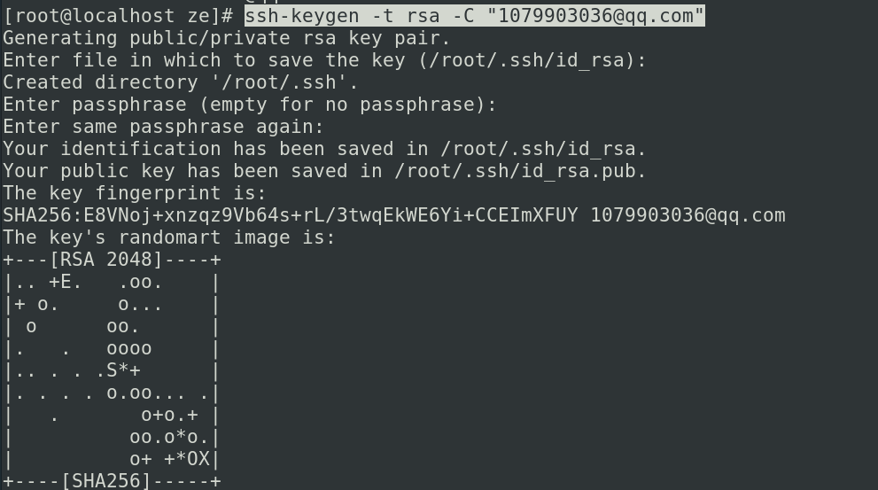

## 完全地覆盖本地的代码，只保留服务器端代码，则直接回退到上一个版本，再进行pull

`git reset --hard` 

`git pull origin master`

注：master为分支名

## CentOS 7 配置

// 安装git

sudo yum -y install git

git --version

// 配置名字和邮箱

git config --global user.name "ze"

git config --global user.email "1079903036@qq.com"

// 查看配置信息

git config --global --list

// 安装SSH密钥  会提示路径

ssh-keygen -t rsa -C "1079903036@qq.com"

// 读取密钥

vim id_rsa.pub 

// 克隆仓库

git clone git@github.com:Chenyz6/CentOS764bit_Code.git

