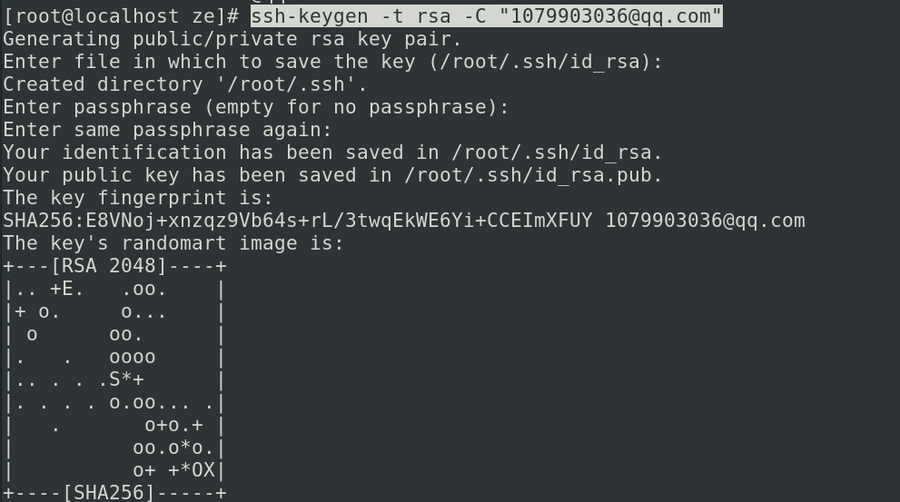
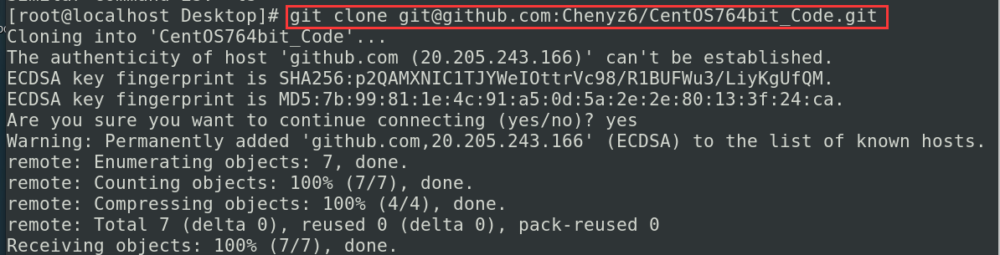
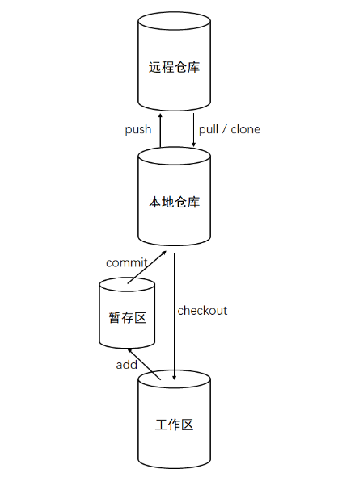
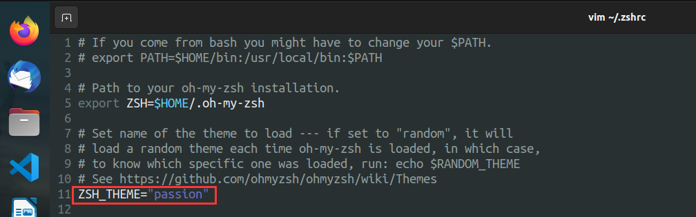
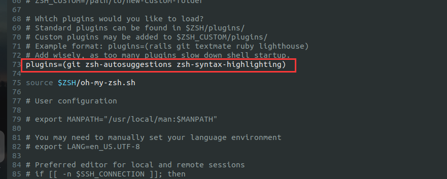
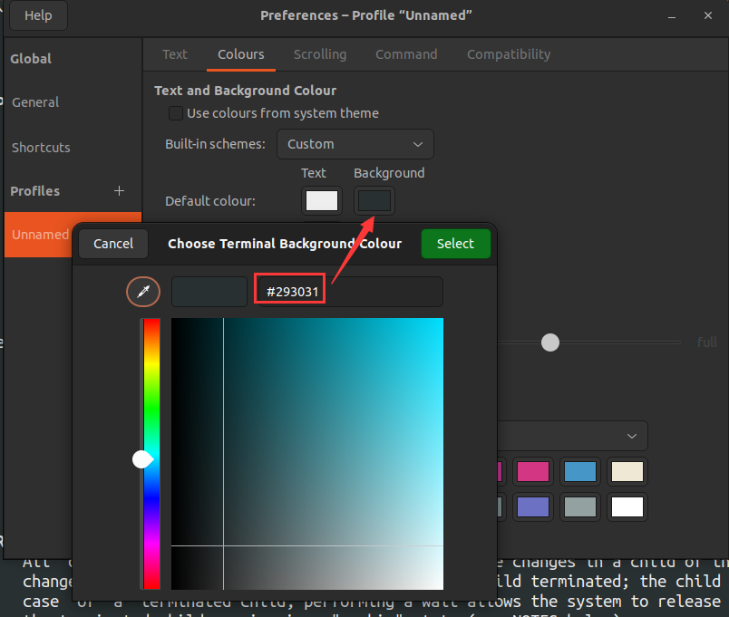

## 完全地覆盖本地的代码，只保留服务器端代码，则直接回退到上一个版本，再进行pull

`git reset --hard` 

`git pull origin master`

注：master为分支名


## CentOS 7 git 配置

// 安装git

sudo yum -y install git

git --version

// 配置名字和邮箱

git config --global user.name "ze"

git config --global user.email "1079903036@qq.com"

// 查看配置信息

git config --global --list

// 安装SSH密钥  会提示路径

ssh-keygen -t rsa -C "1079903036@qq.com"



// 读取密钥

vim id_rsa.pub 

// 克隆仓库

git clone git@github.com:Chenyz6/CentOS764bit_Code.git




// 提交到远程仓库-------------------

git push --progress "origin" main

// 添加本地文件到缓存区

将需要上传的代码或文件拷贝到新建文件夹里

在Git里输入以下代码回车

```text
git add .
```

注意add与“.”之间有一个空格。

// 为上传文件添加注释

等待缓存完毕，输入命令：

```text
git commit -m "first push"
```

其中的first push为注释的内容，请自定义填写。

// 提交本地文件到github新建项目中

等待上步完成，继续输入执行命令：

```text
git push origin main
```


## Ubuntu git 配置

sudo apt update																			列出所有可更新的软件清单命令

sudo apt upgrade						  												升级软件包

sudo apt install git     																	安装git

git config --global user.name "ze-ubuntu"								设置名称

git config --global user.email "1079903036@qq.com"			设置邮箱

git config --global --list																  查看配置信息

ssh-keygen -t rsa -C "1079903036@qq.com							 生成SSH秘钥

cd ~/.ssh																						  进入到ssh目录

vim id_rsa.pub																			   复制公钥内容

ssh -T git@git.oschina.net															测试是否可以连通

出现Permission denied (publickey)											表示测试成功

git clone git@github.com:Chenyz6/Ubuntu_Code.git			 看在哪个用户生成的SSH密钥，再决定是否加sudo

git status  																					   查看当前状态

git add .  																						 把内容全部添加到本地git缓存区中

git commit -m "提交内容介绍"  													推送修改到本地git库中

git push origin main																	  提交到远程仓库

git pull origin main																	    从远程仓库拉取




##  lazygit 安装步骤

```
LAZYGIT_VERSION=$(curl -s "https://api.github.com/repos/jesseduffield/lazygit/releases/latest" | grep -Po '"tag_name": "v\K[^"]*')
curl -Lo lazygit.tar.gz "https://github.com/jesseduffield/lazygit/releases/latest/download/lazygit_${LAZYGIT_VERSION}_Linux_x86_64.tar.gz"
tar xf lazygit.tar.gz lazygit
sudo install lazygit /usr/local/bin
```


## zsh配置

**第一步 → 把 oh-my-zsh 项目 Clone 下来：**

```bash
git clone https://github.com/robbyrussell/oh-my-zsh.git ~/.oh-my-zsh
```

**第二步 → 复制 .zshrc**

```bash
cp ~/.oh-my-zsh/templates/zshrc.zsh-template ~/.zshrc
```

**第三步 → 更改你的默认 Shell**

```bash
chsh -s /bin/zsh
```

**第四步 → 主题下载**

```bash
https://github.com/ohmyzsh/ohmyzsh/wiki/External-themes
```


**自动补齐**

git clone https://github.com/zsh-users/zsh-autosuggestions $ZSH_CUSTOM/plugins/zsh-autosuggestions

**高亮**

git clone https://github.com/zsh-users/zsh-syntax-highlighting.git $ZSH_CUSTOM/plugins/zsh-syntax-highlighting


安装插件

```bash
vim ~/.zshrc
```

执行文件

```bash
source ~/.zshrc
```







