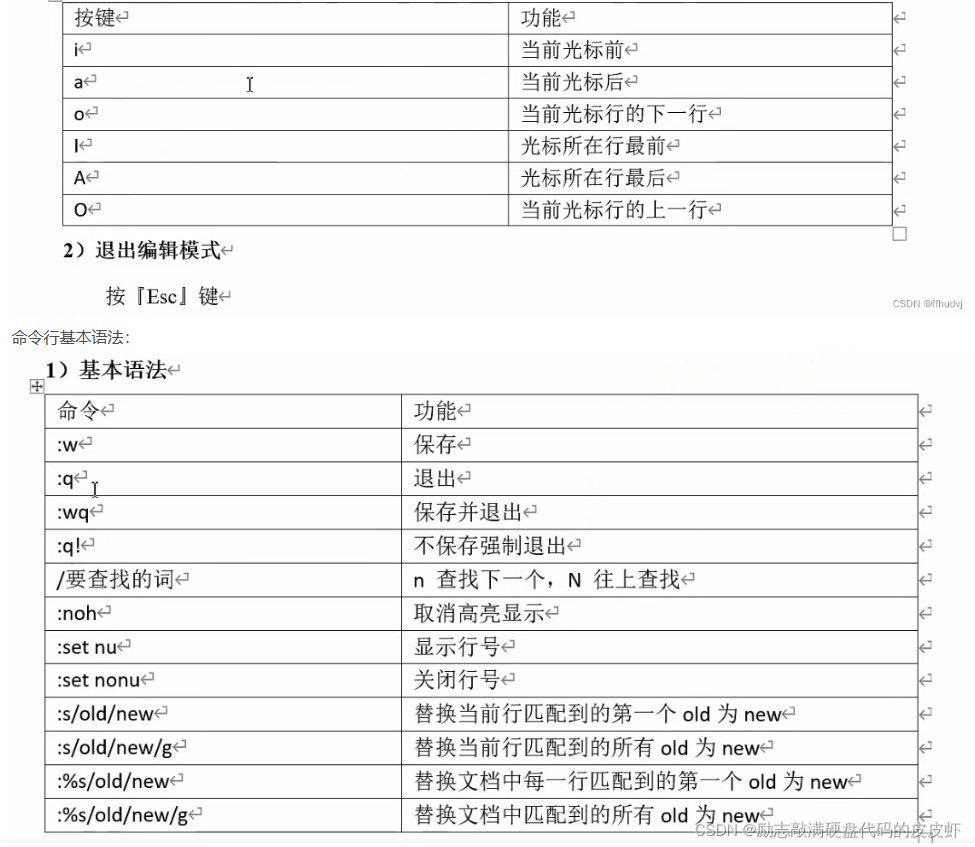
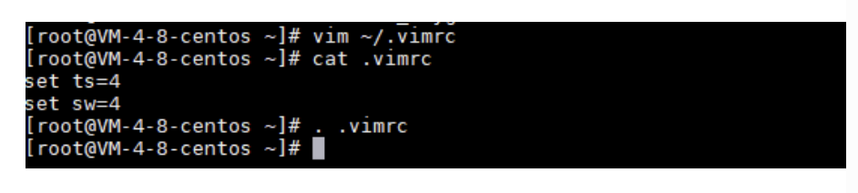

# Linux常用命令

## 清屏命令

1. clear

\#实质上是翻页,只要往上翻还是能看到之前的记录

2. ctrl + L

\#等价于 clear

## 分屏

```
:vsp filename
```


## vim




 *号从上往下找

#号从下往上找


### 设置vim  tab首行缩进为4个空格



  1 set ts=4
  2 set sw=4
  3 imap ( ()<ESC>i        "设置（自动补全
  4 imap [ []<ESC>i
  5 imap { {}<ESC>i
  6 imap < <><ESC>i
  7 imap ' ''<ESC>i
  8 imap " ""<ESC>i
  9 set nu 						"设置显示行号
 10 set ruler				    "设置标尺
 11 set ai						 "设置文本高亮
 12 set autoindent		"设置自动缩进（与上一行的缩进相同）


### 查看Man Page    --->    shift + k （K）

####  

### 高亮显示

在编辑器里非编辑状态，输入：
shift + 3 （#）
shift + 8 （*）
会出现高亮显示，看着很不舒服，
取消方式:
：noh


### 查找宏定义

【 + d         左中括号 ＋ d


## 删除后缀名相同文件  用*


## ldd命令 查看可执行程序加载哪些库和路径


## cat tac命令

只输入cat  用来回显   （你输入什么，它输出什么）

tac   反过来输出显示


## 大文本查看命令 more less head tail


## stat命令

文件/文件系统的详细信息显示


## 用户用户组


### whoami

查看当前用户


### chmod


### chown


### chgrp


### 直接修改用户和用户组


## find命令   -- 找文件


## grep命令   -- 找文件内容


## ps命令

ps aux    如果直接用ps命令，会显示所有进程的状态，通常结合**grep**命令查看某进程的状态


ps ajx    查看父进程ID，进程ID，进程组ID，会话ID的方法：ps ajx


ps -Lf 进程号               查看单前的进程的线程


## **sudo apt update**

列出所有可更新的软件清单命令


## **sudo apt upgrade**

升级软件包


## strace  查看系统调用


## ulimit -a 显示当前的各种用户进程限制


# Linux问题


## 用自己新加的库 编译报错


[解决error while loading shared libraries: libXXX.so.X: cannot open shared object file: No such file_Mr.deeplan的博客-CSDN博客](https://blog.csdn.net/deeplan_1994/article/details/83927832?utm_medium=distribute.pc_relevant_right.none-task-blog-BlogCommendFromMachineLearnPai2-1.nonecase&depth_1-utm_source=distribute.pc_relevant_right.none-task-blog-BlogCommendFromMachineLearnPai2-1.nonecase)

进入root用户 


## 切换root用户报错 Authentication failure

