## man 手册

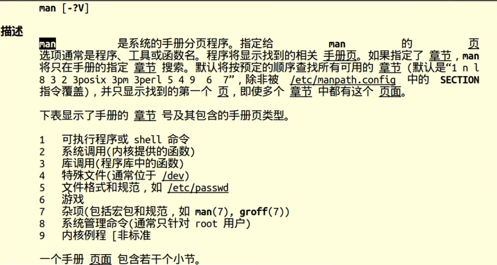

**内核：操作系统核心程序**

## 库函数和系统调用

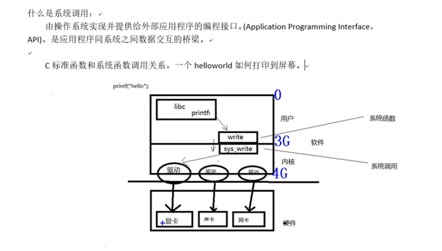

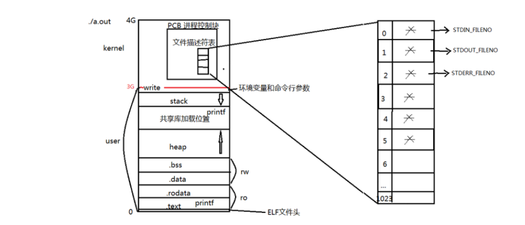

## umask

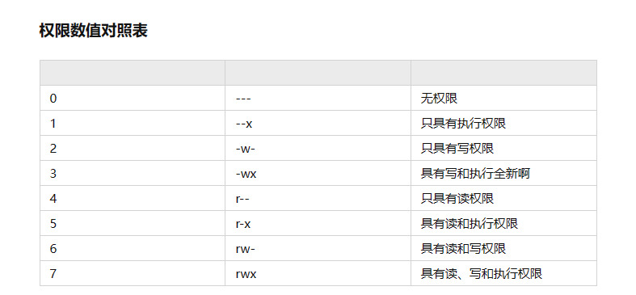

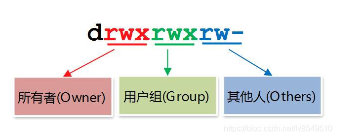

[root@localhost ~]# umask
0022
**\#root用户默认是0022，普通用户默认是 0002**

显然，如果想最终得到文件或目录的初始权限值，我们还需要了解文件和目录的最大默认权限值。在 Linux 系统中，文件和目录的最大默认权限是不一样的：

- **对文件来讲，其可拥有的最大默认权限是 666**，即 rw- rw- rw-。也就是说，使用文件的任何用户都没有执行（x）权限。原因很简单，执行权限是文件的最高权限，赋予时绝对要慎重，因此绝不能在新建文件的时候就默认赋予，只能通过用户手工赋予。
- **对目录来讲，其可拥有的最大默认权限是 777**，即 rwx rwx rwx。

## open函数：

	int open(char *pathname, int flags)	#include <unistd.h>
	
	参数：
		pathname: 欲打开的文件路径名
	
		flags：文件打开方式：	#include <fcntl.h>
	
			O_RDONLY|O_WRONLY|O_RDWR	O_CREAT|O_APPEND|O_TRUNC|O_EXCL|O_NONBLOCK ....
			
	O_TRUNC 把文件截断成0，把文件清0
	
	返回值：
		成功： 打开文件所得到对应的 文件描述符（整数）
	
		失败： -1， 设置errno	
	
	int open(char *pathname, int flags, mode_t mode)		123  775	
	
	参数：
		pathname: 欲打开的文件路径名
	
		flags：文件打开方式：	O_RDONLY|O_WRONLY|O_RDWR	O_CREAT|O_APPEND|O_TRUNC|O_EXCL|O_NONBLOCK ....
	
		mode: 参数3使用的前提， 参2指定了 O_CREAT。	取值8进制数，用来描述文件的 访问权限。 rwx    0664
	
			创建文件最终权限 = mode & ~umask
	
	返回值：
		成功： 打开文件所得到对应的 文件描述符（整数）
	
		失败： -1， 设置errno	

## close函数：

	int close(int fd);

错误处理函数：		与 errno 相关。

	printf("xxx error: %d\n", errno);
	
	char *strerror(int errnum);
	
		printf("xxx error: %s\n", strerror(errno));
	
	void perror(const char *s);
	
		perror("open error");

## read函数：

	ssize_t read(int fd, void *buf, size_t count);
	
	参数：
		fd：文件描述符
	
		buf：存数据的缓冲区
	
		count：缓冲区大小
	
	返回值：
	
		0：读到文件末尾。
	
		成功；	> 0 读到的字节数。
	
		失败：	-1， 设置 errno
	
		-1： 并且 errno = EAGIN 或 EWOULDBLOCK, 说明不是read失败，而是read在以非阻塞方式读一个设备文件（网络文件），并且文件无数据。

## write函数：

	ssize_t write(int fd, const void *buf, size_t count);
	
	参数：
		fd：文件描述符
	
		buf：待写出数据的缓冲区
	
		count：数据大小
	
	返回值：
	
		成功；	写入的字节数。
	
		失败：	-1， 设置 errno

## perror所用头文件（自动翻译errno）

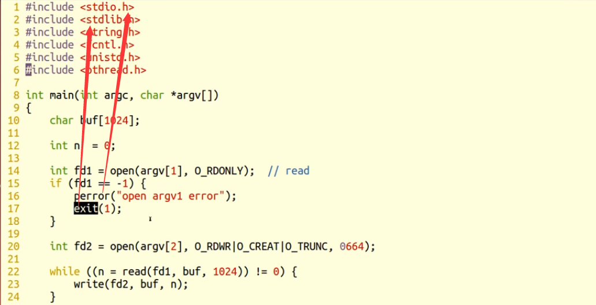

**perror()          #include<stdio.h>**

**exit()				#include <stdlib.h>**

**strerror(errno)        errno -- 全局变量 #include <errno.h>**

## fgetc()

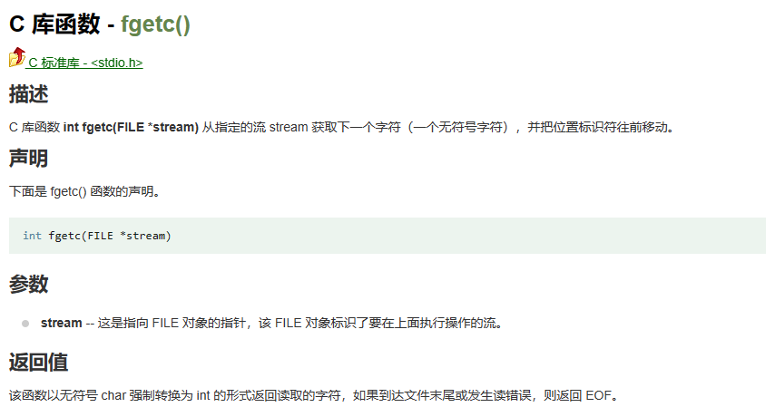

## fputc()

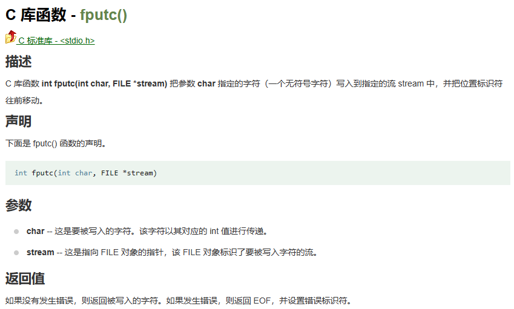

## fgets()

## fputs()

## strace  查看系统调用

## 缓冲区fputs（）

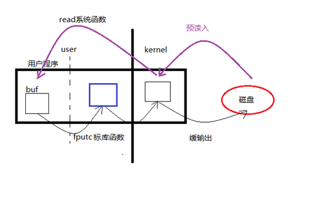

**用户空间  进入  内核空间 ----------消耗时间大**

## 文件描述符：

	PCB进程控制块：本质 结构体。
	
	成员：文件描述符表。
	
	文件描述符：0/1/2/3/4。。。。/1023     表中可用的最小的。
	
	0 - STDIN_FILENO
	
	1 - STDOUT_FILENO
	
	2 - STDERR_FILENO

## 阻塞、非阻塞：  是设备文件、网络文件的属性。

	产生阻塞的场景。 读设备文件。读网络文件。（读常规文件无阻塞概念。）
	
	/dev/tty -- 终端文件。
	
	open("/dev/tty", O_RDWR|O_NONBLOCK)	--- 设置 /dev/tty 非阻塞状态。(默认为阻塞状态)

**read   返回-1      并且errno = EAGAIN  表示     文件设置了非阻塞但是没有数据**

**read返回 -1： 并且 errno = EAGIN 或 EWOULDBLOCK, 说明不是read失败，而是read在以非阻塞方式读一个设备文件（网络文件），并且文件无数据。**

## fcntl：int (int fd, int cmd, ...) 

	int flgs = fcntl(fd,  F_GETFL);
	
	flgs |= O_NONBLOCK
	
	fcntl(fd,  F_SETFL, flgs);
	
	获取文件状态： F_GETFL
	
	设置文件状态： F_SETFL

**flags   --   位图**

## lseek函数：

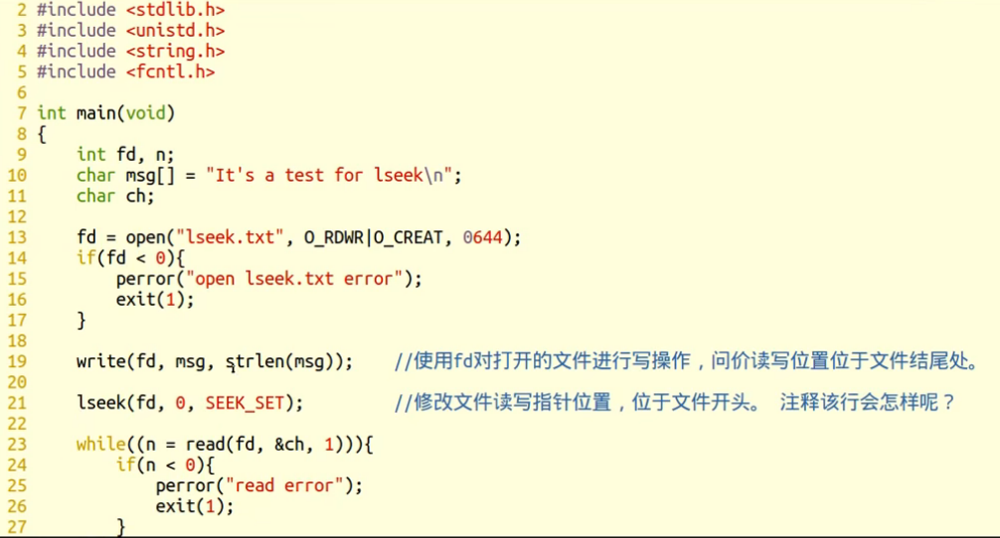

	off_t lseek(int fd, off_t offset, int whence);
	
	参数：
		fd：文件描述符
	
		offset： 偏移量
	
		whence：起始偏移位置： SEEK_SET/SEEK_CUR/SEEK_END
	
	返回值：
	
		成功：较起始位置偏移量
	
		失败：-1 errno

### 应用场景：	

1.文件的“读”、“写”使用同一偏移位置。

2. **使用lseek获取文件大小   把whence设置成SEEK_END  返回的值就是从头到结尾的偏移量**

3. **使用lseek拓展文件大小：要想使文件大小真正拓展，必须引起IO操作。**

	使用 truncate 函数，直接拓展文件。	int ret = truncate("dict.cp", 250);
	
	截断文件长度成指定长度。常用来拓展文件大小，代替lseek。
	
	​    **int truncate(const char *path, off_t length);   成功：0；失败：-1设置errno为相应值**
	
	​    **int ftruncate(int fd, off_t length);**
	
	
	
	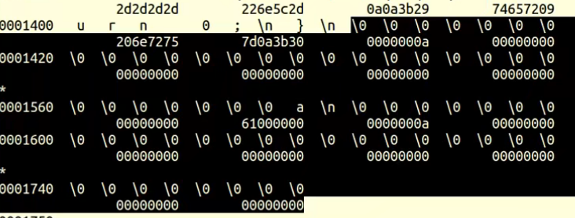
	
	od -tcx filename 查看文件的16进制表示形式    ----->  查看一些看不懂的内容
	
	od -tcd filename 查看文件的10进制表示形式 

## 传入参数：

	1. 指针作为函数参数。
	
	2. 同常有const关键字修饰。
	
	3. 指针指向有效区域， 在函数内部做读操作。

## 传出参数：

	1. 指针作为函数参数。
	
	2. 在函数调用之前，指针指向的空间可以无意义，但必须有效。
	
	3. 在函数内部，做写操作。
	
	4. 函数调用结束后，充当函数返回值。

## 传入传出参数：

	1. 指针作为函数参数。
	
	2. 在函数调用之前，指针指向的空间有实际意义。
	
	3. 在函数内部，先做读操作，后做写操作。
	
	4. 函数调用结束后，充当函数返回值。

## inode 

**其本质为结构体，存储文件的属性信息。**如：权限、类型、大小、时间、用户、盘块位置……也叫作文件属性管理结构，大多数的inode都存储在磁盘上。

少量常用、近期使用的inode会被缓存到内存中。

## dentry  目录项

**目录项，其本质依然是结构体**，重要成员变量有两个 {文件名，inode，...}，而文件内容(data)保存在磁盘盘块中。

读法：de n try

## stat/lstat 函数：

### 符号穿透：stat会。lstat不会。

### cat 会穿透符号链接

### ls -l 不会穿透符号链接

	#include <sys/stat.h>
	
	int stat(const char *path, struct stat *buf);
	
	参数：
		path： 文件路径
	
		buf：（传出参数） 存放文件属性。
	
	返回值：
	
		成功： 0
	
		失败： -1 errno
	
	获取文件大小： buf.st_size
	
	获取文件类型： buf.st_mode
	
	获取文件权限： buf.st_mode

## ln

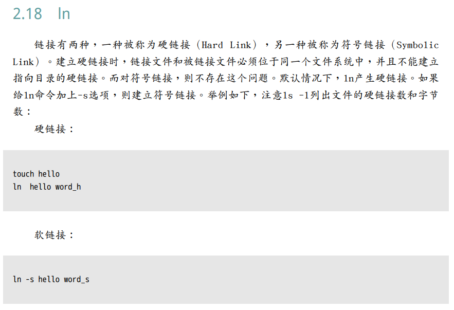

## link/unlink:

	隐式回收。

 删除一个文件的目录项；

​     int unlink(const char *pathname); 成功：0；失败：-1设置errno为相应值

​     注意Linux下删除文件的机制：不断将st_nlink -1，直至减到0为止。无目录项对应的文件，将会被操作系统择机释放。(具体时间由系统内部调度算法决定)

​     因此，我们删除文件，从某种意义上说，**只是让文件具备了被释放的条件。**

unlink函数的特征：清除文件时，如果文件的硬链接数到0了，没有dentry对应，但该文件仍不会马上被释放。要等到所有打开该文件的进程关闭该文件，系统才会挑时间将该文件释放掉。      

## readlink 得到链接所指向的文件名

**读取符号链接文件本身内容，得到链接所指向的文件名。**

ssize_t readlink(const char *path, char *buf, size_t bufsiz);  

成功：返回实际读到的字节数；

失败：-1设置errno为相应值。

## rename函数

重命名一个文件。

 int rename(const char *oldpath, const char *newpath); 成功：0；失败：-1设置errno为相应值

## getcwd函数

获取进程当前工作目录     (卷3，标库函数)

​          char *getcwd(char *buf, size_t size);    成功：buf中保存当前进程工作目录位置。失败返回NULL。

## chdir函数

改变当前进程的工作目录

​          int chdir(const char *path);  成功：0；失败：-1设置errno为相应值

 

## 文件，目录权限

## 目录操作函数：

	DIR * opendir(char *name);
	
	int closedir(DIR *dp);
	
	struct dirent *readdir(DIR * dp);
	
		struct dirent {
	
			inode
	
			char dname[256];
		}

## opendir函数

#include <dirent.h>

根据传入的目录名打开一个目录 (库函数)                    DIR * 类似于 FILE *

​     DIR *opendir(const char *name);   

成功  返回指向该目录结构体指针，

失败  返回NULL    

  参数支持相对路径、绝对路径两种方式：例如：打开当前目录：① getcwd() , opendir() ② opendir(".");

## closedir函数

关闭打开的目录

int closedir(DIR *dirp);       成功：0；失败：-1设置errno为相应值

## readdir函数

读取目录     (库函数)

​     struct dirent *readdir(DIR *dirp); 

成功返回目录项结构体指针；

失败返回NULL设置errno为相应值

需注意返回值，读取数据结束时也返回NULL值，所以应借助errno进一步加以区分。

eg： 打印文件目录内容      用while一个一个取出来

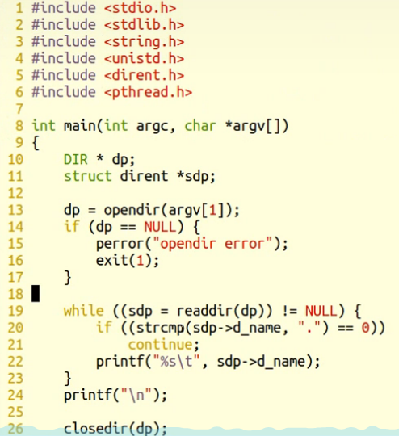

## BitMask掩码

BitMask在计算机学中指的是一串二进制数字，通过与目标数字的按位操作，达到屏蔽指定位的目的。

## 字符串拼接方法

## 递归遍历目录代码

 [ls-R.c](ls-R.c) 
