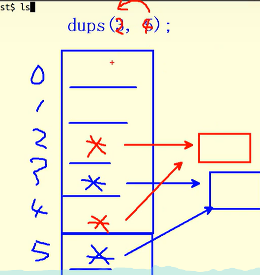

## 递归遍历目录：ls-R.c

	1. 判断命令行参数，获取用户要查询的目录名。	int argc, char *argv[1]
	
		argc == 1  --> ./
	
	2. 判断用户指定的是否是目录。 stat  S_ISDIR(); --> 封装函数 isFile() {   }
	
	3. 读目录： read_dir() { 
	
		opendir（dir）
	
		while （readdir（））{
	
			普通文件，直接打印
	
			目录：
				拼接目录访问绝对路径。sprintf(path, "%s/%s", dir, d_name) 
	
				递归调用自己。--》 opendir（path） readdir closedir
		}
	
		closedir（）
	
		}
		read_dir() --> isFile() ---> read_dir()

## dup 和 dup2： duplicate

dup（）    **复制**一份到新的文件描述符！！！

	int dup(int oldfd);		文件描述符复制。
	
		oldfd: 已有文件描述符
	
		返回：新文件描述符。
	
	int dup2(int oldfd, int newfd); 文件描述符复制。重定向。

dup2（）

## fcntl 函数实现 dup：

	int fcntl(int fd, int cmd, ....)
	
	cmd: F_DUPFD
	
	参3:  	被占用的，返回最小可用的。
	
		未被占用的， 返回=该值的文件描述符。
	
	传参了就是dup2	

## 进程：
程序：死的。只占用磁盘空间。		——剧本。

进程；活的。运行起来的程序。占用内存、cpu等系统资源。	——戏。

## PCB进程控制块：

	进程id
	
	文件描述符表
	
	进程状态：	初始态、就绪态、运行态、挂起态、终止态。
	
	进程工作目录位置
	
	*umask掩码 
	
	信号相关信息资源。
	
	用户id和组id

## fork函数：

	pid_t fork(void)
	
	创建子进程。父子进程各自返回。父进程返回子进程pid。 子进程返回 0.
	
	getpid();getppid();
	
	循环创建N个子进程模型。 每个子进程标识自己的身份。

## 父子进程相同：

	刚fork后。 data段、text段、堆、栈、环境变量、全局变量、宿主目录位置、进程工作目录位置、信号处理方式

## 父子进程不同：

	进程id、返回值、各自的父进程、进程创建时间、闹钟、未决信号集

## 父子进程共享：

	读时共享、写时复制。———————— 全局变量。
	
	1. 文件描述符 2. mmap映射区。

​	
​	

​	