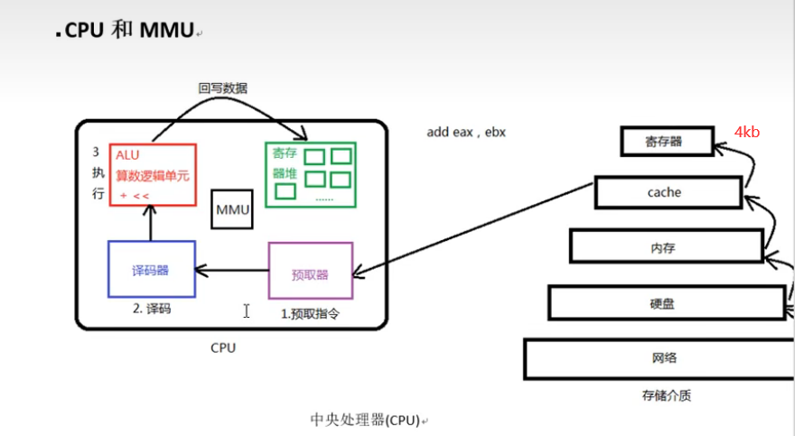
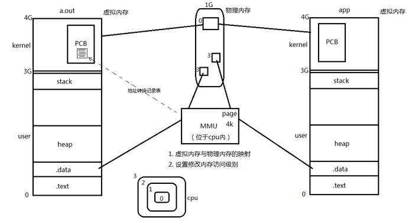
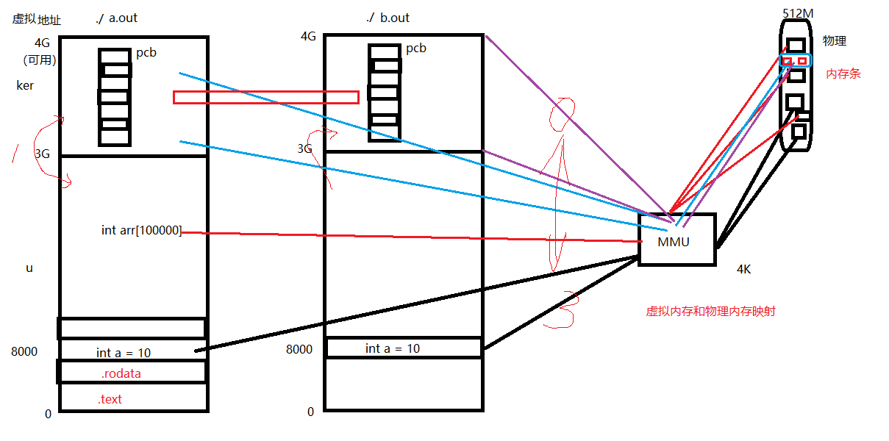
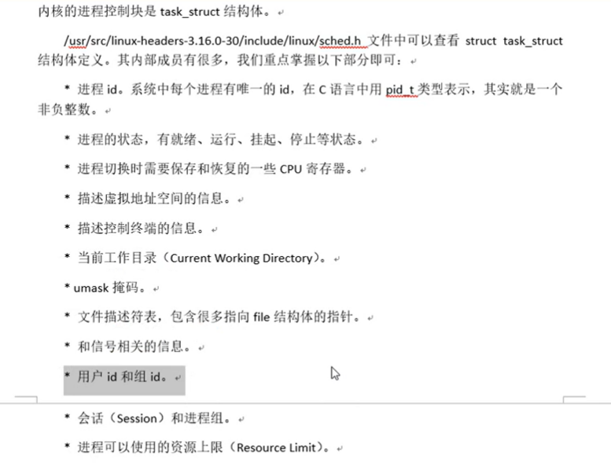
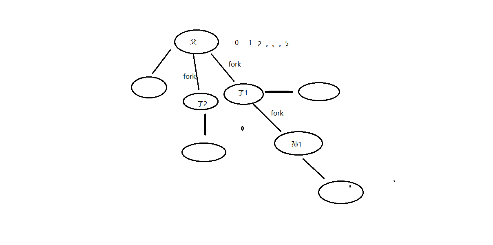
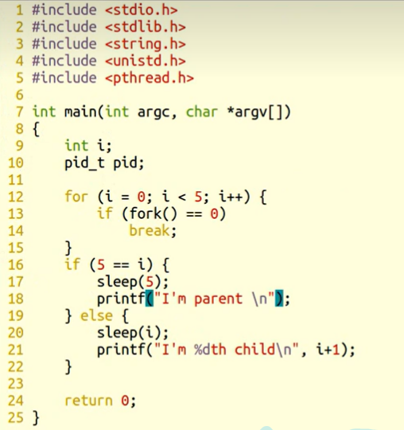
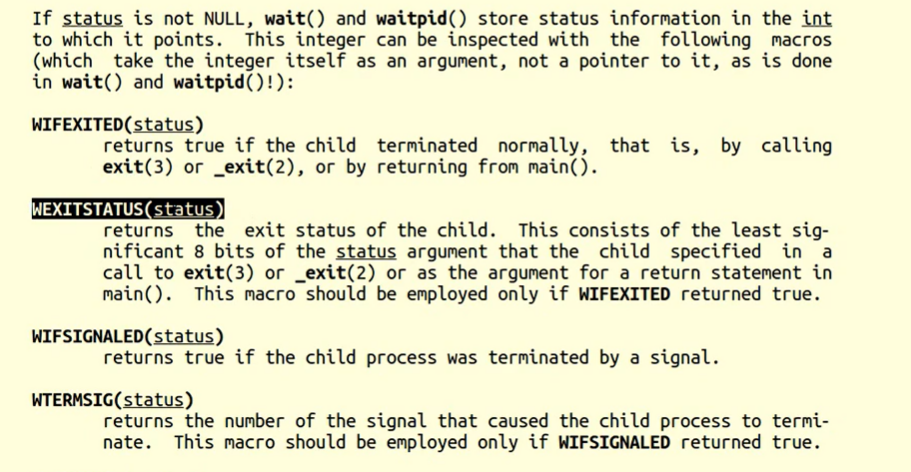
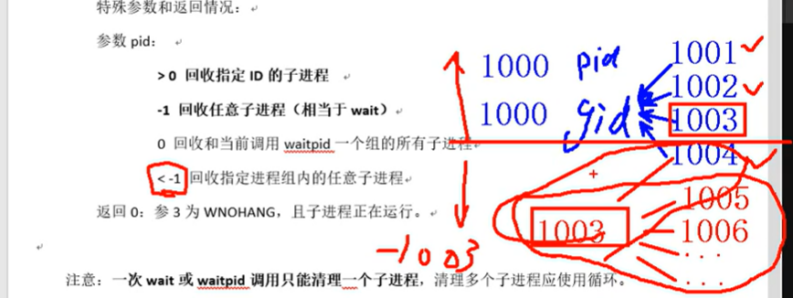

## 进程：

程序：死的。只占用磁盘空间。		——剧本。

进程；活的。运行起来的程序。占用内存、cpu等系统资源。	——戏。

## MMU 内存管理单元

MMU(Memory Management Unit)，即内存管理单元

## PCB进程控制块：

	进程id
	
	文件描述符表
	
	进程状态：	初始态、就绪态、运行态、挂起态、终止态。
	
	进程工作目录位置
	
	*umask掩码 
	
	信号相关信息资源。
	
	用户id和组id

## 环境变量：

环境变量，是指在[操作系统](http://baike.baidu.com/view/880.htm)中用来指定操作系统运行环境的一些参数。通常具备以下特征：

① 字符串(本质) ② 有统一的格式：名=值[:值] ③ 值用来描述进程环境信息。

存储形式：与命令行参数类似。char *[]数组，数组名environ，内部存储字符串，NULL作为哨兵结尾。

使用形式：与命令行参数类似。

加载位置：与命令行参数类似。位于用户区，高于stack的起始位置。

引入环境变量表：须声明环境变量。extern char ** environ;      

### 常见环境变量

按照惯例，环境变量字符串都是name=value这样的形式，大多数name由大写字母加下划线组成，一般把name的部分叫做环境变量，value的部分则是环境变量的值。环境变量定义了进程的运行环境，一些比较重要的环境变量的含义如下：

#### PATH

**可执行文件的搜索路径**。ls命令也是一个程序，执行它不需要提供完整的路径名/bin/ls，然而通常我们执行当前目录下的程序a.out却需要提供完整的路径名./a.out，这是因为PATH环境变量的值里面包含了ls命令所在的目录/bin，却不包含a.out所在的目录。PATH环境变量的值可以包含多个目录，用:号隔开。在Shell中用echo命令可以查看这个环境变量的值：

$ echo $PATH

#### SHELL

当前Shell，它的值通常是/bin/bash。

#### TERM

当前终端类型，在图形界面终端下它的值通常是xterm，终端类型决定了一些程序的输出显示方式，比如图形界面终端可以显示汉字，而字符终端一般不行。

#### LANG

语言和locale，决定了字符编码以及时间、货币等信息的显示格式。

#### HOME

当前用户主目录的路径，很多程序需要在主目录下保存配置文件，使得每个用户在运行该程序时都有自己的一套配置。

## Bash Shell

Bash 也是一种跑在你电脑里的*程序*(program)，但它的设计使你能轻松地与之“对话”(talk)。

在你电脑里的每个程序都能做很多不同的事：读取文档、启动其他程序、数学运算、控制设备。

**Bash 这个程序，与他们最大的不同在于，它并不执行某种特定的任务，而是听从你这个用户的命令。**

为此，**一种“语言”被特意创造出来，使你可以与 Bash 对话，告诉它该做什么。这种语言就是 Bash shell 语言**，你之后会与它熟悉亲近起来。

## fork函数：

	pid_t fork(void)
	
	创建子进程。父子进程各自返回。父进程返回子进程pid。 子进程返回 0.
	
	getpid();getppid();
	
	循环创建N个子进程模型。 每个子进程标识自己的身份。

## 父子进程相同：

	刚fork后。 data段、text段、堆、栈、环境变量、全局变量、宿主目录位置、进程工作目录位置、信号处理方式

## 父子进程不同：

	进程id、返回值、各自的父进程、进程创建时间、闹钟、未决信号集

## 父子进程共享：

	读时共享、写时复制。———————— 全局变量。
	
	1. 文件描述符 2. mmap映射区。

父子进程之间在fork后。有哪些相同，那些相异之处呢？

每fork一个子进程都要将父进程的0-3G地址空间完全拷贝一份，然后在映射至物理内存吗？？？

当然不是！父子进程间遵循***读时共享写时复制***的原则。这样设计，无论子进程执行父进程的逻辑还是执行自己的逻辑都能节省内存开销。  

**重点注意！躲避父子进程共享全局变量的知识误区！**

【重点】：父子进程共享：

1. 文件描述符(打开文件的结构体) 
2. mmap建立的映射区 (进程间通信详解)

 

**特别的，fork之后父进程先执行还是子进程先执行不确定。取决于内核所使用的调度算法。**

## 创建五个子进程 顺序打印

## gdb调试：

	设置父进程调试路径：set follow-fork-mode parent (默认)
	
	设置子进程调试路径：set follow-fork-mode child

## exec函数族：

	使进程执行某一程序。成功无返回值，失败返回 -1
	
	int execlp(const char *file, const char *arg, ...);		借助 PATH 环境变量找寻待执行程序
	
		参1： 程序名
	
		参2： argv0
	
		参3： argv1
	
		...： argvN
	
		哨兵：NULL
	
	int execl(const char *path, const char *arg, ...);		自己指定待执行程序路径。
	
	int execvp();

ps ajx --> pid ppid gid sid 

## 孤儿进程：

	父进程先于子进终止，子进程沦为“孤儿进程”，会被 init 进程领养。

## 僵尸进程：

	子进程终止，父进程尚未对子进程进行回收，在此期间，子进程为“僵尸进程”。  kill 对其无效。

## 守护进程（ Daemon）

### 守护进程是运行在后台的一种特殊进程

#### 1、定义

**守护进程是运行在后台的一种特殊进程**，它独立于控制终端并且周期性地执行某种任务或循环等待处理某些事件的发生；它不需要用户输入就能运行而且提供某种服务，**不是对整个系统就是对某个用户程序提供服务**。

**Linux系统的大多数服务器就是通过守护进程实现的**

守护进程一般在系统启动时开始运行，除非强行终止，否则直到系统关机才随之一起停止运行；
守护进程一般都以root用户权限运行，因为要使用某些特殊的端口（1-1024）或者资源；
守护进程的父进程一般都是init进程，因为它真正的父进程在fork出守护进程后就直接退出了，所以守护进程都是孤儿进程，由init接管；
守护进程是非交互式程序，没有控制终端，所以任何输出，无论是向标准输出设备stdout还是标准出错设备stderr的输出都需要特殊处理。
守护进程的名称通常以d结尾，比如sshd、xinetd、crond等

#### 2、作用
1.守护进程是一个生存周期较长的进程，通常独立于控制终端并且周期性的执行某种任务或者等待处理某些待发生的事件
2.大多数服务都是通过守护进程实现的
3.关闭终端，相应的进程都会被关闭，而守护进程却能够突破这种限制
Linux系统的大多数服务器就是通过守护进程实现的。常见的守护进程包括：

系统日志进程syslogd、
web服务器httpd、
邮件服务器sendmail
数据库服务器mysqld等

## wait函数：	

### 回收子进程退出资源， 阻塞回收任意一个。

	pid_t wait(int *status)
	
	参数：（传出） 回收进程的状态。
	
	返回值：成功： 回收进程的pid
	
		失败： -1， errno
	
	函数作用1：	阻塞等待子进程退出
	
	函数作用2：	清理子进程残留在内核的 pcb 资源
	
	函数作用3：	通过传出参数，得到子进程结束状态

用宏函数查看回收子进程的状态status

## 获取子进程正常终止值：

		WIFEXITED(status) --》 为真 --》调用 WEXITSTATUS(status) --》 得到 子进程 退出值。
	
	获取导致子进程异常终止信号：
	
		WIFSIGNALED(status) --》 为真 --》调用 WTERMSIG(status) --》 得到 导致子进程异常终止的信号编号。

可使用wait函数传出参数status来保存进程的退出状态。借助宏函数来进一步判断进程终止的具体原因。宏函数可分为如下三组：

1. WIFEXITED(status) 为非0   → 进程正常结束

​     WEXITSTATUS(status) 如上宏为真，使用此宏 → 获取进程退出状态 (exit的参数)

2. WIFSIGNALED(status) 为非0 → 进程异常终止

​     WTERMSIG(status) 如上宏为真，使用此宏 → 取得使进程终止的那个信号的编号。

3. WIFSTOPPED(status) 为非0 → 进程处于暂停状态

​     WSTOPSIG(status) 如上宏为真，使用此宏 → 取得使进程暂停的那个信号的编号。

​     WIFCONTINUED(status) 为真 → 进程暂停后已经继续运行

## waitpid函数：	

指定某一个进程进行回收。可以设置非阻塞。			

waitpid(-1, &status, 0) == wait(&status);

	pid_t waitpid(pid_t pid, int *status, int options)
	
	参数：
		pid：指定回收某一个子进程pid
	
			> 0: 待回收的子进程pid
	
			-1：任意子进程
	
			0：同组的子进程。
	
		status：（传出） 回收进程的状态。
	
		options：WNOHANG 指定回收方式为，非阻塞。！！！！！！！
	
	返回值：
	
		> 0 : 表成功回收的子进程 pid
	
		0 : 函数调用时， 参3 指定了WNOHANG， 并且，没有子进程结束。
	
		-1: 失败。errno

总结：

	wait、waitpid	一次调用，回收一个子进程。
	
			想回收多个。while 

**注意 子进程的变量空间 和 父进程的变量空间  读写冲突**

