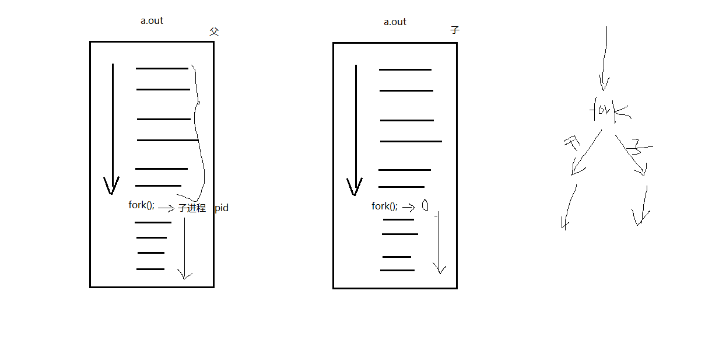

## 进程：

程序：死的。只占用磁盘空间。		——剧本。

进程；活的。运行起来的程序。占用内存、cpu等系统资源。	——戏。

## MMU 内存管理单元

MMU(Memory Management Unit)，即内存管理单元

## PCB进程控制块：

	进程id
	
	文件描述符表
	
	进程状态：	初始态、就绪态、运行态、挂起态、终止态。
	
	进程工作目录位置
	
	*umask掩码 
	
	信号相关信息资源。
	
	用户id和组id

## 环境变量：

环境变量，是指在[操作系统](http://baike.baidu.com/view/880.htm)中用来指定操作系统运行环境的一些参数。通常具备以下特征：

① 字符串(本质) ② 有统一的格式：名=值[:值] ③ 值用来描述进程环境信息。

存储形式：与命令行参数类似。char *[]数组，数组名environ，内部存储字符串，NULL作为哨兵结尾。

使用形式：与命令行参数类似。

加载位置：与命令行参数类似。位于用户区，高于stack的起始位置。

引入环境变量表：须声明环境变量。extern char ** environ;      

### 常见环境变量

按照惯例，环境变量字符串都是name=value这样的形式，大多数name由大写字母加下划线组成，一般把name的部分叫做环境变量，value的部分则是环境变量的值。环境变量定义了进程的运行环境，一些比较重要的环境变量的含义如下：

#### PATH

可执行文件的搜索路径。ls命令也是一个程序，执行它不需要提供完整的路径名/bin/ls，然而通常我们执行当前目录下的程序a.out却需要提供完整的路径名./a.out，这是因为PATH环境变量的值里面包含了ls命令所在的目录/bin，却不包含a.out所在的目录。PATH环境变量的值可以包含多个目录，用:号隔开。在Shell中用echo命令可以查看这个环境变量的值：

$ echo $PATH

#### SHELL

当前Shell，它的值通常是/bin/bash。

#### TERM

当前终端类型，在图形界面终端下它的值通常是xterm，终端类型决定了一些程序的输出显示方式，比如图形界面终端可以显示汉字，而字符终端一般不行。

#### LANG

语言和locale，决定了字符编码以及时间、货币等信息的显示格式。

#### HOME

当前用户主目录的路径，很多程序需要在主目录下保存配置文件，使得每个用户在运行该程序时都有自己的一套配置。

## Bash Shell

Bash 也是一种跑在你电脑里的*程序*(program)，但它的设计使你能轻松地与之“对话”(talk)。

在你电脑里的每个程序都能做很多不同的事：读取文档、启动其他程序、数学运算、控制设备。

**Bash 这个程序，与他们最大的不同在于，它并不执行某种特定的任务，而是听从你这个用户的命令。**

为此，**一种“语言”被特意创造出来，使你可以与 Bash 对话，告诉它该做什么。这种语言就是 Bash shell 语言**，你之后会与它熟悉亲近起来。

## fork函数：

	pid_t fork(void)
	
	创建子进程。父子进程各自返回。父进程返回子进程pid。 子进程返回 0.
	
	getpid();getppid();
	
	循环创建N个子进程模型。 每个子进程标识自己的身份。

## 父子进程相同：

	刚fork后。 data段、text段、堆、栈、环境变量、全局变量、宿主目录位置、进程工作目录位置、信号处理方式

## 父子进程不同：

	进程id、返回值、各自的父进程、进程创建时间、闹钟、未决信号集

## 父子进程共享：

	读时共享、写时复制。———————— 全局变量。
	
	1. 文件描述符 2. mmap映射区。

父子进程之间在fork后。有哪些相同，那些相异之处呢？

每fork一个子进程都要将父进程的0-3G地址空间完全拷贝一份，然后在映射至物理内存吗？？？

当然不是！父子进程间遵循***读时共享写时复制***的原则。这样设计，无论子进程执行父进程的逻辑还是执行自己的逻辑都能节省内存开销。  

**重点注意！躲避父子进程共享全局变量的知识误区！**

【重点】：父子进程共享：

1. 文件描述符(打开文件的结构体) 
2. mmap建立的映射区 (进程间通信详解)

 

**特别的，fork之后父进程先执行还是子进程先执行不确定。取决于内核所使用的调度算法。**

## 创建五个子进程 顺序打印

