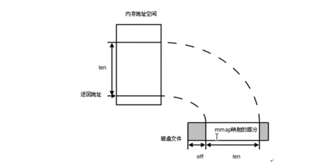

## 进程间通信的常用方式，特征：

### IPC    InterProcess Communication

## 常用的进程间通信方式有：

① 管道 (使用最简单)     有名管道

​	FIFO: 非血缘之间       无名管道

② 信号 (开销最小)

③ 共享映射区 (无血缘关系)

④ 本地套接字 (最稳定)

	管道：简单
	
	信号：开销小
	
	mmap映射：非血缘关系进程间
	
	socket（本地套接字）：稳定

## 管道：

	实现原理： 内核借助环形队列机制，使用内核缓冲区实现。
	
	特质；	1. 伪文件
	
		2. 管道中的数据只能一次读取。
	
		3. 数据在管道中，只能单向流动。
	
	局限性：1. 自己写，不能自己读。
	
		2. 数据不可以反复读。
	
		3. 半双工通信。
	
		4. 血缘关系进程间可用。

## pipe函数：	创建，并打开管道。

	int pipe(int fd[2]);
	
	参数：	fd[0]: 读端。
	
		fd[1]: 写端。
	
	返回值： 成功： 0
	
		 失败： -1 errno

## 管道的读写行为！！！

	读管道：
		1. 管道有数据，read返回实际读到的字节数。
	
		2. 管道无数据：	1）无写端，read返回0 （类似读到文件尾）
	
				2）有写端，read阻塞等待。
	
	写管道：
		1. 无读端， 异常终止。 （SIGPIPE导致的）
	
		2. 有读端：	1） 管道已满， 阻塞等待
	
				2） 管道未满， 返回写出的字节个数。

## pipe管道： 用于有血缘关系的进程间通信。  ps aux | grep 		ls | wc -l	

	父子进程间通信：

	兄弟进程间通信：

## 管道缓冲区大小

​     可以使用ulimit –a 命令来查看当前系统中创建管道文件所对应的内核缓冲区大小。通常为：

​          pipe size      (512 bytes, -p) 8

​     也可以使用**fpathconf**函数，借助参数    选项来查看。使用该宏应引入头文件<unistd.h>

​          long fpathconf(int fd, int name);   成功：返回管道的大小     失败：-1，设置errno

##  fifo管道：可以用于无血缘关系的进程间通信。

	命名管道：  mkfifo 
	
	无血缘关系进程间通信：
	
		读端，open fifo O_RDONLY
	
		写端，open fifo O_WRONLY

## 文件实现进程间通信：

	打开的文件是内核中的一块缓冲区。多个无血缘关系的进程，可以同时访问该文件。

## 共享内存映射:

void *mmap(void *addr, size_t length, int prot, int flags, int fd, off_t offset);		创建共享内存映射

	参数：
		addr： 	指定映射区的首地址。通常传NULL，表示让系统自动分配
	
		length：共享内存映射区的大小。（<= 文件的实际大小）
	
		prot：	共享内存映射区的读写属性。PROT_READ、PROT_WRITE、PROT_READ|PROT_WRITE
	
		flags：	标注共享内存的共享属性。MAP_SHARED、MAP_PRIVATE
	
		fd:	用于创建共享内存映射区的那个文件的 文件描述符。
	
		offset：默认0，表示映射文件全部。偏移位置。需是 4k 的整数倍。
	
	返回值：
	
		成功：映射区的首地址。
	
		失败：MAP_FAILED (void*(-1))， errno

## int munmap(void *addr, size_t length);		释放映射区。

	addr：mmap 的返回值
	
	length：大小

argument   变量

parameter  参数

### 使用注意事项：

	1. 用于创建映射区的文件大小为 0，实际指定非0大小创建映射区，出 “总线错误”。 信号 7  SIGBUS  
	
	2. 用于创建映射区的文件大小为 0，实际制定0大小创建映射区， 出 “无效参数”。
	
	3. 用于创建映射区的文件读写属性为，只读。映射区属性为 读、写。 出 “无效参数”。
	
	4. 创建映射区，需要read权限。当访问权限指定为 “共享”MAP_SHARED是， mmap的读写权限，应该 <=文件的open权限。	只写不行。
	
	5. 文件描述符fd，在mmap创建映射区完成即可关闭。后续访问文件，用 地址访问。
	
	6. offset 必须是 4096的整数倍。（MMU 映射的最小单位 4k ）
	
	7. 对申请的映射区内存，不能越界访问。 
	
	8. munmap用于释放的 地址，必须是mmap申请返回的地址。
	
	9. 映射区访问权限为 “私有”MAP_PRIVATE, 对内存所做的所有修改，只在内存有效，不会反应到物理磁盘上。
	
	10. 映射区访问权限为 “私有”MAP_PRIVATE, 只需要open文件时，有读权限，用于创建映射区即可。

## mmap函数的保险调用方式：

	1. fd = open（"文件名"， O_RDWR）;
	
	2. mmap(NULL, 有效文件大小， PROT_READ|PROT_WRITE, MAP_SHARED, fd, 0);

## 父子进程使用 mmap 进程间通信：

	父进程 先 创建映射区。 open（ O_RDWR） mmap( MAP_SHARED );
	
	指定 MAP_SHARED 权限
	
	fork() 创建子进程。
	
	一个进程读， 另外一个进程写。

## 无血缘关系进程间 mmap 通信：  				【会写】

	两个进程 打开同一个文件，创建映射区。
	
	指定flags 为 MAP_SHARED。
	
	一个进程写入，另外一个进程读出。
	
	【注意】：无血缘关系进程间通信。	mmap：数据可以重复读取。
	
								 fifo：数据只能一次读取。

## 匿名映射：只能用于 血缘关系进程间通信  MAP_ANONYMOUS

	p = (int *)mmap(NULL, 40, PROT_READ|PROT_WRITE, MAP_SHARED|MAP_ANONYMOUS, -1, 0);

用在以前的操作系统 例如类Unix系统 没有MAP_ANONYMOUS

open（“/dev/zero”）			

/dev/zero  -->  从这里面拿数据  有多少拿多少   读出来的数据是\0     是一个特殊的文件，当你读它的时候，它会**提供无限的空字符**(NULL, ASCII NUL, 0x00)。

其中的一个典型用法是用它提供的字符流来覆盖信息，另一个常见用法是产生一个特定大小的空白文件

/dev/null  -->  是一个特殊的文件，它被称为“空设备”。它没有任何数据，读取它永远不会产生任何输出，写入它永远不会导致任何数据被存储。/dev/null 起着**丢弃数据**的作用，可以用于一些需要忽略输出或者输入的场合。