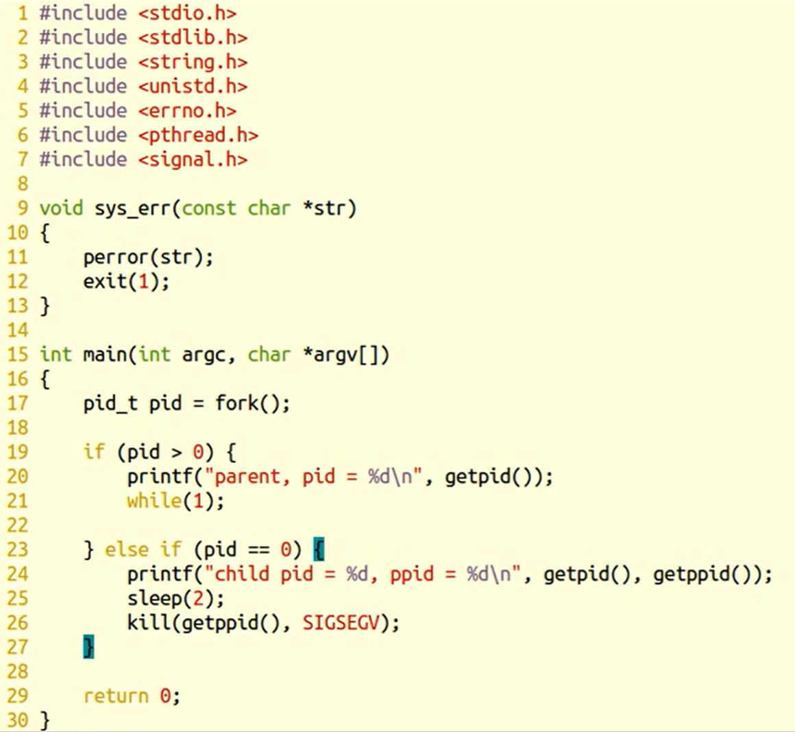
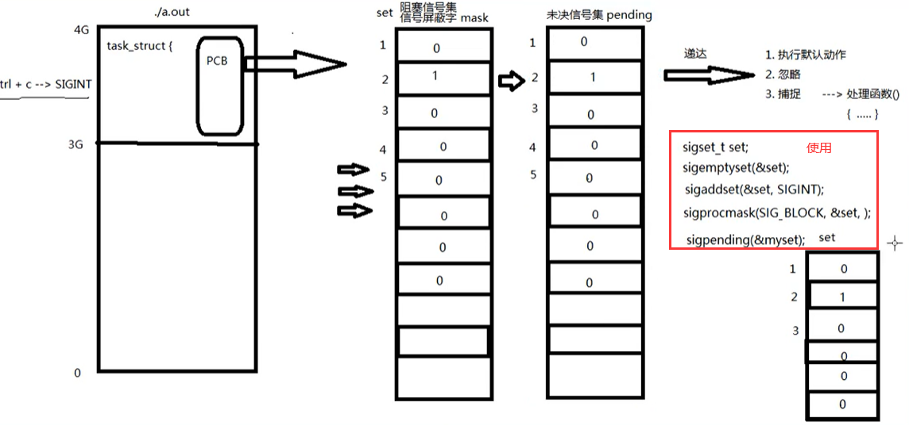
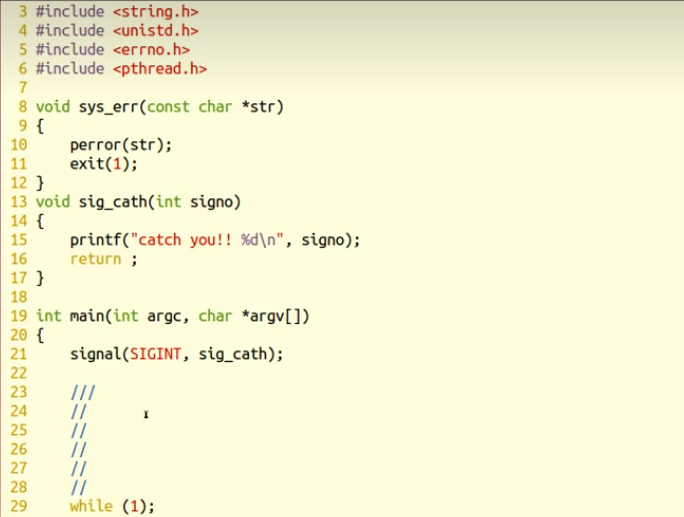
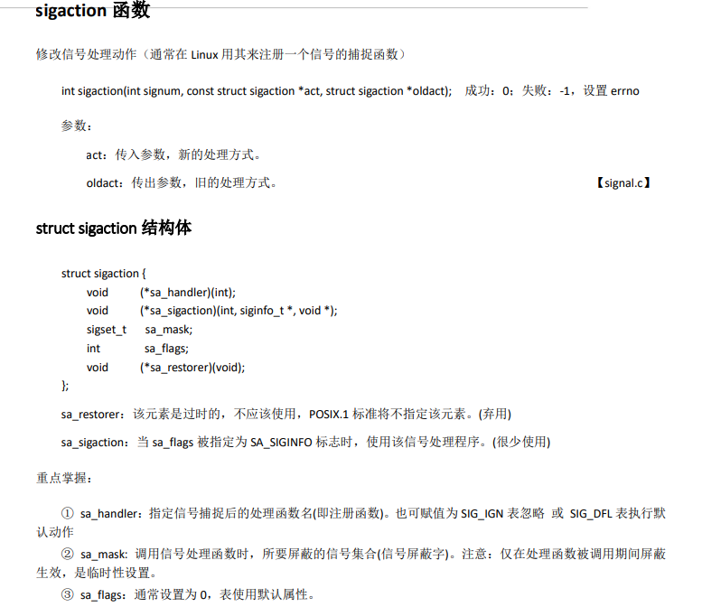
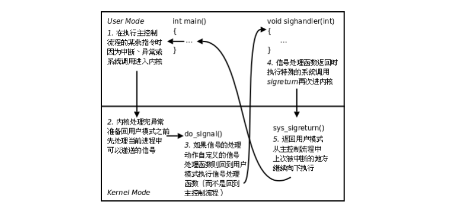

## 信号共性：

	简单、不能携带大量信息、满足条件才发送。

## 信号的特质：

	信号是软件层面上的“中断”。一旦信号产生，无论程序执行到什么位置，必须立即停止运行，处理信号，处理结束，再继续执行后续指令。
	
	所有信号的产生及处理全部都是由【内核】完成的。

## 信号相关的概念：

	产生信号：
	
		1. 按键产生
	
		2. 系统调用产生
	
		3. 软件条件产生
	
		4. 硬件异常产生
	
		5. 命令产生
	
	概念：
		未决：产生与递达之间状态。  
	
		递达：产生并且送达到进程。直接被内核处理掉。
	
		信号处理方式： 执行默认处理动作、忽略、捕捉（自定义）

		阻塞信号集（信号屏蔽字）： 本质：位图。用来记录信号的屏蔽状态。一旦被屏蔽的信号，在解除屏蔽前，一直处于未决态。
	
		未决信号集：本质：位图。用来记录信号的处理状态。该信号集中的信号，表示，已经产生，但尚未被处理。

## 信号4要素：

	信号使用之前，应先确定其4要素，而后再用！！！
	
	编号、名称、对应事件、默认处理动作。

## fork（）

fork调用的一个奇妙之处就是它仅仅被调用一次，却能够返回两次，它可能有三种不同的返回值：

1. 在父进程中，fork返回新创建子进程的进程ID；
2. 在子进程中，fork返回0；
3. 如果出现错误，fork返回一个负值；

## kill命令 和 kill函数：

	int kill（pid_t pid, int signum）
	
	参数：
		pid: > 0:发送信号给指定进程
	
			= 0：发送信号给跟调用kill函数的那个进程处于同一进程组的进程。
	
			< -1: 取绝对值，发送信号给该绝对值所对应的进程组的所有组员。
	
			= -1：发送信号给，有权限发送的所有进程。
	
		signum：待发送的信号
	
	返回值：
		成功： 0
	
		失败： -1 errno

## alarm 函数：使用自然计时法

	定时发送SIGALRM给当前进程。
	
	unsigned int alarm(unsigned int seconds);
	
		seconds：定时秒数
	
		返回值：上次定时剩余时间。
	
			无错误现象。
	
		alarm（0）； 取消闹钟。
	
	time 命令 ： 查看程序执行时间。   实际时间 = 用户时间 + 内核时间 + 等待时间。  --》 优化瓶颈 IO

## setitimer函数：

	int setitimer(int which, const struct itimerval *new_value, struct itimerval *old_value);
	
	参数：
		which：	ITIMER_REAL： 采用自然计时。 ——> SIGALRM
	
			ITIMER_VIRTUAL: 采用用户空间计时  ---> SIGVTALRM
	
			ITIMER_PROF: 采用内核+用户空间计时 ---> SIGPROF
		
		new_value：定时秒数
	
		           类型：struct itimerval {
	
	           				struct timeval {
	           					time_t      tv_sec;         /* seconds */
	           					suseconds_t tv_usec;        /* microseconds */
	
	       				}it_interval;---> 周期定时秒数
	
	           				 struct timeval {
	           					time_t      tv_sec;         
	           					suseconds_t tv_usec;        
	
	       				}it_value;  ---> 第一次定时秒数  
	       			 };
	
		old_value：传出参数，上次定时剩余时间。
	
		e.g.
			struct itimerval new_t;	
			struct itimerval old_t;	
	
			new_t.it_interval.tv_sec = 0;
			new_t.it_interval.tv_usec = 0;
			new_t.it_value.tv_sec = 1;
			new_t.it_value.tv_usec = 0;
	
			int ret = setitimer(&new_t, &old_t);  定时1秒
	
	返回值：
		成功： 0
	
		失败： -1 errno

## 其他几个发信号函数：

	int raise(int sig);
	
	void abort(void);

## 信号集操作函数：

	sigset_t set;  自定义信号集。
	
	sigemptyset(sigset_t *set);	清空信号集
	
	sigfillset(sigset_t *set);	全部置1
	
	sigaddset(sigset_t *set, int signum);	将一个信号添加到集合中
	
	sigdelset(sigset_t *set, int signum);	将一个信号从集合中移除
	
	sigismember（const sigset_t *set，int signum); 判断一个信号是否在集合中。 在--》1， 不在--》0

## 设置信号屏蔽字和解除屏蔽：

	int sigprocmask(int how, const sigset_t *set, sigset_t *oldset);
	
		how:	SIG_BLOCK:	设置阻塞
	
			SIG_UNBLOCK:	取消阻塞
	
			SIG_SETMASK:	用自定义set替换mask。
	
		set：	自定义set
	
		oldset：旧有的 mask。

## 操作信号集

## 查看未决信号集：

	int sigpending(sigset_t *set);
	
		set： 传出的 未决信号集。

## 【信号捕捉】：

	signal();
	
	【sigaction();】 重点！！！

信号捕捉  第二个参数是  **函数指针**

typedef void (*sighandler_t)(int);   // 函数指针 指向一个参数为int类型返回值为void的

## sigaction()函数

##  信号捕捉特性：

	1. 捕捉函数执行期间，信号屏蔽字 由 mask --> sa_mask , 捕捉函数执行结束。 恢复回mask
	
	2. 捕捉函数执行期间，本信号自动被屏蔽(sa_flgs = 0).
	
	3. 捕捉函数执行期间，被屏蔽信号多次发送，解除屏蔽后只处理一次！

借助信号完成 子进程回收。

## 内核实现信号捕捉过程

进内核的时候顺便进行查看信号 

## SIGCHLD 的产生条件

子进程终止时 

子进程接收到 SIGSTOP 信号停止时 

子进程处在停止态，接受到 SIGCONT 后唤醒时

子进程结束运行，其父进程会收到 SIGCHLD 信号。该信号的默认处理动作是忽略。可以捕捉该信号，在捕捉函 数中完成子进程状态的回收。

## 子进程回收

***代码： [catch_child.c](catch_child.c)*** 

pid_ t waitpid(pid_t pid, int *status, int options);
返回值：
当正常返回的时候waitpid返回收集到的子进程的进程ID；
如果设置了选项WNOHANG,而调用中waitpid发现没有已退出的子进程可收集,则返回0；
如果调用中出错,则返回-1,这时errno会被设置成相应的值以指示错误所在；
**参数：**
**pid：**
Pid=-1,等待任一个子进程。与wait等效。
Pid>0.等待其进程ID与pid相等的子进程。
**status:**
WIFEXITED(status): 若为正常终止子进程返回的状态，则为真。（查看进程是否是正常退出）
WEXITSTATUS(status): 若WIFEXITED非零，提取子进程退出码。（查看进程的退出码）
**options:**
参数为0:也就是阻塞版本的等待，也就是说该waitpid在子进程没有退出情况下就不会返回，就和wait的使用一模一样，因为wait的使用就是阻塞版本的等待方式；
参数为WNOHANG: 这是一个宏，表示调用wait为非阻塞的版本，非阻塞也就以为执行带waitpid函数会立即返回；
而设置这个参数：返回情况有以下几种：

若pid指定的子进程没有结束，则waitpid()函数返回0，父进程不予以等待；
若正常结束，则返回该子进程的ID；
若等待失败，即返回小于0；

