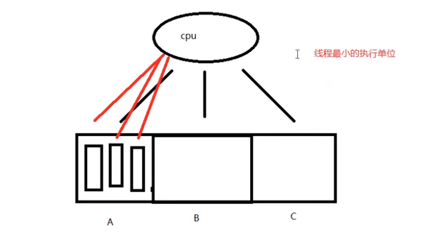
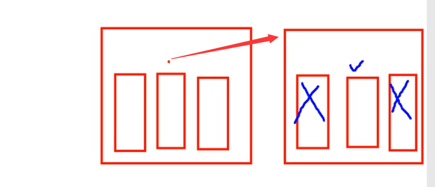
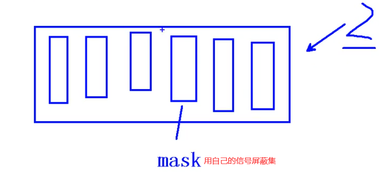

## 守护进程：

	daemon进程。通常运行与操作系统后台，脱离控制终端。一般不与用户直接交互。周期性的等待某个事件发生或周期性执行某一动作。
	
	不受用户登录注销影响。通常采用以d结尾的命名方式。

## 守护进程创建步骤：

	1. fork子进程，让父进程终止。
	
	2.  setsid() 创建新会话
	
	3. 通常根据需要，改变工作目录位置 chdir()， 防止目录被卸载。
	
	4. 通常根据需要，重设umask文件权限掩码，影响新文件的创建权限。  022 -- 755	0345 --- 432   r---wx-w-   422
	
	5. 通常根据需要，关闭/重定向 文件描述符
	
	6. 守护进程 业务逻辑。while（）

创建守护进程代码：  [daemon.c](代码\session_daemon_test\daemon.c) 

## 线程概念：

	进程：有独立的 进程地址空间。有独立的pcb。	分配资源的最小单位。
	
	线程：有独立的pcb。没有独立的进程地址空间。	最小单位的执行。
	
	ps -Lf 进程id 	---> 线程号。LWP  --》cpu 执行的最小单位。

## 线程共享：

	独享 栈空间（内核栈、用户栈）
	
	共享 ./text./data ./rodataa ./bsss heap  ---> 共享【全局变量】（errno）

## LWP：轻量级进程

1. Linux中没有真正的线程，但windows中确实有线程
2. Linux中没有的线程是由进程来模拟实现的（又称作：轻量级进程）
3. 所以在Linux中（在CPU角度看）进程被称作轻量级进程（LWP）
由于Linux下没有真正的线程，只有所谓的用户级线程，线程在CPU地址空间内运行

## pthread_t

 `pthread_t` 为 `unsigned long`

## 线程控制原语：

### pthread_self

	pthread_t pthread_self(void);	获取线程id。 线程id是在进程地址空间内部，用来标识线程身份的id号。
	
		返回值：本线程id

	检查出错返回：  线程中。
	
		fprintf(stderr, "xxx error: %s\n", strerror(ret));

### pthread_create

	int pthread_create(pthread_t *tid, const pthread_attr_t *attr, void *(*start_rountn)(void *), void *arg); 创建子线程。
	
		参1：传出参数，表新创建的子线程 id
	
		参2：线程属性。传NULL表使用默认属性。
	
		参3：子线程回调函数。创建成功，ptherad_create函数返回时，该函数会被自动调用。
	
		参4：参3的参数。指定传递给函数参3的实参，当不需要传递任何数据时，将 arg 赋值为 NULL 即可
	
		返回值：成功：0
	
			失败：errno

	循环创建N个子线程：
	
		for （i = 0； i < 5; i++）
	
			pthread_create(&tid, NULL, tfn, (void *)i);   // 将 int 类型 i， 强转成 void *， 传参。	

代码：  [pthrd_more.c](代码\pthread_test\test\pthrd_more.c) 

### pthread_exit

	void pthread_exit(void *retval);  退出当前线程。
	
		retval：退出值。 无退出值时，NULL
	
		exit();	退出当前进程。
	
		return: 返回到调用者那里去。
	
		pthread_exit(): 退出当前线程。

### pthread_join

	int pthread_join(pthread_t thread, void **retval);	阻塞 回收线程。
	
		thread: 待回收的线程id
	
		retval：传出参数。 回收的那个线程的退出值。
	
			线程异常借助，值为 -1。
	
		返回值：成功：0
	
			失败：errno

代码： [pthrd_join2.c](代码\pthread_test\test\pthrd_join2.c)

### pthread_detach

	int pthread_detach(pthread_t thread);		设置线程分离
	
	thread: 待分离的线程id
	
	返回值：成功：0
		
	失败：errno

实现线程分离 int pthread_detach(pthread_t thread); 成功：0；失败：错误号 

线程分离状态：指定该状态，线程主动与主控线程断开关系。

线程结束后，其退出状态不由其他线程获取，而 直接自己自动释放。网络、多线程服务器常用。 进程若有该机制，将不会产生僵尸进程。僵尸进程的产生主要由于进程死后，大部分资源被释放，一点残留资 源仍存于系统中，导致内核认为该进程仍存在。

一般情况下，线程终止后，其终止状态一直保留到其它线程调用 pthread_join 获取它的状态为止。但是线程也 可以被置为 detach 状态，这样的线程一旦终止就立刻回收它占用的所有资源，而不保留终止状态。 

**不能对一个已经处于 detach 状态的线程调用 pthread_join**，这样的调用将返回 EINVAL 错误。也就是说，如果已 经对一个线程调用了 pthread_detach 就不能再调用 pthread_join 了。

代码： [pthrd_detach.c](代码\pthread_test\test\pthrd_detach.c) 

**strerror(ret)：：翻译错误序号成char ***

### pthread_cancel

	int pthread_cancel(pthread_t thread);		杀死一个线程。  需要到达取消点（保存点）
	
		thread: 待杀死的线程id
		
		返回值：成功：0
	
			失败：errno
	
		如果，子线程没有到达取消点， 那么 pthread_cancel 无效。
	
		我们可以在程序中，手动添加一个取消点。使用 pthread_testcancel();
	
		成功被 pthread_cancel() 杀死的线程，返回 -1.使用pthead_join 回收。

【注意】：线程的取消并不是实时的，而有一定的延时。需要等待线程到达某个取消点(检查点)。 

类似于玩游戏存档，必须到达指定的场所(存档点，如：客栈、仓库、城里等)才能存储进度。杀死线程也不是立刻就能完成，必须要到达取消点。 

取消点：是线程检查是否被取消，并按请求进行动作的一个位置。通常是一些系统调用 creat，open，pause， close，read，write..... 执行命令 man 7 pthreads 可以查看具备这些取消点的系统调用列表。

可粗略认为一个系统调用(进入内核)即为一个取消点。如线程中没有取消点，可以通过调用 pthread_testcancel 函数自行设置一个取消点。

被取消的线程， 退出值定义在Linux的pthread库中。常数PTHREAD_CANCELED的值是-1。可在头文件pthread.h 中找到它的定义：#define PTHREAD_CANCELED ((void *) -1)。因此当我们对一个已经被取消的线程使用 pthread_join 回收时，得到的返回值为-1。

## 线程控制原语            进程控制原语

	线程控制原语					进程控制原语

	pthread_create()				fork();
	
	pthread_self()					getpid();
	
	pthread_exit()					exit(); 		/ return 
	
	pthread_join()					wait()/waitpid()
	
	pthread_cancel()				kill()
	
	pthread_detach()

## 线程属性

	设置分离属性
	
	pthread_attr_t attr  	创建一个线程属性结构体变量
	
	pthread_attr_init(&attr);	初始化线程属性
	
	pthread_attr_setdetachstate(&attr,  PTHREAD_CREATE_DETACHED);		设置线程属性为 分离态
	
	pthread_create(&tid, &attr, tfn, NULL); 借助修改后的 设置线程属性 创建为分离态的新线程
	
	pthread_attr_destroy(&attr);	销毁线程属性

​			

	## 线程注意事项

1. 主线程退出其他线程不退出，主线程应调用 pthread_exit

2.  避免僵尸线程 pthread_join pthread_detach pthread_create 指定分离属性 被 join 线程可能在 join 函数返回前就释放完自己的所有内存资源，所以不应当返回被回收线程栈中的值; 

3. malloc 和 mmap 申请的内存可以被其他线程释放 

4. 应避免在多线程模型中调用 fork 除非，马上 exec，**子进程中只有调用 fork 的线程存在，其他线程在子进程 中均 pthread_exit** 

   

5. 信号的复杂语义很难和多线程共存，应避免在多线程引入信号机制

​	

​	