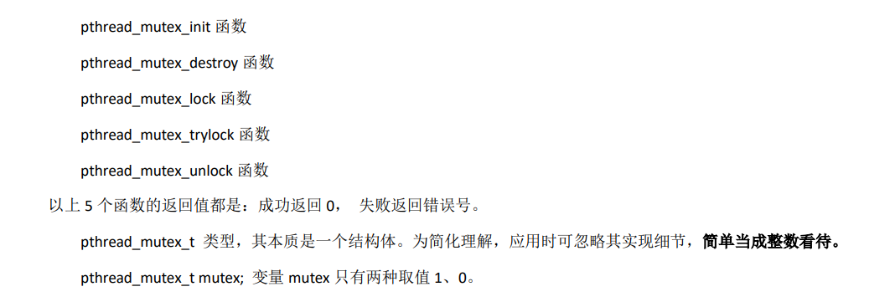
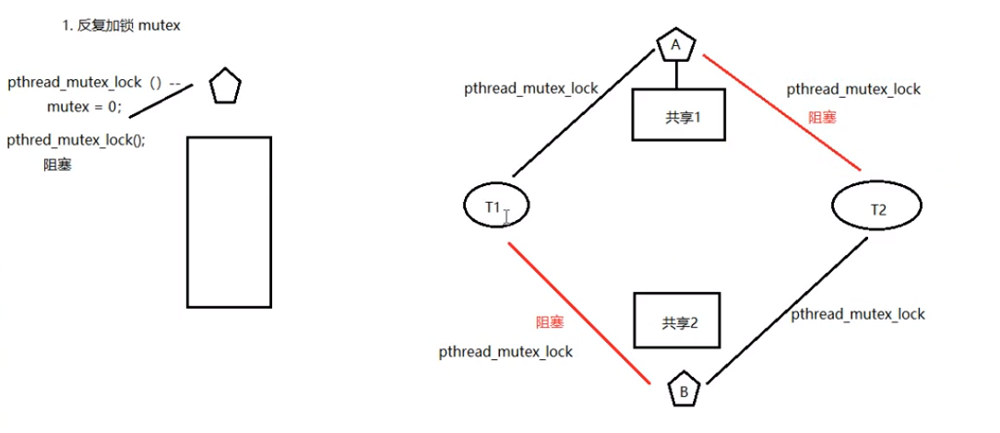
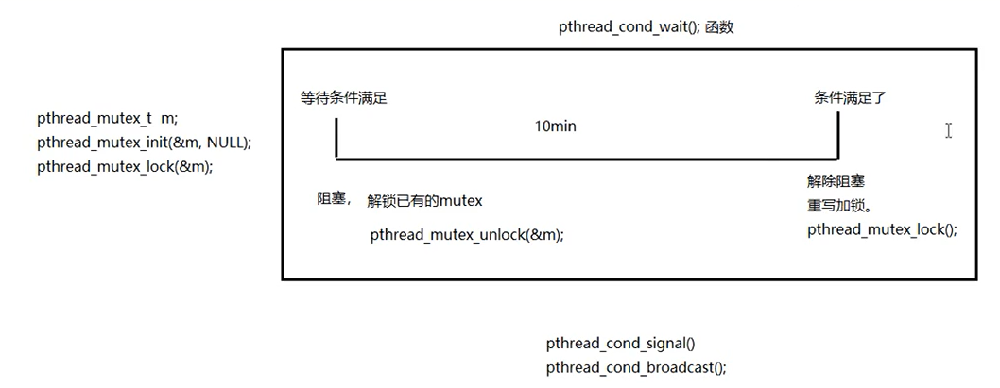
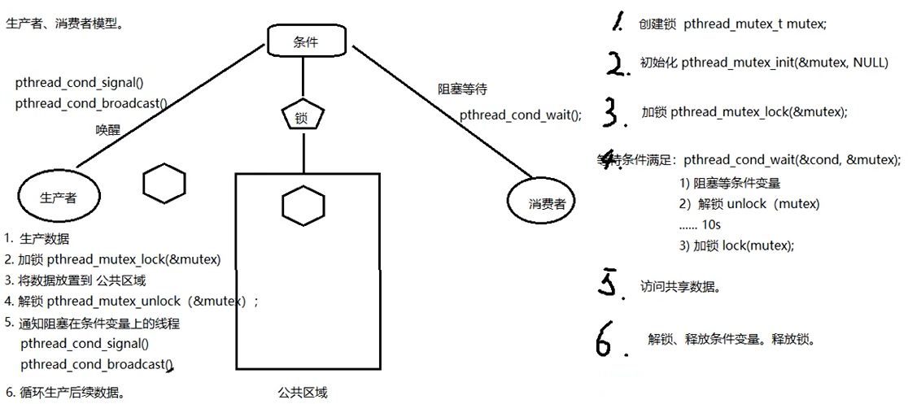
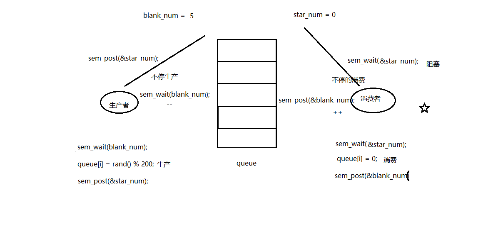

## 线程同步

	协同步调，对公共区域数据按序访问。防止数据混乱，产生与时间有关的错误。

## 锁的使用

	建议锁！对公共数据进行保护。所有线程【应该】在访问公共数据前先拿锁再访问。但，锁本身不具备强制性。

## 使用mutex(互斥量、互斥锁)一般步骤

	pthread_mutex_t 类型。 
	
	1. pthread_mutex_t lock;  创建锁
	
	2  pthread_mutex_init; 初始化		1
	
	3. pthread_mutex_lock;加锁		1--	--> 0
	
	4. 访问共享数据（stdout)		
	
	5. pthrad_mutext_unlock();解锁		0++	--> 1
	
	6. pthead_mutex_destroy；销毁锁

## 初始化互斥量

		pthread_mutex_t mutex;
	
		1. pthread_mutex_init(&mutex, NULL);   			动态初始化。
	
		2. pthread_mutex_t mutex = PTHREAD_MUTEX_INITIALIZER;	静态初始化。
	
	注意事项：
	
		尽量保证锁的粒度， 越小越好。（访问共享数据前，加锁。访问结束【立即】解锁。）
	
		互斥锁，本质是结构体。 我们可以看成整数。 初值为 1。（pthread_mutex_init() 函数调用成功。）
	
		加锁： --操作， 阻塞线程。
	
		解锁： ++操作， 换醒阻塞在锁上的线程。
	
		try锁：尝试加锁，成功--。失败，返回。同时设置错误号 EBUSY

## restrict关键字

	用来限定指针变量。被该关键字限定的指针变量所指向的内存操作，必须由本指针完成。

## 【死锁】：

	是使用锁不恰当导致的现象：
	
		1. 对一个锁反复lock。
	
		2. 两个线程，各自持有一把锁，请求另一把。

## 读写锁：锁只有一把

	锁只有一把。以读方式给数据加锁——读锁。以写方式给数据加锁——写锁。
	
	读共享，写独占。
	
	写锁优先级高。
	
	相较于互斥量而言，当读线程多的时候，提高访问效率
	
	pthread_rwlock_t  rwlock;
	
	pthread_rwlock_init(&rwlock, NULL);
	
	pthread_rwlock_rdlock(&rwlock);		try
	
	pthread_rwlock_wrlock(&rwlock);		try
	
	pthread_rwlock_unlock(&rwlock);
	
	pthread_rwlock_destroy(&rwlock);

## 条件变量

	本身不是锁！  但是通常结合锁来使用。 mutex
	
	pthread_cond_t cond;
	
	初始化条件变量：
	
		1. pthread_cond_init(&cond, NULL);   			动态初始化。
	
		2. pthread_cond_t cond = PTHREAD_COND_INITIALIZER;	静态初始化。
	
	阻塞等待条件：
	
		pthread_cond_wait(&cond, &mutex);
	
		作用：	1） 阻塞等待条件变量满足
	
			2） 解锁已经加锁成功的信号量 （相当于 pthread_mutex_unlock(&mutex)）
	
			3)  当条件满足，函数返回时，重新加锁信号量 （相当于， pthread_mutex_lock(&mutex);）

	pthread_cond_signal(): 唤醒阻塞在条件变量上的 (至少)一个线程。
	
	pthread_cond_broadcast()： 唤醒阻塞在条件变量上的 所有线程。

	【要求，能够借助条件变量，完成生成者消费者】

代码： [conditionVar_product_consumer.c](代码\pthread_sync_test\conditionVar_product_consumer.c) 

## 信号量 Semaphore

	应用于线程、进程间同步。
	
	相当于 初始化值为 N 的互斥量。  N值，表示可以同时访问共享数据区的线程数。
	
	函数：
		sem_t sem;	定义类型。
	
		int sem_init(sem_t *sem, int pshared, unsigned int value);
	
		参数：
			sem： 信号量 
	
			pshared：	0： 用于线程间同步
					
					1： 用于进程间同步
	
			value：N值。（指定同时访问的线程数）

		sem_destroy();
	
		sem_wait();		一次调用，做一次-- 操作， 当信号量的值为 0 时，再次 -- 就会阻塞。 （对比 pthread_mutex_lock）
	
		sem_post();		一次调用，做一次++ 操作. 当信号量的值为 N 时, 再次 ++ 就会阻塞。（对比 pthread_mutex_unlock）

代码： [sem_product_consumer.c](代码\pthread_sync_test\sem_product_consumer.c) 

​	

​		