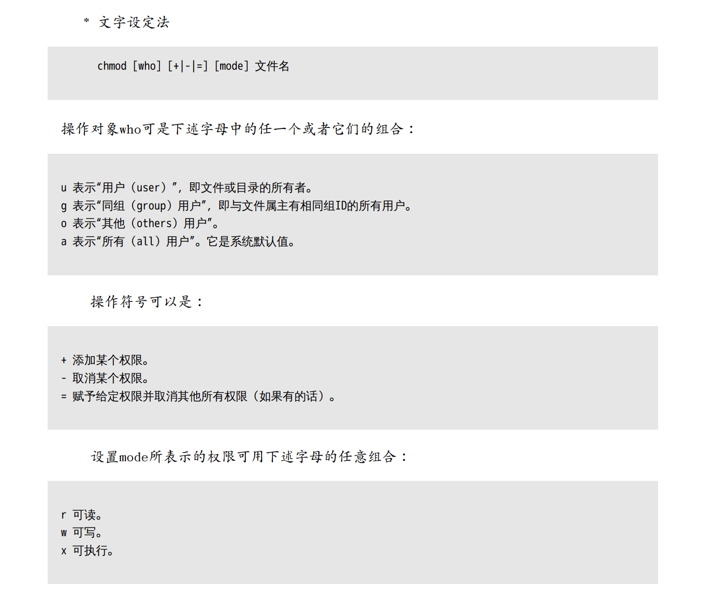
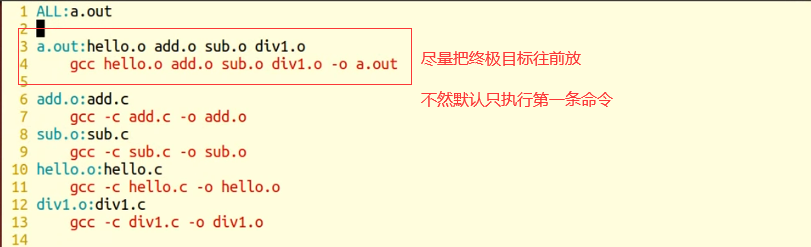

# Linux常用命令

### 清屏命令

1. clear

\#实质上是翻页,只要往上翻还是能看到之前的记录

2. ctrl + L

\#等价于 clear

### 分屏

```
:vsp filename
```


### vim


 *号从上往下找

#号从下往上找


#### 设置vim  tab首行缩进为4个空格


#### 查看Man Page    --->    shift + k （K）

####  

#### 高亮显示

在编辑器里非编辑状态，输入：
shift + 3 （#）
shift + 8 （*）
会出现高亮显示，看着很不舒服，
取消方式:
：noh


### 删除后缀名相同文件  用*


### ldd命令 查看可执行程序加载哪些库和路径


### cat tac命令

只输入cat  用来回显   （你输入什么，它输出什么）

tac   反过来输出显示


### 大文本查看命令 more less head tail


### stat命令

文件/文件系统的详细信息显示


### 用户用户组


#### whoami

查看当前用户


#### chmod




#### chown


#### chgrp


#### 直接修改用户和用户组


### find命令   -- 找文件


### grep命令   -- 找文件内容


## 包管理工具  Centos  yum


## Linux系统文件类型

普通文件：-

目录文件：d

字符设备文件：c

块设备文件：b

软连接：l

管道文件：p

套接字：s

未知文件。


## gcc编译四步骤 


## gcc参数


-I    指定头文件的路径


## 32位系统 内存存储情况 数据段合并


​		32位的CPU(准确的说是运行在32位模式下的CPU)只能寻址最大4GB的内存，受制于此，32位的操作系统也只能识别最大4GB的内存，由于在系统中，除了内存之外，还有很多存储设备，因此，真正可以利用的内存空间肯定小于4GB，也就是我们看到的系统属性中显示的3.xxG。
　　但64位CPU则有了很大改变，64位CPU的最大寻址空间为2的64次方bytes，计算后其可寻址空间达到了惊人的16TB(treabytes)，即16384GB。当然，这只是理论，从实际应用上，win10 64bit的各版本分别为8GB-192GB，其中，家庭普通版能支持8GB内存，家庭高级版能支持16GB内存，而64位的win10专业版、企业版和旗舰版最高可支持192GB内存。


## 动态库和静态库理论对比


## 静态库


出现以下情况，一般都是链接器出现的问题


## 动态库


**PIC表示位置无关代码**

gcc **-c** add.c -o add.o -fPIC

gcc -shared **-o** libmylib.so add.o


**export LD_LIBRARY_PATH=./   写路径**

**环境变量 是进程的概念**


## 软连接和硬链接


软连接在创建的时候  尽量使用绝对路径  便于移植


## GDB调试


 


## Makefile

什么是makefile？或许很多Winodws的程序员都不知道这个东西，因为那些Windows的IDE都为你做了这个工作，但我觉得要作一个好的和professional的程序员，makefile还是要懂。这就好像现在有这么多的HTML的编辑器，但如果你想成为一个专业人士，你还是要了解HTML的标识的含义。特别在Unix下的软件编译，你就不能不自己写makefile了，会不会写makefile，从一个侧面说明了一个人是否具备完成大型工程的能力。

因为，**makefile关系到了整个工程的编译规则。一个工程中的源文件不计数，其按类型、功能、模块分别放在若干个目录中，makefile定义了一系列的规则来指定，哪些文件需要先编译，哪些文件需要后编译，哪些文件需要重新编译，甚至于进行更复杂的功能操作，因为makefile就像一个Shell脚本一样，其中也可以执行操作系统的命令。**

makefile带来的好处就是——“自动化编译”，一旦写好，只需要一个make命令，整个工程完全自动编译，极大的提高了软件开发的效率。make是一个命令工具，是一个解释makefile中指令的命令工具，一般来说，大多数的IDE都有这个命令，比如：Delphi的make，Visual C++的nmake，Linux下GNU的make。可见，makefile都成为了一种在工程方面的编译方法。

现在讲述如何写makefile的文章比较少，这是我想写这篇文章的原因。当然，不同产商的make各不相同，也有不同的语法，但其本质都是在“文件依赖性”上做文章，这里，我仅对GNU的make进行讲述，我的环境是RedHat Linux 8.0，make的版本是3.80。必竟，这个make是应用最为广泛的，也是用得最多的。而且其还是最遵循于IEEE 1003.2-1992 标准的（POSIX.2）。

在这篇文档中，将以C/C++的源码作为我们基础，所以必然涉及一些关于C/C++的编译的知识，相关于这方面的内容，还请各位查看相关的编译器的文档。这里所默认的编译器是UNIX下的GCC和CC。
————————————————
版权声明：本文为CSDN博主「haoel」的原创文章，遵循CC 4.0 BY-SA版权协议，转载请附上原文出处链接及本声明。
原文链接：https://blog.csdn.net/haoel/article/details/2886





**clean的时候记得一定要   加一个-n查看一下要删除的内容是不是源码**


## Read/Write 函数


## 阻塞/非阻塞


