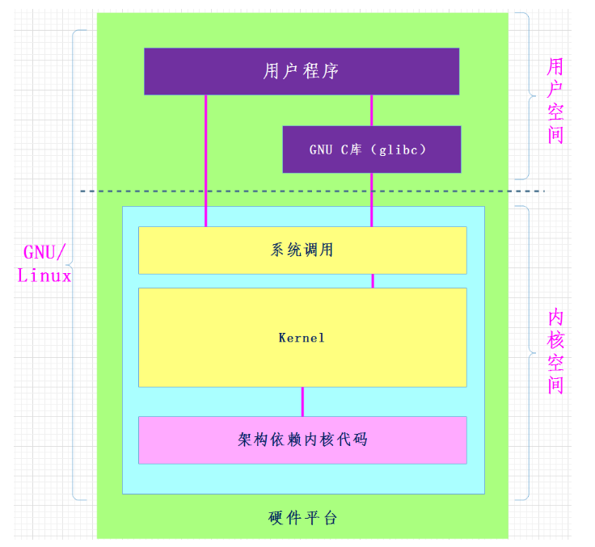

## 包管理工具  Centos  yum


## Linux系统文件类型

普通文件：-

目录文件：d

字符设备文件：c

块设备文件：b

软连接：l

管道文件：p

套接字：s

未知文件。


## gcc编译四步骤 


## gcc参数


-I    指定头文件的路径


## 32位系统 内存存储情况 数据段合并


​		32位的CPU(准确的说是运行在32位模式下的CPU)只能寻址最大4GB的内存，受制于此，32位的操作系统也只能识别最大4GB的内存，由于在系统中，除了内存之外，还有很多存储设备，因此，真正可以利用的内存空间肯定小于4GB，也就是我们看到的系统属性中显示的3.xxG。
　　但64位CPU则有了很大改变，64位CPU的最大寻址空间为2的64次方bytes，计算后其可寻址空间达到了惊人的16TB(treabytes)，即16384GB。当然，这只是理论，从实际应用上，win10 64bit的各版本分别为8GB-192GB，其中，家庭普通版能支持8GB内存，家庭高级版能支持16GB内存，而64位的win10专业版、企业版和旗舰版最高可支持192GB内存。


## 动态库和静态库理论对比


## 静态库


出现以下情况，一般都是链接器出现的问题


## 动态库


**PIC表示位置无关代码**

gcc **-c** add.c -o add.o -fPIC

gcc -shared **-o** libmylib.so add.o


**export LD_LIBRARY_PATH=./   写路径**

**环境变量 是进程的概念**


## 软连接和硬链接


软连接在创建的时候  尽量使用绝对路径  便于移植


## GDB调试


 


## Makefile

什么是makefile？或许很多Winodws的程序员都不知道这个东西，因为那些Windows的IDE都为你做了这个工作，但我觉得要作一个好的和professional的程序员，makefile还是要懂。这就好像现在有这么多的HTML的编辑器，但如果你想成为一个专业人士，你还是要了解HTML的标识的含义。特别在Unix下的软件编译，你就不能不自己写makefile了，会不会写makefile，从一个侧面说明了一个人是否具备完成大型工程的能力。

因为，**makefile关系到了整个工程的编译规则。一个工程中的源文件不计数，其按类型、功能、模块分别放在若干个目录中，makefile定义了一系列的规则来指定，哪些文件需要先编译，哪些文件需要后编译，哪些文件需要重新编译，甚至于进行更复杂的功能操作，因为makefile就像一个Shell脚本一样，其中也可以执行操作系统的命令。**

makefile带来的好处就是——“自动化编译”，一旦写好，只需要一个make命令，整个工程完全自动编译，极大的提高了软件开发的效率。make是一个命令工具，是一个解释makefile中指令的命令工具，一般来说，大多数的IDE都有这个命令，比如：Delphi的make，Visual C++的nmake，Linux下GNU的make。可见，makefile都成为了一种在工程方面的编译方法。

现在讲述如何写makefile的文章比较少，这是我想写这篇文章的原因。当然，不同产商的make各不相同，也有不同的语法，但其本质都是在“文件依赖性”上做文章，这里，我仅对GNU的make进行讲述，我的环境是RedHat Linux 8.0，make的版本是3.80。必竟，这个make是应用最为广泛的，也是用得最多的。而且其还是最遵循于IEEE 1003.2-1992 标准的（POSIX.2）。

在这篇文档中，将以C/C++的源码作为我们基础，所以必然涉及一些关于C/C++的编译的知识，相关于这方面的内容，还请各位查看相关的编译器的文档。这里所默认的编译器是UNIX下的GCC和CC。
————————————————
版权声明：本文为CSDN博主「haoel」的原创文章，遵循CC 4.0 BY-SA版权协议，转载请附上原文出处链接及本声明。
原文链接：https://blog.csdn.net/haoel/article/details/2886


**clean的时候记得一定要   加一个-n查看一下要删除的内容是不是源码**


## Read/Write 函数


## 阻塞/非阻塞


## 僵尸进程与孤儿进程的区别

**僵尸进程**一个父进程利用fork创建子进程，如果子进程退出，而父进程没有利用wait 或者 waitpid 来获取子进程的状态信息，那么**子进程的状态描述符**依然保存在系统中。

**孤儿进程**一个父进程退出， 而它的一个或几个子进程仍然还在运行，那么这些子进程就会变成孤儿进程，孤儿进程将被init进程（进程号为1）所收养，并由init进程对它们完成状态收集的工作。


## 守护进程

守护进程：Daemon(精灵)进程，是 Linux 中的后台服务进程，通常独立于控制终端并且周期性地执行某种任务或等待处理 某些发生的事件。一般采用以 d 结尾的名字。 Linux 后台的一些系统服务进程，没有控制终端，不能直接和用户交互。不受用户登录、注销的影响，一直在 运行着，他们都是守护进程。如：预读入缓输出机制的实现；ftp 服务器；nfs 服务器等。 创建守护进程，最关键的一步是调用 setsid 函数创建一个新的 Session，并成为 Session Leader。


## 会话

会话是由一个或多个进程组 组成的。

如下图所示，一个会话中由三个进程组。 

会话是由进程组中第一个进程创建出来的（即领头进程<进程组组长>） 会话中的领头进程ID(PID)也是会话的ID(SID).


## man


## 库函数API和系统调用的区别



- (1) 库函数是语言或应用程序的一部分，而系统调用是内核提供给应用程序的接口，属于系统的一部分

- (2) 库函数在用户地址空间执行，系统调用是在内核地址空间执行，库函数运行时间属于用户时间，系统调用属于系统时间，库函数开销较小，系统调用开销较大

- (3) 系统调用依赖于平台，库函数并不依赖

  

**系统调用是为了方便使用操作系统的接口，而库函数则是为了人们编程的方便。**

**库函数调用与系统无关，不同的系统，调用库函数，库函数会调用不同的底层函数实现，因此可移植性好。**


## Linux目录内容


以下是对这些目录的解释：

- **/bin**：
  bin 是 Binaries (二进制文件) 的缩写, 这个目录存放着最经常使用的命令。

- **/boot：**
  这里存放的是启动 Linux 时使用的一些核心文件，包括一些连接文件以及镜像文件。

- **/dev ：**
  dev 是 Device(设备) 的缩写, 该目录下存放的是 Linux 的外部设备，在 Linux 中访问设备的方式和访问文件的方式是相同的。

- **/etc：**
  etc 是 Etcetera(等等) 的缩写,这个目录用来存放所有的系统管理所需要的配置文件和子目录。

- **/home**：
  用户的主目录，在 Linux 中，每个用户都有一个自己的目录，一般该目录名是以用户的账号命名的，如上图中的 alice、bob 和 eve。

- **/lib**：
  lib 是 Library(库) 的缩写这个目录里存放着系统最基本的动态连接共享库，其作用类似于 Windows 里的 DLL 文件。几乎所有的应用程序都需要用到这些共享库。

- **/lost+found**：
  这个目录一般情况下是空的，当系统非法关机后，这里就存放了一些文件。

- **/media**：
  linux 系统会自动识别一些设备，例如U盘、光驱等等，当识别后，Linux 会把识别的设备挂载到这个目录下。

- **/mnt**：
  系统提供该目录是为了让用户临时挂载别的文件系统的，我们可以将光驱挂载在 /mnt/ 上，然后进入该目录就可以查看光驱里的内容了。

- **/opt**：
  opt 是 optional(可选) 的缩写，这是给主机额外安装软件所摆放的目录。比如你安装一个ORACLE数据库则就可以放到这个目录下。默认是空的。

- **/proc**：
  proc 是 Processes(进程) 的缩写，/proc 是一种伪文件系统（也即虚拟文件系统），存储的是当前内核运行状态的一系列特殊文件，这个目录是一个虚拟的目录，它是系统内存的映射，我们可以通过直接访问这个目录来获取系统信息。
  这个目录的内容不在硬盘上而是在内存里，我们也可以直接修改里面的某些文件，比如可以通过下面的命令来屏蔽主机的ping命令，使别人无法ping你的机器：

  ```
  echo 1 > /proc/sys/net/ipv4/icmp_echo_ignore_all
  ```

- **/root**：
  该目录为系统管理员，也称作超级权限者的用户主目录。

- **/sbin**：
  s 就是 Super User 的意思，是 Superuser Binaries (超级用户的二进制文件) 的缩写，这里存放的是系统管理员使用的系统管理程序。

- **/selinux**：
   这个目录是 Redhat/CentOS 所特有的目录，Selinux 是一个安全机制，类似于 windows 的防火墙，但是这套机制比较复杂，这个目录就是存放selinux相关的文件的。

- **/srv**：
   该目录存放一些服务启动之后需要提取的数据。

- **/sys**：

  这是 Linux2.6 内核的一个很大的变化。该目录下安装了 2.6 内核中新出现的一个文件系统 sysfs 。

  sysfs 文件系统集成了下面3种文件系统的信息：针对进程信息的 proc 文件系统、针对设备的 devfs 文件系统以及针对伪终端的 devpts 文件系统。

  该文件系统是内核设备树的一个直观反映。

  当一个内核对象被创建的时候，对应的文件和目录也在内核对象子系统中被创建。

- **/tmp**：
  tmp 是 temporary(临时) 的缩写这个目录是用来存放一些临时文件的。

- **/usr**：
   usr 是 unix shared resources(共享资源) 的缩写，这是一个非常重要的目录，用户的很多应用程序和文件都放在这个目录下，类似于 windows 下的 program files 目录。

- **/usr/bin：**
  系统用户使用的应用程序。

- **/usr/sbin：**
  超级用户使用的比较高级的管理程序和系统守护程序。

- **/usr/src：**
  内核源代码默认的放置目录。

- **/var**：
  var 是 variable(变量) 的缩写，这个目录中存放着在不断扩充着的东西，我们习惯将那些经常被修改的目录放在这个目录下。包括各种日志文件。

- **/run**：
  是一个临时文件系统，存储系统启动以来的信息。当系统重启时，这个目录下的文件应该被删掉或清除。如果你的系统上有 /var/run 目录，应该让它指向 run。

在 Linux 系统中，有几个目录是比较重要的，平时需要注意不要误删除或者随意更改内部文件。

**/etc**： 上边也提到了，这个是系统中的配置文件，如果你更改了该目录下的某个文件可能会导致系统不能启动。

**/bin, /sbin, /usr/bin, /usr/sbin**: 这是系统预设的执行文件的放置目录，比如 **ls** 就是在 **/bin/ls** 目录下的。

值得提出的是 **/bin**、**/usr/bin** 是给系统用户使用的指令（除 root 外的通用用户），而/sbin, /usr/sbin 则是给 root 使用的指令。

**/var**： 这是一个非常重要的目录，系统上跑了很多程序，那么每个程序都会有相应的日志产生，而这些日志就被记录到这个目录下，具体在 /var/log 目录下，另外 mail 的预设放置也是在这里。
