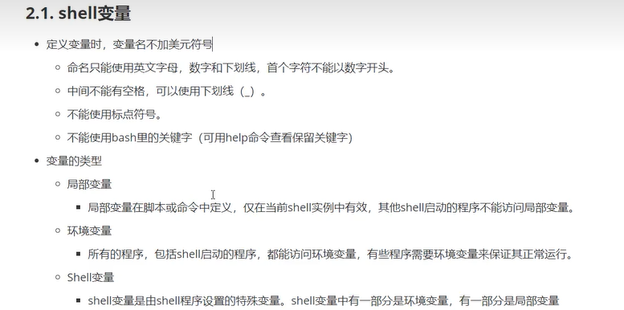

# Chmod


| who  | 用户类型 | 说明                   |
| :--- | :------- | :--------------------- |
| `u`  | user     | 文件所有者             |
| `g`  | group    | 文件所有者所在组       |
| `o`  | others   | 所有其他用户           |
| `a`  | all      | 所有用户, 相当于 *ugo* |

| #    | 权限           | rwx  | 二进制 |
| :--- | :------------- | :--- | :----- |
| 7    | 读 + 写 + 执行 | rwx  | 111    |
| 6    | 读 + 写        | rw-  | 110    |
| 5    | 读 + 执行      | r-x  | 101    |
| 4    | 只读           | r--  | 100    |
| 3    | 写 + 执行      | -wx  | 011    |
| 2    | 只写           | -w-  | 010    |
| 1    | 只执行         | --x  | 001    |
| 0    | 无             | ---  | 000    |

例如， 765 将这样解释：

- 所有者的权限用数字表达：属主的那三个权限位的数字加起来的总和。如 rwx ，也就是 4+2+1 ，应该是 7。
- 用户组的权限用数字表达：属组的那个权限位数字的相加的总和。如 rw- ，也就是 4+2+0 ，应该是 6。
- 其它用户的权限数字表达：其它用户权限位的数字相加的总和。如 r-x ，也就是 4+0+1 ，应该是 5。

# Shell 


Shell 是一个用 C 语言编写的程序，它是用户使用 Linux 的桥梁。Shell 既是一种命令语言，又是一种程序设计语言。

Shell 是指一种应用程序，这个应用程序提供了一个界面，用户通过这个界面访问操作系统内核的服务。

Ken Thompson 的 sh 是第一种 Unix Shell，Windows Explorer 是一个典型的图形界面 Shell。

[**Shell 在线工具**](https://www.runoob.com/try/showbash.php?filename=helloworld)


## Shell 脚本

Shell 脚本（shell script），是一种为 shell 编写的脚本程序。

业界所说的 shell 通常都是指 shell 脚本，但读者朋友要知道，shell 和 shell script 是两个不同的概念。

由于习惯的原因，简洁起见，本文出现的 "shell编程" 都是指 shell 脚本编程，不是指开发 shell 自身。


## 第一个Shell脚本

```shell
#! /bin/bash
echo "Hello World !"
```


## Shell脚本执行方式


在没有执行权限的时候可以**使用sh命令**来执行

### 绝对路径（重新打开一个进程执行脚本文件）


### sh执行（重新打开一个进程执行脚本文件）


### source 执行（默认使用当前进程执行脚本）

（作用域的问题）


## Shell 变量




## Shell字符串


