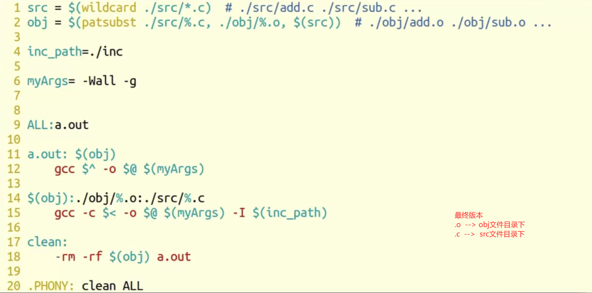

## 脚本

把一系列**命令**集合放到一个文件当中**批量执行**

## Makefile概述

什么是makefile？或许很多Winodws的程序员都不知道这个东西，因为那些Windows的IDE都为你做了这个工作，但我觉得要作一个好的和professional的程序员，makefile还是要懂。这就好像现在有这么多的HTML的编辑器，但如果你想成为一个专业人士，你还是要了解HTML的标识的含义。特别在Unix下的软件编译，你就不能不自己写makefile了，会不会写makefile，从一个侧面说明了一个人是否具备完成大型工程的能力。

因为，**makefile关系到了整个工程的编译规则。一个工程中的源文件不计数，其按类型、功能、模块分别放在若干个目录中，makefile定义了一系列的规则来指定，哪些文件需要先编译，哪些文件需要后编译，哪些文件需要重新编译，甚至于进行更复杂的功能操作，因为makefile就像一个Shell脚本一样，其中也可以执行操作系统的命令。**

makefile带来的好处就是——“自动化编译”，一旦写好，只需要一个make命令，整个工程完全自动编译，极大的提高了软件开发的效率。make是一个命令工具，是一个解释makefile中指令的命令工具，一般来说，大多数的IDE都有这个命令，比如：Delphi的make，Visual C++的nmake，Linux下GNU的make。可见，makefile都成为了一种在工程方面的编译方法。

现在讲述如何写makefile的文章比较少，这是我想写这篇文章的原因。当然，不同产商的make各不相同，也有不同的语法，但其本质都是在“文件依赖性”上做文章，这里，我仅对GNU的make进行讲述，我的环境是RedHat Linux 8.0，make的版本是3.80。必竟，这个make是应用最为广泛的，也是用得最多的。而且其还是最遵循于IEEE 1003.2-1992 标准的（POSIX.2）。

在这篇文档中，将以C/C++的源码作为我们基础，所以必然涉及一些关于C/C++的编译的知识，相关于这方面的内容，还请各位查看相关的编译器的文档。这里所默认的编译器是UNIX下的GCC和CC。
————————————————
版权声明：本文为CSDN博主「haoel」的原创文章，遵循CC 4.0 BY-SA版权协议，转载请附上原文出处链接及本声明。
原文链接：https://blog.csdn.net/haoel/article/details/2886

## gcc编译四步骤 

## makefile： 管理项目。

	命名：makefile	 Makefile  --- make 命令
	
	1 个规则：
	
		目标：依赖条件
		（一个tab缩进）命令
	
		1. 目标的时间必须晚于依赖条件的时间，否则，更新目标
	
		2. 依赖条件如果不存在，找寻新的规则去产生依赖条件。
	
	ALL：指定 makefile 的终极目标。

	2 个函数：
	
		src = $(wildcard ./*.c): 匹配当前工作目录下的所有.c 文件。将文件名组成列表，赋值给变量 src。  src = add.c sub.c div1.c 
	
		obj = $(patsubst %.c, %.o, $(src)): 将参数3中，包含参数1的部分，替换为参数2。 obj = add.o sub.o div1.o
	
	clean:	(没有依赖)
	
		-rm -rf $(obj) a.out	“-”：作用是，删除不存在文件时，不报错。顺序执行结束。
	
	3 个自动变量：
	
		$@: 在规则的命令中，表示规则中的目标。
	
		$^: 在规则的命令中，表示所有依赖条件。
	
		$<: 在规则的命令中，表示第一个依赖条件。如果将该变量应用在模式规则中，它可将依赖条件列表中的依赖依次取出，套用模式规则。
	
	模式规则：
	
		%.o:%.c
		   gcc -c $< -o %@
	
	静态模式规则：
	
		$(obj):%.o:%.c
		   gcc -c $< -o %@	
	
	伪目标：
	
		.PHONY: clean ALL
	
	参数：
		-n：模拟执行make、make clean 命令。
	
		-f：指定文件执行 make 命令。				xxxx.mk

### make clean -n  

**clean的时候记得一定要   加一个-n查看一下要删除的内容是不是源码**

### -代表出错依然执行

### 最终状态：

