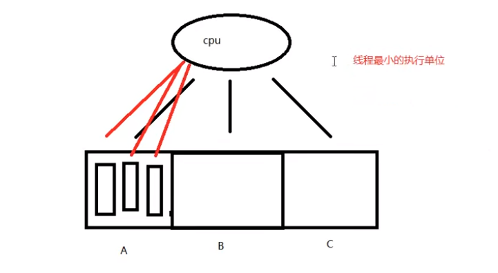

## 守护进程：

	daemon进程。通常运行与操作系统后台，脱离控制终端。一般不与用户直接交互。周期性的等待某个事件发生或周期性执行某一动作。
	
	不受用户登录注销影响。通常采用以d结尾的命名方式。

## 守护进程创建步骤：

	1. fork子进程，让父进程终止。
	
	2.  setsid() 创建新会话
	
	3. 通常根据需要，改变工作目录位置 chdir()， 防止目录被卸载。
	
	4. 通常根据需要，重设umask文件权限掩码，影响新文件的创建权限。  022 -- 755	0345 --- 432   r---wx-w-   422
	
	5. 通常根据需要，关闭/重定向 文件描述符
	
	6. 守护进程 业务逻辑。while（）

创建守护进程代码： **[daemon.c](daemon.c)** 

## 线程概念：

	进程：有独立的 进程地址空间。有独立的pcb。	分配资源的最小单位。
	
	线程：有独立的pcb。没有独立的进程地址空间。	最小单位的执行。
	
	ps -Lf 进程id 	---> 线程号。LWP  --》cpu 执行的最小单位。

## 线程共享：

	独享 栈空间（内核栈、用户栈）
	
	共享 ./text./data ./rodataa ./bsss heap  ---> 共享【全局变量】（errno）

## 线程控制原语：

	pthread_t pthread_self(void);	获取线程id。 线程id是在进程地址空间内部，用来标识线程身份的id号。
	
		返回值：本线程id

	检查出错返回：  线程中。
	
		fprintf(stderr, "xxx error: %s\n", strerror(ret));

	int pthread_create(pthread_t *tid, const pthread_attr_t *attr, void *(*start_rountn)(void *), void *arg); 创建子线程。
	
		参1：传出参数，表新创建的子线程 id
	
		参2：线程属性。传NULL表使用默认属性。
	
		参3：子线程回调函数。创建成功，ptherad_create函数返回时，该函数会被自动调用。
		
		参4：参3的参数。没有的话，传NULL
	
		返回值：成功：0
	
			失败：errno

	循环创建N个子线程：
	
		for （i = 0； i < 5; i++）
	
			pthread_create(&tid, NULL, tfn, (void *)i);   // 将 int 类型 i， 强转成 void *， 传参。	

	void pthread_exit(void *retval);  退出当前线程。
	
		retval：退出值。 无退出值时，NULL
	
		exit();	退出当前进程。
	
		return: 返回到调用者那里去。
	
		pthread_exit(): 退出当前线程。

	int pthread_join(pthread_t thread, void **retval);	阻塞 回收线程。
	
		thread: 待回收的线程id
	
		retval：传出参数。 回收的那个线程的退出值。
	
			线程异常借助，值为 -1。
	
		返回值：成功：0
	
			失败：errno
	
	int pthread_detach(pthread_t thread);		设置线程分离
	
		thread: 待分离的线程id

​	
​		返回值：成功：0
​	
			失败：errno	
	
	int pthread_cancel(pthread_t thread);		杀死一个线程。  需要到达取消点（保存点）
	
		thread: 待杀死的线程id
		
		返回值：成功：0
	
			失败：errno
	
		如果，子线程没有到达取消点， 那么 pthread_cancel 无效。
	
		我们可以在程序中，手动添加一个取消点。使用 pthread_testcancel();
	
		成功被 pthread_cancel() 杀死的线程，返回 -1.使用pthead_join 回收。

## 线程控制原语            进程控制原语

	线程控制原语					进程控制原语

	pthread_create()				fork();
	
	pthread_self()					getpid();
	
	pthread_exit()					exit(); 		/ return 
	
	pthread_join()					wait()/waitpid()
	
	pthread_cancel()				kill()
	
	pthread_detach()

## 线程属性：

	设置分离属性。
	
	pthread_attr_t attr  	创建一个线程属性结构体变量
	
	pthread_attr_init(&attr);	初始化线程属性
	
	pthread_attr_setdetachstate(&attr,  PTHREAD_CREATE_DETACHED);		设置线程属性为 分离态
	
	pthread_create(&tid, &attr, tfn, NULL); 借助修改后的 设置线程属性 创建为分离态的新线程
	
	pthread_attr_destroy(&attr);	销毁线程属性

​			

​	

​	

​	