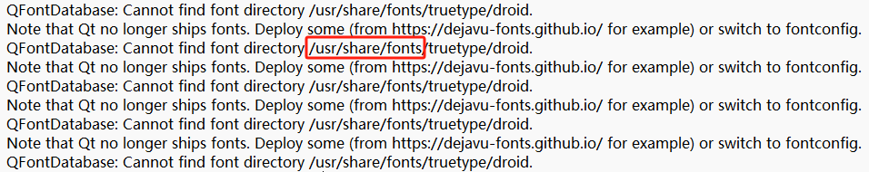

## ARM QT环境搭建

[RK3399 ARM QT开发环境搭建_arm架构 qt-opensource-linux-arm64-5.9.0.run_风的呼吸7的博客-CSDN博客](https://blog.csdn.net/hl1796/article/details/90205218)

注：使用Ubuntu16

QT_QPA_DEFAULT_PLATFORM = linuxfb
QMAKE_CFLAGS_RELEASE += -O2 -march=armv8-a -lts
QMAKE_CXXFLAGS_RELEASE += -O2 -march=armv8-a -lts

#!/bin/sh
./configure \
-prefix /opt/qt5.9.1-arm \   						// 改成自己编译后生成的路径
-confirm-license \
-opensource \
-release \
-make libs \
-xplatform linux-aarch64-gnu-g++ \
-pch \
-qt-libjpeg \
-qt-libpng \
-qt-zlib \
-no-opengl \
-no-sse2 \
-no-openssl \
-no-cups \
-no-glib \
-no-dbus \
-no-xcb \
-no-separate-debug-info \

export QTEDIR=/opt/qt5.9.0-arm/
export LD_LIBRARY_PATH=/opt/qt5.9.0-arm/lib:$LD_LIBRARY_PATH
export QT_QPA_PLATFORM_PLUGIN_PATH=$QTEDIR/plugins
export QT_QPA_PLATFORM=linuxfb
export QT_QPA_FONTDIR=/usr/share/fonts/truetype/droid

## 终端编译arm架构下程序

进入到项目文件

sudo /home/ze/Desktop/qt5.15.0-arm/bin/qmake					// 找到编译完qt源码的路径     执行完会生成Makefile

make

出现这个问题代表缺少字体

在红圈的位置缺少字体配置文件

在配置文件（/etc/profile）中修改/添加字体配置文件位置

