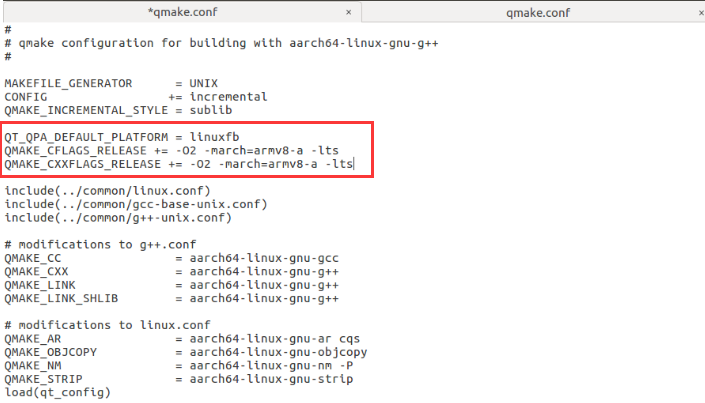
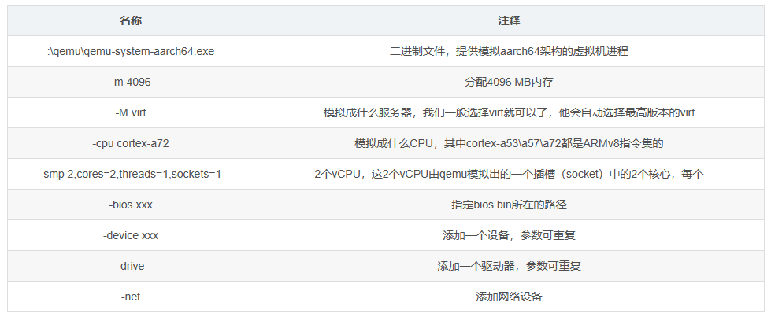
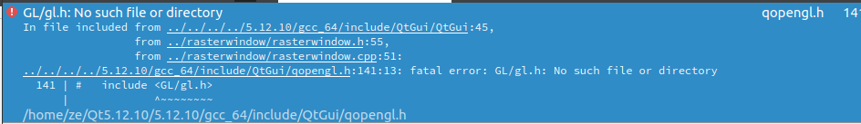

## Git 

### 安装最新版Git

sudo add-apt-repository ppa:git-core/ppa 

sudo apt update

sudo apt install git


### Git 配置

sudo apt update																			列出所有可更新的软件清单命令

sudo apt upgrade						  												升级软件包

sudo apt install git     																	安装git

git config --global user.name "ze-ubuntu"								设置名称

git config --global user.email "1079903036@qq.com"			设置邮箱

git config --global --list																  查看配置信息

ssh-keygen -t rsa -C "1079903036@qq.com"							 生成SSH秘钥

cd ~/.ssh																						  进入到ssh目录

vim id_rsa.pub																			   复制公钥内容

ssh -T git@git.oschina.net															测试是否可以连通

出现Permission denied (publickey)											表示测试成功

git clone git@github.com:Chenyz6/Ubuntu_Code.git			 看在哪个用户生成的SSH密钥，再决定是否加sudo

git status  																					   查看当前状态

git add .  																						 把内容全部添加到本地git缓存区中

git commit -m "提交内容介绍"  													推送修改到本地git库中

git push origin main																	  提交到远程仓库

git pull origin main																	    从远程仓库拉取


### Git回退上个版本

git reset --hard								

参数撤销工作区中所有未提交的修改内容，将暂存区与工作区都回到上一次版本，并删除之前的所有信息提交


##  Lazygit 配置

```
LAZYGIT_VERSION=$(curl -s "https://api.github.com/repos/jesseduffield/lazygit/releases/latest" | grep -Po '"tag_name": "v\K[^"]*')
curl -Lo lazygit.tar.gz "https://github.com/jesseduffield/lazygit/releases/latest/download/lazygit_${LAZYGIT_VERSION}_Linux_x86_64.tar.gz"

tar xf lazygit.tar.gz lazygit

sudo install lazygit /usr/local/bin
```


## Zsh配置

**第一步 → 把 oh-my-zsh 项目 Clone 下来：**

```bash
git clone https://github.com/robbyrussell/oh-my-zsh.git ~/.oh-my-zsh
```

**第二步 → 复制 .zshrc**

```bash
cp ~/.oh-my-zsh/templates/zshrc.zsh-template ~/.zshrc
```

**第三步 → 更改你的默认 Shell**

```bash
chsh -s /bin/zsh
```

**第四步 → 主题下载**

```bash
https://github.com/ohmyzsh/ohmyzsh/wiki/External-themes
```


**自动补齐**

git clone https://github.com/zsh-users/zsh-autosuggestions $ZSH_CUSTOM/plugins/zsh-autosuggestions

**高亮**

git clone https://github.com/zsh-users/zsh-syntax-highlighting.git $ZSH_CUSTOM/plugins/zsh-syntax-highlighting


安装插件

```bash
vim ~/.zshrc
```

执行文件

```bash
source ~/.zshrc
```


background:	#293031


#293031	#DC322F	#298D76	#B58900	#CA3793	#D33682	#4697C8	#EEE8D5


#B55739	#F66151	#586E75	#657B83	#839496	#6C71C4	#93A1A1	#FFFFFF


## PowerVim 配置

GitHub链接：[youngyangyang04/PowerVim: Make your vim more power and much easer. (github.com)](https://github.com/youngyangyang04/PowerVim)

1. git clone https://github.com/youngyangyang04/PowerVim.git

2. cd PowerVim

3. sh install.sh

直接执行 sh install.sh会报install.sh: 8: install.sh: Syntax error: "(" unexpected

4. sudo dpkg-reconfigure dash   					  	需将sh指向bash可正常运行脚本    选择no


执行完脚本后使用vim会报如下错误：
处理 /home/wsy/.vimrc 时发生错误:
第 42 行:
E197: 不能设定语言为 "zh_CN.gb2312"


ubuntu中文支持，及中文乱码问题

状况：所用的ubuntu系统不支持中文，遇见中文就????。ORZ…

目标：使系统/服务器支持中文，能够正常显示。

首先，安装中文支持包language-pack-zh-hans：

5. sudo apt-get install language-pack-zh-hans
   然后，修改/etc/environment（在文件的末尾追加）：

LANG="zh_CN.UTF-8"
LANGUAGE="zh_CN:zh:en_US:en"

6. 再修改/var/lib/locales/supported.d/local(没有这个文件就新建，同样在末尾追加)：

en_US.UTF-8 UTF-8
zh_CN.UTF-8 UTF-8
zh_CN.GBK GBK
zh_CN GB2312
最后，执行命令：

7. sudo locale-gen
   对于中文乱码是空格的情况，安装中文字体解决。

8. sudo apt-get install fonts-droid-fallback ttf-wqy-zenhei ttf-wqy-microhei fonts-arphic-ukai fonts-arphic-uming
   


## SSH配置

sudo apt update											更新数据源

sudo apt install openssh-server -y				安装ssh

sudo systemctl status ssh 							查看状态

sudo ufw allow ssh										如果你的防火墙开启了，使用下面语句

vim /etc/ssh/sshd_config							   查看端口号

ifconfig 														  查看IP


## c++编译器安装

sudo apt-get install build-essential -y


## QtCreator 所有版本官方下载地址

1.所有版本QT下载地址 ：

[Index of /archive/qt](https://link.zhihu.com/?target=http%3A//download.qt.io/archive/qt/)

\2. 所有Qt Creator下载地址：

[Index of /archive/qtcreator](https://link.zhihu.com/?target=http%3A//download.qt.io/archive/qtcreator/)

\3. 所有Qt VS开发插件下载地址:

[Index of /archive/vsaddin](https://link.zhihu.com/?target=http%3A//download.qt.io/archive/vsaddin/)

4.Qt官网镜像下载地址： 　

[Index of /](https://link.zhihu.com/?target=http%3A//download.qt.io/)


## Linux 编译arm版本的qt程序

**注意：Ubuntu16**

[RK3399 ARM QT开发环境搭建_arm架构 qt-opensource-linux-arm64-5.9.0.run_风的呼吸7的博客-CSDN博客](https://blog.csdn.net/hl1796/article/details/90205218?spm=1001.2014.3001.5506)

### 1.下载交叉工具编译链

官网：

[Builds & Downloads | Linaro](https://www.linaro.org/downloads/)

具体下载网址：

[Linaro Releases](https://releases.linaro.org/components/toolchain/binaries/7.5-2019.12/aarch64-linux-gnu/)

下载这个   gcc-linaro-7.5.0-2019.12-x86_64_aarch64-linux-gnu.tar.xz

### 2.安装交叉编译工具

tar -xvf gcc-linaro-7.2.1-2017.11-x86_64_aarch64-linux-gnu.tar.xz 

sudo gedit /etc/profile			    //  配置环境变量

末尾添加       export PATH="/opt/gcc-aarch64-linux-gnu/bin:$PATH"  		  // 注意位置

source  /etc/profile					  // 使环境变量生效

aarch64-linux-gnu-gcc -v			// 验证是否成功

### 3. 交叉编译qt源码

下载qt源码注意qt下载版本（qt-everywhere-src-5.15.0.tar.xz）    

网址：

[Index of /archive/qt/5.15/5.15.0/single](https://download.qt.io/archive/qt/5.15/5.15.0/single/)

将下载的qt-everywhere-opensource-src-5.15.0.tar.xz压缩包复制到/opt目录下，完成后在/opt目录下输入命令

tar -xvf qt-everywhere-opensource-src-5.15.0.tar.xz

cd   /opt/qt-everywhere-opensource-src-5.15.0		// 注意位置

sudo gedit /opt/qt-everywhere-opensource-src-5.15.0/qtbase/mkspecs/linux-aarch64-gnu-g++/qmake.conf

在其中添加如下内容

QT_QPA_DEFAULT_PLATFORM = linuxfb
QMAKE_CFLAGS_RELEASE += -O2 -march=armv8-a -lts
QMAKE_CXXFLAGS_RELEASE += -O2 -march=armv8-a -lts



sudo gedit auto.sh				// 自动配置脚本

#!/bin/sh
./configure \
-prefix /opt/qt5.9.1-arm \             		// 位置改成要生成的目录
-confirm-license \
-opensource \
-release \
-make libs \
-xplatform linux-aarch64-gnu-g++ \
-pch \
-qt-libjpeg \
-qt-libpng \
-qt-zlib \
-no-opengl \
-no-sse2 \
-no-openssl \
-no-cups \
-no-glib \
-no-dbus \
-no-xcb \
-no-separate-debug-info \


sudo chmod u+x auto.sh 

./auto.sh

sudo make

sudo make install

### 4.安装qtcreator

注意版本：qt-opensource-linux-x64-5.12.10.run

sudo chmod u+x qt-opensource-linux-x64-5.9.0.run 

./qt-opensource-linux-x64-5.9.0.run


安装完qtcreator打开可能会没反应           sudo apt-get install libxcb-xinerama0     // 装这个就好了

### 5.将交叉编译的Qt库复制到板子上

将上面编译完源码的文件压缩

到板子上解压

tar -zxvf qt5.15.0.tar.gz

sudo vi /etc/profile         // 注意修改路径

export QTEDIR=/opt/qt5.9.0-arm/
export LD_LIBRARY_PATH=/opt/qt5.9.0-arm/lib:$LD_LIBRARY_PATH
export QT_QPA_PLATFORM_PLUGIN_PATH=$QTEDIR/plugins
export QT_QPA_PLATFORM=linuxfb
export QT_QPA_FONTDIR=/usr/share/fonts/truetype/droid

source /etc/profile

### 6.运行

将linux用arm编译好的debug文件导入到板子上

赋予权限 sudo chmod 777 -R（文件遍历用-R）

运行  sudo ./XXXX


## QEMU

https://blog.csdn.net/zjy666888/article/details/124914183

https://blog.csdn.net/h1007886499/article/details/121110333

### 1.工具准备

以银河麒麟桌面操作系统V10 arm64为例:Kylin-Desktop-V10-Release-Build1-20200710-arm64.iso
下载地址：
系统镜像：
https://www.it610.com/article/1297185834776207360.htm
QEMU ：
https://qemu.weilnetz.de/w64/2021/qemu-w64-setup-20210505.exe
UEFI：
http://releases.linaro.org/components/kernel/uefi-linaro/16.02/release/qemu64/QEMU_EFI.fd

### 2.安装

#### 1.安装QEMU

双击qemu-w64-setup-20210505.exe，指定安装目录，例：D：\qemu
安装好后，利用如下步骤qemu创建一个虚拟硬盘文件：
在D:\qemu文件夹下，打开cmd命令行
在命令行中键入：

```
qemu-img create -f qcow2 D:\Kylin\kylindisk.qcow2 40G （最好选择40G，20G不够分配磁盘）
```

此时，会在Kylin文件夹下产生一个kylindisk.qcow2文件。

##### 或制作镜像

分配稍微大一点  例如 50G

```cpp
qemu-img.exe create C:\qemu\kylinDesktop.img 10G
```

成功如下：


#### 2.安装虚拟机

在D:\qemu文件夹下，打开cmd命令行
在命令行中键入：

```
 qemu-system-aarch64.exe -m 4096 -cpu cortex-a72 -smp 8,sockets=4,cores=2 -M virt -bios D:\Kylin\QEMU_EFI.fd -device VGA -device nec-usb-xhci -device usb-mouse -device usb-kbd -drive if=none,file=D:\Kylin\kylindisk.qcow2,id=hd0 -device virtio-blk-device,drive=hd0 -drive if=none,file=D:\Kylin\Kylin-Desktop-V10-Release-Build1-20200710 arm64.iso,id=cdrom,media=cdrom -device virtio-scsi-device -device scsi-cd,drive=cdrom -net nic -net user,hostfwd=tcp::2222-:22
```

安装过程中，分区可以直接选择最下面的快速安装系统选项，点击安装系统按钮，即可安装，大概两个小时。

#### 3.下次启动虚拟机

如下次想要启动，直接进入到qemu所在位置，cmd命令行，执行以下命令：

```
 qemu-system-aarch64.exe -m 4096 -cpu cortex-a72 -smp 8,sockets=4,cores=2 -M virt -bios D:\Kylin\QEMU_EFI.fd -device VGA -device nec-usb-xhci -device usb-mouse -device usb-kbd -drive if=none,file=D:\Kylin\kylindisk.qcow2,id=hd0 -device virtio-blk-device,drive=hd0 -drive if=none,file=,id=cdrom,media=cdrom -device virtio-scsi-device -device scsi-cd,drive=cdrom -net nic -net user,hostfwd=tcp::2222-:22
```

不用再指定iso文件。



#### 4.主机与虚拟机传送文件

当想要主机文件拷贝到虚拟机时，可以利用MobaXterm，其中
Remote Host :127.0.0.1
Specify username :（为虚拟机设定的用户名）
Port :2222

#### 总结

在安装银河麒麟高级服务器操作系统V10时，运行程序会提示缺少libpng12.so.0，此时需要下载编译装库。
下载解压libpng-1.2.59.tar.gz
然后编译：

```
BUILD_LIBS=${HOME}/build_libs
./autogen.sh
./configure --prefix=${BUILD_LIBS}
make
make install
```

在编译得到的/home/build_libs的文件夹中，建立软连接，输入命令：

```
sudo ln -s /home/ucas/build_libs/lib/libpng12.so.0.59.0 /usr/lib/libpng12.so.0
```


# 问题

## Ubuntu安装完Qt打不开

[ubuntu 安装qt后打不开_ubuntu安装qt后打不开_SzyuSxxm的博客-CSDN博客](https://blog.csdn.net/suzy419/article/details/116301562)


sudo apt-get install libxcb-xinerama0     // 装这个就好了


## QT 缺少 GL/gl.h



sudo apt install mesa-common-dev


## rpm安装包依赖问题

再安装#yum -y install expect 工具
缓存你需要安装的rpm，但是不安装，使用yum主要是自动解决依赖关系，把相关的依赖包一网打尽。
使用命令：
mkdir -p /YOUR/DOWNLOAD/PATH
yum install <package name> --downloadonly --downloaddir=/YOUR/DOWNLOAD/PATH
将需要的rpm包下载到/tmp/yum中，复制到你的环境中，使用
rpm -ivh *
安装即可
如果rpm -ivh *不行对的话，可以使用如下命令
rpm -Uvh *.rpm --nodeps --force
