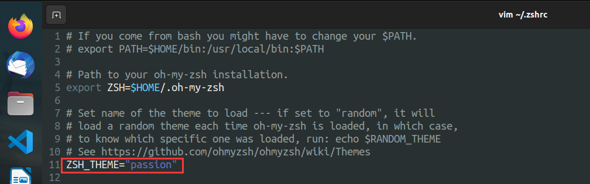
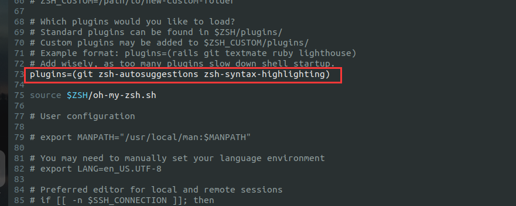
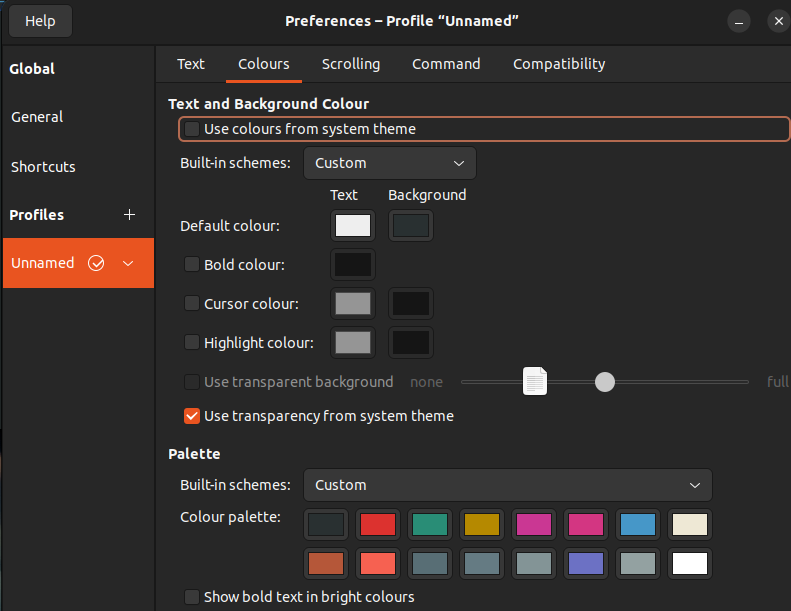

# Git

## 安装最新版Git

sudo add-apt-repository ppa:git-core/ppa 

sudo apt update

sudo apt install git


## Git 配置

sudo apt update																			列出所有可更新的软件清单命令

sudo apt upgrade						  												升级软件包

sudo apt install git     																	安装git

git config --global user.name "ze-ubuntu"								设置名称

git config --global user.email "1079903036@qq.com"			设置邮箱

git config --global --list																  查看配置信息

ssh-keygen -t rsa -C "1079903036@qq.com							 生成SSH秘钥

cd ~/.ssh																						  进入到ssh目录

vim id_rsa.pub																			   复制公钥内容

ssh -T git@git.oschina.net															测试是否可以连通

出现Permission denied (publickey)											表示测试成功

git clone git@github.com:Chenyz6/Ubuntu_Code.git			 看在哪个用户生成的SSH密钥，再决定是否加sudo

git status  																					   查看当前状态

git add .  																						 把内容全部添加到本地git缓存区中

git commit -m "提交内容介绍"  													推送修改到本地git库中

git push origin main																	  提交到远程仓库

git pull origin main																	    从远程仓库拉取


## Git回退上个版本

git reset --hard								

参数撤销工作区中所有未提交的修改内容，将暂存区与工作区都回到上一次版本，并删除之前的所有信息提交


#  Lazygit 配置

```
LAZYGIT_VERSION=$(curl -s "https://api.github.com/repos/jesseduffield/lazygit/releases/latest" | grep -Po '"tag_name": "v\K[^"]*')
curl -Lo lazygit.tar.gz "https://github.com/jesseduffield/lazygit/releases/latest/download/lazygit_${LAZYGIT_VERSION}_Linux_x86_64.tar.gz"

tar xf lazygit.tar.gz lazygit

sudo install lazygit /usr/local/bin
```


# Zsh配置

**第一步 → 把 oh-my-zsh 项目 Clone 下来：**

```bash
git clone https://github.com/robbyrussell/oh-my-zsh.git ~/.oh-my-zsh
```

**第二步 → 复制 .zshrc**

```bash
cp ~/.oh-my-zsh/templates/zshrc.zsh-template ~/.zshrc
```

**第三步 → 更改你的默认 Shell**

```bash
chsh -s /bin/zsh
```

**第四步 → 主题下载**

```bash
https://github.com/ohmyzsh/ohmyzsh/wiki/External-themes
```


**自动补齐**

git clone https://github.com/zsh-users/zsh-autosuggestions $ZSH_CUSTOM/plugins/zsh-autosuggestions

**高亮**

git clone https://github.com/zsh-users/zsh-syntax-highlighting.git $ZSH_CUSTOM/plugins/zsh-syntax-highlighting


安装插件

```bash
vim ~/.zshrc
```

执行文件

```bash
source ~/.zshrc
```








background:	#293031


#293031	#DC322F	#298D76	#B58900	#CA3793	#D33682	#4697C8	#EEE8D5


#B55739	#F66151	#586E75	#657B83	#839496	#6C71C4	#93A1A1	#FFFFFF


# PowerVim 配置

GitHub链接：[youngyangyang04/PowerVim: Make your vim more power and much easer. (github.com)](https://github.com/youngyangyang04/PowerVim)

1. git clone https://github.com/youngyangyang04/PowerVim.git

2. cd PowerVim

3. sh install.sh

直接执行 sh install.sh会报install.sh: 8: install.sh: Syntax error: "(" unexpected

4. sudo dpkg-reconfigure dash   					  	需将sh指向bash可正常运行脚本    选择no


执行完脚本后使用vim会报如下错误：
处理 /home/wsy/.vimrc 时发生错误:
第 42 行:
E197: 不能设定语言为 "zh_CN.gb2312"


ubuntu中文支持，及中文乱码问题

状况：所用的ubuntu系统不支持中文，遇见中文就????。ORZ…

目标：使系统/服务器支持中文，能够正常显示。

首先，安装中文支持包language-pack-zh-hans：

5. sudo apt-get install language-pack-zh-hans
   然后，修改/etc/environment（在文件的末尾追加）：

LANG="zh_CN.UTF-8"
LANGUAGE="zh_CN:zh:en_US:en"

6. 再修改/var/lib/locales/supported.d/local(没有这个文件就新建，同样在末尾追加)：

en_US.UTF-8 UTF-8
zh_CN.UTF-8 UTF-8
zh_CN.GBK GBK
zh_CN GB2312
最后，执行命令：

7. sudo locale-gen
   对于中文乱码是空格的情况，安装中文字体解决。

8. sudo apt-get install fonts-droid-fallback ttf-wqy-zenhei ttf-wqy-microhei fonts-arphic-ukai fonts-arphic-uming
   


