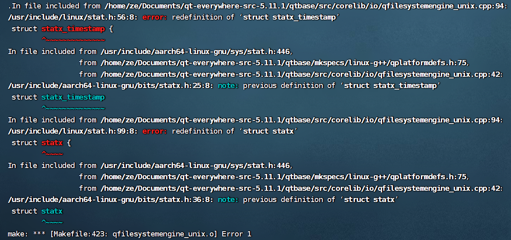
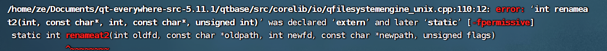
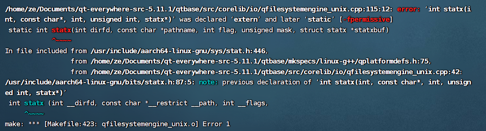

# aarch64-gcc7.3.0编译qt5.11.1源码

## ERROR1

 sudo vim  /home/ze/Documents/qt-everywhere-src-5.11.1/qtbase/src/corelib/io/qfilesystemengine_unix.cpp   

删除   #include <linux/stat.h>

## ERROR2

 sudo vim /home/ze/Documents/qt-everywhere-src-5.11.1/qtbase/src/corelib/io/qfilesystemengine_unix.cpp

删除 两个static

