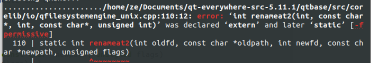
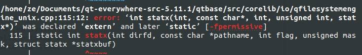
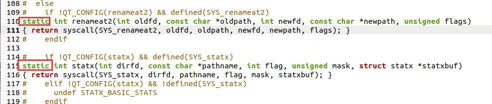
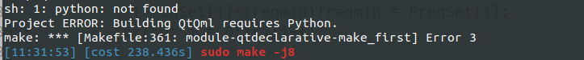
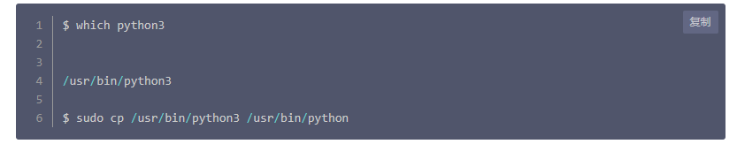

x86 Ubuntu下 aarch64-gcc7.3.1编译qt5.11.1源码

## error1 

qt-everywhere-src-5.11.3/qtbase/src/corelib/global/qrandom.cpp:455:62: error: no matching function for call to ‘std::mersenne_twister_engine

 解决方法：定位到qrandom.cpp 文件，文件编辑器打开后，在220行添加类型声明：typedef quint32 result_type;

## error2

qt-everywhere-src-5.11.3/qtbase/src/corelib/tools/qbytearraymatcher.h:103:38: error: ‘numeric_limits’ is not a member of ‘std’

 解决方法：因为qbytearraymatcher.h 文件缺少 limits头文件，所以打开此文件添加#include <limits>

执行命令：vim qbytearraymatcher.h

## error3

删除  111 和 115  行的static

## error4

