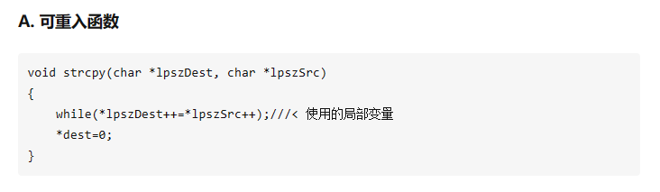
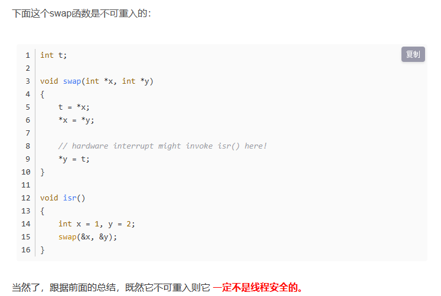
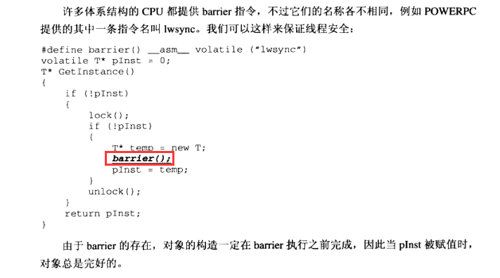
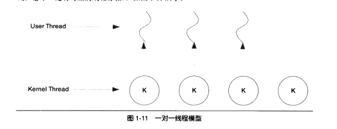
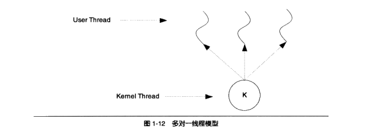
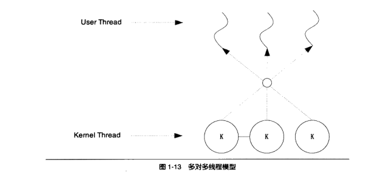
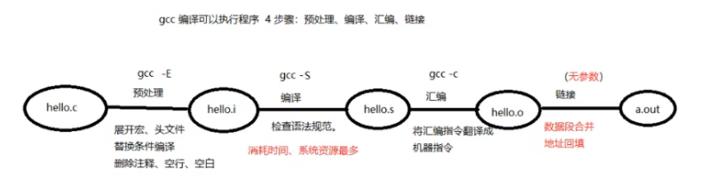
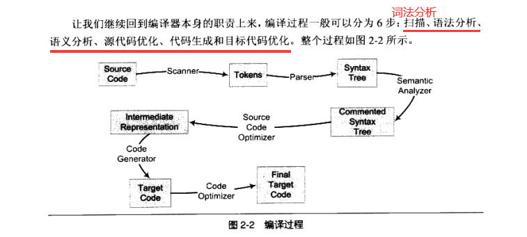

# 第一章

 ## 可重入（Reentrant）函数

**一个函数被称为可重入的，表明该函数被重入之后不会产生任何不良后果。**

重入一般可以理解为一个函数在同时多次调用，例如操作系统在进程调度过程中，或者单片机、处理器等的中断的时候会发生重入的现象。
可重入的函数必须满足以下三个条件：

（1）可以在执行的过程中可以被打断；

（2）被打断之后，在该函数一次调用执行完之前，可以再次被调用（或进入，reentered)。

（3）再次调用执行完之后，被打断的上次调用可以继续恢复执行，并正确执行。

可重入函数可以**在任意时刻被中断**，稍后再继续运行，不会丢失数据。

不可重入（non-reentrant）函数不能由超过一个任务所共享，除非能确保函数的互斥（或者使用信号量，或者在代码的关键部分禁用中断）。

**不可重入的函数**由于使用了一些系统资源，比如**全局变量区，中断向量表**等，所以它如果被中断的话，可能会出现问题，这类函数是不能运行在多任务环境下的。

满足下列条件的函数多数是不可重入的：

- 函数体内使用了静态（static）的数据结构；
- 函数体内调用了 malloc() 或者 free() 函数；
- 函数体内调用了标准 I/O 函数;

### **如何写出可重入的函数？**

- 在函数体内不访问那些全局变量；
- 如果必须访问全局变量，记住利用互斥信号量来保护全局变量。或者调用该函数前关中断，调用后再开中断；
- 不使用静态局部变量；
- 坚持只使用缺省态（auto）局部变量；
- 在和硬件发生交互的时候，切记关闭硬件中断。完成交互记得打开中断，在有些系列上，这叫做“进入/退出核心”或者用 OS_ENTER_KERNAL/OS_EXIT_KERNAL 来描述；
- 不能调用任何不可重入的函数；
- 谨慎使用堆栈。最好先在使用前先 OS_ENTER_KERNAL；

## 过度优化

对编译器的优化我们可以使用 compiler barrier，比如大家熟知的 "volatile"，就可以让编译器生成的代码，每次都从内存重新读取变量的值，而不是用寄存器中暂存的值。因为在多线程环境中，不会被当前线程修改的变量，可能会被其他的线程修改，从内存读才可靠。

### volatile关键字

**防止编译器过度优化**  

Volatile意思是“易变的”，应该解释为“**直接存取原始内存地址**”比较合适

**volatile提醒编译器它后面所定义的变量随时都有可能改变**，因此编译后的程序每次需要存储或读取这个变量的时候，告诉编译器对该变量不做优化，都会直接从变量内存地址中读取数据，从而可以提供对特殊地址的稳定访问。

如果没有volatile关键字，则编译器可能优化读取和存储，可能暂时使用寄存器中的值，如果这个变量由别的程序更新了的话，将出现不一致的现象。（简洁的说就是：volatile关键词影响编译器编译的结果，用volatile声明的变量表示该变量随时可能发生变化，与该变量有关的运算，不要进行编译优化，以免出错）

[C语言丨深入理解volatile关键字 - 知乎 (zhihu.com)](https://zhuanlan.zhihu.com/p/343688629)

### barrier指令  保证线程安全

一条barrier指令会阻止CPU将该指令之前的指令交换到barrier之后

barrier      障碍物，屏障；界线

## 线程模型

### 一对一模型

线程之间的并发是真正的并发，一个线程因为某原因阻塞时，其他线程执行不会受影响。

**缺点：**

由于许多操作系统限制了内核线程的数量，因此一对一线程会让用户的线程数量受到限制。

许多操作系统内核线程调度时，**上下文切换的开销较大**，导致用户线程的执行效率下降。

### 多对一模型

缺点：**一个用户线程阻塞，所有的线程都无法执行**。

**好处：**高效的上下文切换和几乎无限制的线程数量。

### 多对多模型

在多对多模型中，**一个用户线程阻塞并不会使得所有的用户线程阻塞**，因为此时还有别的线程可以被调度来执行。另外，多对多模型对用户线程的数量也没什么限制，在多处理器系统上。多对多模型的线程也能得到一定的性能提升，不过提升的幅度不如一对一模型高。

## 第二章 静态链接

### 构建

Visual Studio等，集成的IDE把便于和链接合并到一起的过程称为**构建**

### GCC编译四步骤

## 编译

gcc这个命令只是这些后台程序的包装，

它会根据不同的参数要求去调用预编译编译程序cc1、汇编器as、链接器ld。

### 编译器编译过程

