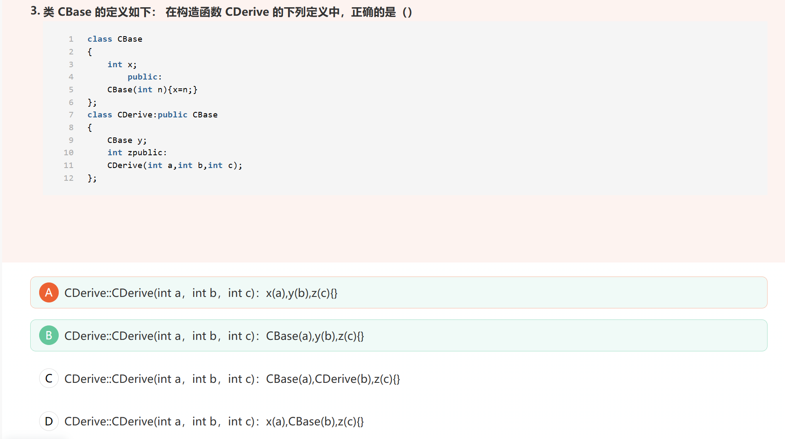

# 牛客C++专项练习


## sizeof和strlen

 数组的sizeof值等于数组所占用的内存字节数。
1）当字符数组表示字符串时，其sizeof值将’/0’计算进去。
2）当数组为形参时，其sizeof值相当于指针的sizeof值

strlen是遇到结束符则停止，所以 strlen出来的结果是不包含\0的


**sizeof**

**字符串*才*包含"\0"    所以多一个**

**数组就是正常的长度**


## ->和++ 优先级   <<  ^

成员选择符->优先级比前置++、后置++都要高。

<<的优先级高于^的优先级


## 继承派生方式


在哪种派生方式中，派生类可以访问基类中的protected成员（ ）

public和private
public和protected
protected和private
**public、protected、private均可**


## 括号表达式

括号表达式计算顺序是从左到右，然后整个表达式返回的是最右边表达式的值

已知int i=0, j=1, k=2;，则逻辑表达式      ++i||- -j&&++k   值为（1）


&&	 全真为真

||	   全假为假


## 静态局部变量

函数中的静态局部变量默认为0


## 容器分配到另一个容器

需要提前给目标容器分配空间

merge（）   和      transform（）     和    copy（）  和    set_intersection（）  和   set_union（）


## \ 不是完整的字符

‘\’不是字符

‘\xff’是十六进制表示的字符

'\O00'1到3位表示的八进制字符

NULL 本质是字符'\0'，ASCII码为0


## string函数assign（）

assign（） 在分配的时候 **必须是空的字符串** 要不然编译不通过

拼接字符串使用append（）


## 容器区别

1）只有set和map  有 查找find和统计count

2）只有set和map   erase可以删除值为多少的元素

3）对于随机访问的迭代器的容器，都可以利用sort算法直接对其进行排序      string     vector     deque


## 对组的创建

void test01()
{
	pair<string, int> p(string("Tom"), 20);
	cout << "姓名： " <<  p.first << " 年龄： " << p.second << endl;


​    pair<string, int> p2 = make_pair("Jerry", 10);
​    cout << "姓名： " << p2.first << " 年龄： " << p2.second << endl;

}


## 用new开辟的数组不要用sizeof

new开辟的时候已经知道大小了


## 函数重写 重载

链接：https://www.nowcoder.com/questionTerminal/2118aa97672a4575a661c1faef7142d4

**函数重载**(Overload) :

 同类同名不同参方法
 发生在同一个类中。
 方法名相同、参数列表不相同。
 **和返回值没有关系**。


 **函数重写**（Override）：

 在子类中和父类相同声明的方法
 发生在子父类中，必须有继承关系。
 返回值类型相同、方法名、参数列表相同。
 子父类中的方法一模一样。


## 指向函数指针定义方式

返回类型  (*指针名）  (函数参数列表)  ，例如 void （*p）（int）是指向一个返回值为void 参数为int类型的函数

**对于指向成员函数的指针略有不同：**

**普通成员变量：**返回类型 （类名::*指针名）=

**静态成员变量：**返回类型 （*指针名）=

需要注意，***初始化静态成员变量要在类外初始化，不能在声明时直接赋值**。*

并且，**调用静态成员变量的时候，不需要加对象名，直接\*指针，**

另外，**因为优先级的原因，调用成员函数指针的时候括号不能少**。


## erase（）特点

erase（）函数的特点就是删除当前的元素，并自动指向下一个元素。


## 实例化对象

若一个类没有默认构造函数，那么我们在实例化该类对象时就需要传参对其进行初始化，所以实例化没有默认构造函数的类对象时必须使用初始化列表对其进行初始化。


## Map容器可以通过[键值]  直接来查找实值

#include <map>
map<char, int> symbolValues = {
	{ 'I', 1 },
	{ 'V', 5 },
	{ 'X', 10 },
	{ 'L', 50 },
	{ 'C', 100 },
	{ 'D', 500 },
	{ 'M', 1000 },
};

int main()
{
	int value = symbolValues['M'];
	cout << value << endl;
	system("pause");
	return 0;
}


## 二维数组问题

`#include <stdio.h>
int main() { 
    int  intArray[] = {1, 2, 3, 4, 5}; 
    int  *p = (int *)(&intArray+1); 
    printf("%d,%d",*(intArray+1),*(p-1)); 
    return 0; 
}`


int  *p = (int *)(&intArray+1);
intArray：是数组的首地址，
&intArray：就是存放这个数组首地址的地址,可用int (*)[5]的指针保存，
&intArray+1：相当于int (*)[5]这个指针的指针偏移，偏移量是指向元素的大小*1，（比如double *p，p+1的偏移量就是一个double的大小*1）
(int *)(&intArray+1)：相当于把偏移后的地址（也是一个int[5]）强转给p保存；
可得p指的是数组intArray结尾的下个地址，用二维数组理解的话就是intArray是第一个int[5]，即int[0][5]，p指向的是int[1][5]

*(p-1)就是intArray[5]向前一位即intArray[4]的值


## volatile关键字

volatile三个特性：**易变性；不可优化性；顺序性**。

A易变性：不从寄存器读取，而直接读取内存

B不可优化性：告诉编译器不要对volatile变量进行优化

C，D都涉及顺序性，volatile只保证编译器不对volatile变量之间的顺序进行改变

如果一个基本变量被volatile修饰，编译器将不会把它保存到寄存器中，而是每一次都去访问内存中实际保存该变量的位置上 

优化器在用到volatile变量时必须每次都小心地重新读取这个变量的值，而不是使用保存在寄存器里的备份


## 友元函数

友元函数是可以直接访问类的私有成员的非成员函数。它是**定义在类外的普通函数**，它不属于任何类，但需要在类的**定义**中加以声明，声明时只需在友元的名称前加上关键字friend


**友元函数是独立于当前类的外部函数**

一个友元函数可以同时定义为两个类的友元函数，友元函数既可以在类的内部，也可以在类的外部定义

在外部定义友元函数时，不必加关键字friend


## malloc/free和new/delete的本质区别

1.malloc/free 是C/C++语言的标准库函数，new/delete是C++的运算符

**2.new 能自动分配空间大小**

3.对于用户自定义的对象而言，用malloc/free**无法满足动态管理对象**的要求，对象在创建的时候会自动调用构造函数，对象在消亡之前自动执行析构函数由于malloc/free是库函数而不是运算符，不在编译器的控制范围，不能把构造函数和析构函数的任务强加于malloc/free 。一次C++需要一个能够对对象完成动态分配内存和初始化工作的运算符new，以及一个释放内存的运算符 delete。简单来说就是new/delete能完成跟家详细的对内存的操作，而malloc/ free不能。

**new返回的是所分配类型对象的指针，malloc返回的是void***


## 内联函数

函数调用在执行时，首先要在栈中为形参和局部变量分配存储空间，然后还要将实参的值复制给形参，接下来还要将函数的返回地址（该地址指明了函数执行结束后，程序应该回到哪里继续执行）放入栈中，最后才跳转到函数内部执行。这个过程是要耗费时间的。

另外，函数执行 return 语句返回时，需要从栈中回收形参和局部变量占用的存储空间，然后从栈中取出返回地址，再跳转到该地址继续执行，这个过程也要耗费时间。

总之，使用函数调用语句和直接把函数中的代码重新抄写一遍相比，节省了人力，但是带来了程序运行时间上的额外开销。

**内联函数和普通函数的区别在于：当编译器处理调用内联函数的语句时，不会将该语句编译成函数调用的指令，而是直接将整个函数体的代码插人调用语句处，就像整个函数体在调用处被重写了一遍一样。**

有了内联函数，就能像调用一个函数那样方便地重复使用一段代码，而不需要付出执行函数调用的额外开销。很显然，使用内联函数会使最终可执行程序的体积增加。以时间换取空间，或增加空间消耗来节省时间，这是计算机学科中常用的方法。

内联函数中的代码应该只是很简单、执行很快的几条语句。如果一个函数较为复杂，它执行的时间可能上万倍于函数调用的额外开销，那么将其作为内联函数处理的结果是付出让代码体积增加不少的代价，却只使速度提高了万分之一，这显然是不划算的。


## 虚析构和纯虚析构

多态使用时，如果子类中有属性开辟到堆区，那么***父类指针在释放时无法调用到子类的析构代码***

***父类指针在析构的时候 不会调用子类中析构函数 导致子类如果有堆区属性，出现内存泄露***

解决方式：将父类中的析构函数改为**虚析构**或者**纯虚析构**


虚析构和纯虚析构共性：

* 可以解决父类指针释放子类对象
* 都需要有具体的函数实现

虚析构和纯虚析构区别：

* 如果是纯**虚析构**，该类属于抽象类，**无法实例化对象**


虚析构语法：

`virtual ~类名(){}`

***纯虚析构语法：***

***` virtual ~类名() = 0;`***

***`类名::~类名(){}`    必须要有实现***

**如果有了纯虚析构之后，这个类也属于抽象类，无法实例化对象


**纯虚析构函数必须要有实现！！！！！！！！！！！！**


总结：

​	1. 虚析构或纯虚析构就是用来解决通过父类指针释放子类对象

​	2. 如果子类中没有堆区数据，可以不写为虚析构或纯虚析构

​	3. ***拥有纯虚析构函数的类也属于抽象类  这个类无法实例化对象***


## 纯虚函数和抽象类

在多态中，通常父类中虚函数的实现是毫无意义的，主要都是调用子类重写的内容


因此可以将虚函数改为**纯虚函数**


纯虚函数语法：`virtual 返回值类型 函数名 （参数列表）= 0 ;`


***当类中有了纯虚函数，这个类也称为==抽象类==***


**抽象类特点**：

 * 无法实例化对象

 * 子类必须重写抽象类中的纯虚函数，否则也属于抽象类

   

***抽象类特点：***

***抽象类无法实例化对象***

***子类必须重写父类中的纯虚函数，否则也属于抽象类


## 函数重写

函数返回值类型

函数名

参数列表   都相同


## extern


extern "C"指令中的C，表示的一种编译和连接规约，而不是一种语言。C表示符合C语言的编译和连接规约的任何语言，如Fortran、assembler等


## 多态原理-虚函数


## 函数重新定义 重载

函数不能重新定义，只能重载，除非换作用域（那也不能叫重新定义）；

函数可以被重载而不能重新定义，重载后函数具有不同的形参，原有定义并不失效；


## lambda 表达式

lambda 表达式定义了一个匿名函数，并且可以捕获一定范围内的变量。lambda 表达式的语法形式可简单归纳如下：

[ capture ] ( params ) opt -> ret { body; };

其中 capture 是捕获列表，params 是参数表，opt 是函数选项，ret 是返回值类型，body是函数体。

因此，一个完整的 lambda 表达式看起来像这样：

```
auto f = [](int a) -> int { return a + 1; };std::cout << f(1) << std::endl;  // 输出: 2
```

可以看到，上面通过一行代码定义了一个小小的功能闭包，用来将输入加 1 并返回。

在 C++11 中，lambda 表达式的返回值是通过前面介绍的《[C++返回值类型后置](http://c.biancheng.net/view/3727.html)》语法来定义的。其实很多时候，lambda 表达式的返回值是非常明显的，比如这个例子。因此，C++11 中允许省略 lambda 表达式的返回值定义：

auto f = [](int a){ return a + 1; };

这样编译器就会根据 return 语句自动推导出返回值类型。

需要注意的是，初始化列表不能用于返回值的自动推导：

auto x1 = [](int i){ return i; }; // OK: return type is int
auto x2 = [](){ return { 1, 2 }; }; // error: 无法推导出返回值类型

这时我们需要显式给出具体的返回值类型。

另外，lambda 表达式在没有参数列表时，参数列表是可以省略的。因此像下面的写法都是正确的：

auto f1 = [](){ return 1; };
auto f2 = []{ return 1; }; // 省略空参数表


使用 lambda 表达式捕获列表

lambda 表达式还可以通过捕获列表捕获一定范围内的变量：

- [] 不捕获任何变量。
- [&] 捕获外部作用域中所有变量，并作为引用在函数体中使用（按引用捕获）。
- [=] 捕获外部作用域中所有变量，并作为副本在函数体中使用（按值捕获）。
- [=，&foo] 按值捕获外部作用域中所有变量，并按引用捕获 foo 变量。
- [bar] 按值捕获 bar 变量，同时不捕获其他变量。
- [this] 捕获当前类中的 this [指针](http://c.biancheng.net/c/80/)，让 lambda 表达式拥有和当前类成员函数同样的访问权限。如果已经使用了 & 或者 =，就默认添加此选项。捕获 this 的目的是可以在 lamda 中使用当前类的成员函数和成员变量。


## throw（抛出异常）


## 回调函数

回调函数就是一个通过函数指针调用的函数。
如果你把函数的指针（地址）作为参数传递给另一个函数，当这个指针被用来调用其所指向的函数时，我们就说这是回调函数。
回调函数不是由该函数的实现方法直接调用，而是在特定的事件或条件发生时由另外的一方调用的，用于对该事件或条件进行响应。


this指针

核心就是类成员函数需要this指针访问函数，而全局或者静态函数不需要this指针。
简言之，类的成员函数需要隐含的this指针 而回调函数没有办法提供。


## 数组的定义


## 虚函数

链接：https://www.nowcoder.com/questionTerminal/06198cda7311404698a6d10d3dabbdf2
来源：牛客网


以关键字virtual的成员函数称为虚函数，主要是用于运行时多态，也就是动态绑定。 

  虚函数必须是类的成员函数，不能使友元函数、也不能是构造函数【原因：因为建立一个派生类对象时，必须从类层次的根开始，沿着继承路径逐个调用基类的构造函数，直到自己的构造函数，不能选择性的调用构造函数】 

  不能将虚函数说明为全局函数，也不能说明为static静态成员函数。因为虚函数的动态绑定必须在类的层次依靠this指针实现。 

  再添加一点： 

  虚函数的重载特性：一个派生类中定义基类的虚函数是函数重载的一种特殊形式。 

  重载一般的函数：函数的返回类型和参数的个数、类型可以不同，仅要求函数名相同； 

  而重载虚函数：要求函数名、返回类型、参数个数、参数类型和顺序都完全相同。 

  

  纯虚函数：是在基类中说明的虚函数，它在基类中没有是在定义，要求所有派生类都必须定义自己的版本。 

  纯虚函数的定义形式：virtual 类型  函数名(参数表)=0，该函数赋值为0，表示没有实现定义。在基类中定义为0，在派生类中实现各自的版本。 

  

  纯虚函数与抽象类的关系： 

  抽象类中至少有一个纯虚函数。 

  如果抽象类中的派生类没有为基类的纯虚函数定义实现版本，那么它仍然是抽象类，相反，定义了纯虚函数的实现版本的派生类称为具体类。 

  抽象类在C++中有以下特点： 

1. ​    抽象类只能作为其他类的基类；    
2. ​    抽象类不能建立对象；    
3. ​    抽象类不能用作参数类型、参数返回类型或显示类型转换。


## 条件运算符优先级  大于  赋值运算符


##  复试题


## 迭代器失效

vector是顺序储存，器插入元素后会使后面的元素向后移，所以会使指向后面的元素迭代器失效

map不是顺序存储插入删除元素不会引起其他元素的位置移动，所以只有删除元素时对指向删除元素的迭代器有影响


##   \ " 

\ " 代表一个双引号"符号

"\ "%s\ "\n" 输出 "s[6]"换行。


## “烫” “屯”

微软的 VC 编译器会将未初始化的栈空间以 16 进制的 0xCC 填充，而未初始化的堆空间使用 0xCD 填充，而 0xCCCC 和 0xCDCD 在中文的 GB2312 编码中刚好对应“烫”和“屯”字。

对于栈中内存如果没有初始化，则会出现“烫烫烫烫烫烫”。

对于堆中内存如果没有初始化，则会出现“屯屯屯屯屯”


## 内存泄露！！！


**1.main函数里的s没有初始化就在fun函数里使用s，编译器会报警告，运行时会报错（局部变量未初始化）。答案选D。** 

**2.就算s初始化了，在fun函数里，局部变量t的大小为7，而strcpy函数会复制example末尾的\0 ，所以example+'\0'一共8个字节空间，会溢出，程序会崩溃。** 

**3.就算局部变量t的大小足够大，在fun函数运行结束后，局部变量t的内存空间会被释放掉，此时s成为野指针；返回main函数后，也不会输出example。**


## 类占用内存空间

链接：https://www.nowcoder.com/questionTerminal/217a3f28fb3c410fa9e7aaafebe7e468
来源：牛客网

**A. 类所占大小由虚函数、所有非静态数据成员大小、对其所占字节数决定。 A错误** 

B. 空类大小为一个字节。B正确 

C. 无论基类还是派生类都会共用一个虚函数表，只会占用一个虚表指针大小。C正确 

D. 派生对象的大小才为基类存储空间+派生类特有的**非static数据**成员的空间，D选项共有几点错误：1.派生对象才为两个相加；2.派生类必须为**非static数据。**


## strcpy

链接：https://www.nowcoder.com/questionTerminal/52f4ddcb0b7a4325983d5b5828659335


执行strcpy(ccString1,"No"); ，ccString1变为"No\0Page Fault??"，

会将字符串的结束符'\0'放入，所以比较时返回false，

执行cout << ccString1; 输出时遇到结束符'\0'就结束，只输出“NO”


strcmp**若前大于后，则返回大于零的数；否则，则返回小于零的数**


## 数组声明


## 解释型编译型语言

**编译型语言：**

C/C++  

GO语言 

**解释型语言：**

JAVA

JAVAScript

C#

python


## 创建对象


A       Qiniuome a();是函数声明.      Qiniuome b(2)和 Qiniuome c[3]创建总共4个;      Qiniuome &ra = b和 Qiniuome *pA = c是指针和引用,不会创建对象       Qiniuome *p = new Qiniuome (4);会创建一个


## cin是istream的类对象 


cin表示标准输入的istream对象

istream的常见成员函数有：**istream::getline() 函数，** **istream::ignore() 函数，** **istream::get() 函数等**


## const` `int` `* ``const` `p = &x;


链接：https://www.nowcoder.com/questionTerminal/d254c8b7d83b40869fb1deac913e2581
来源：牛客网

答案:ABD
A. `const int * const p = &x;`中指针p及p指向的int类型数据都被const修饰，即`*p`与`p`都为const属性无法修改

- 编译器报错`error: assignment of read-only location ‘*(const int*)p’ *p = 1;`
- 故`* p =1;`语法错误

B. `const int &q=x;`是指向常量的引用，使用时必须初始化，而且初始化后，引用值不可以改变,引用的常量也不能改变

- 注意 只是修饰引用`q`,`x`不受影响
- 编译器报错`error: increment of read-only reference ‘q’ q++;`
- 故`q++;`语法错误

C. `int const *next=&x;`中`const`修饰整型数 int即`*next`

- 注意 同样只是修饰`*next`,`x`仍然是变量
- 指针变量`next`没有被const修饰因此可以被`next++`改变,语法正确

D. `const int *j=&x;`中`const int *`同`int const *`const修饰`*j`

- 编译器报错`error: increment of read-only location ‘* j’ (*j)++;`
- `(*j)`为const属性无法修改,故语法错误


## return返回值

return只能返回一个值


## 循环队列


## 字符数组问题


答案解析：n = strlen(x)，此时n=4，因为x指向y数组，所以x[4]就是y[4]='\0',那么*x=x[n]就是把x指向的字符串首元素改为'\0'，x++之后x指向第二个字符t，所以第一个输出x=tse，而y遇到第一个字符就是'\0'，所以结束，y输出为空


## 字节对齐

`class A{
  virtual void func(){
      cout<<"func"<<endl;
  }  
    
  float f;
  char p;
  int adf[3];
};`

链接：https://www.nowcoder.com/questionTerminal/2c718d2394714c169d84b1933d0d4b4d?
来源：牛客网

假设是在32bit系统下，指针大小为4字节。 

  类A中存在虚函数，因此在对象的内存空间中，首先有1个指针指向虚函数表（VTABLE），指针占4字节； 

  float f;占4字节； 

  char p;占1字节，但是由于内存对齐，下一个变量相对于对象起始位置的偏移量得是4的整数倍，所以补3个字节； 

  int adf[3];占3*sizeof(int)=12个字节。 

  一共占24个字节。


## 创建对象构造和析构


成员 n 是类 cla 的静态成员，静态成员默认初始化为0。new cla对象时会调用构造函数，n 变成1。delete 时调用析构函数，n 变成0。因此调用 get_n 后输出0。


## 多线程 原子操作


## 指针数组 数组指针


**例：int (*p)[10]; p即为指向数组的指针，又称数组指针。**


## 结构体变量


`链接：https://www.nowcoder.com/questionTerminal/0287f97708464f6ca2a42f759ca64145?
来源：牛客网

```
struct color c1
{    int red;
    int green;
    int blue;
};
（color c1）  为结构体名，c1只是名称的一部分，并非结构体变量名。
```

`


## 字符串函数


## 内联函数注意事项 incline

链接：https://www.nowcoder.com/questionTerminal/cc0b107d247a4090bd232a6caad784be?
来源：牛客网

使用内联函数的时候要注意： 

1. 递归函数不能定义为内联函数  
2. 内联函数一般适合于不存在while和switch等复杂的结构且只有1~5条语句的小函数上，否则编译系统将该函数视为普通函数。 
3. 内联函数只能先定义后使用，否则编译系统也会把它认为是普通函数。  
4. 对内联函数不能进行异常的接口声明。


## C++中空类编译器产生4个成员函数

默认的无参构造函数

默认的析构函数

默认的拷贝构造函数

默认赋值函数


## 宏定义


链接：https://www.nowcoder.com/questionTerminal/761efe02600847a9b260f1001a541ce6?
来源：牛客网


\##是一种分隔连接方式，它的作用是**先分隔，然后进行强制连接**   

  “name”和第一个“”之间被分隔了，所以预处理器会把name## _ ##type##type解释成4段：“**name**”、“”、“**type**”以及“**_type**”，name和type会被替换，而_type不会被替换


## setw()   #include<iomanip.h>


## 类成员默认是private 继承默认也是private

struct 成员默认是public 继承默认也是public


## calloc


## 字符串赋值给数组  ×

char *str; str = "Hello";**是合法的，**

char str[]; str = "Hello";**是非法的，数组名是常量，无法赋值**


## 内存分配


链接：https://www.nowcoder.com/questionTerminal/9e9e1e149c3b4801b56b6d6a6a2fc8bb?
来源：牛客网

对于栈来讲，是由编译器自动管理，无需我们手工控制；对于堆来说，释放工作由程序员控制

**对于栈来讲，生长方向是向下的，也就是向着内存地址减小的方向；对于堆来讲，它的生长方向是向上的，是向着内存地址增加的方向增长。**

对于堆来讲，频繁的 new/delete 势必会造成内存空间的不连续，从而造成大量的碎片，使程序效率降低。对于栈来讲，则不会存在这个问题


## 构造函数

当定义了带参数的构造方法，系统默认的不带参数的构造方法就**不存在**了


## DWORD


## puts putchar


链接：https://www.nowcoder.com/questionTerminal/70fc291ff7444e67a04e2ebe73176e0b?
来源：牛客网

**putchar只能输出单个字符，puts参数只能传一个**

printf("格式控制字符串"， 输出列表)；     如：printf("%s", string); 

putchar（字符数据）；  如：char   a_c=‘h’；putchar（a_c）； 

puts（字符串）；       如：puts（“hello girl”）；


## 字符数组赋值


## 运算符重载

链接：https://www.nowcoder.com/questionTerminal/f9929869e23e4e2e8e6631627fba31af?
来源：牛客网


除了**类属关系运算符"."**、**成员指针运算符".\*"**、**作用域运算符"::"**、**sizeof运算符**和**三目运算符"?:"**以外，C++中的所有运算符都可以重载 

但是=、()、[]、->这四个不能重载为类的友元函数。


凡是带  . 点 的都不能重载，还有一个例外，sizeof


## final

final用来修饰类，让该类不能被继承，理解：使得该类终结！
final用来修饰类的虚函数，使得该虚函数在子类中，不能被重写，理解：使得该功能终结！


## override


## 宏定义


替换为：sum = m+n+m+n*k = 10


## Struct 和 Class 区别
在C++中，来自class的继承默认按照private继承处理，来自struct的继承默认按照public继承处理
class的成员默认是private权限，struct默认是public权限
c里面的struct是变量的聚合体，struct可以有函数
c++的struct可有构造和析构函数


## ％x是以16进制输出 


## 变量在内存存放的地点

```cpp
#include<iostream>
using namespace std;
int main(void)
{
    char str1[] = "hello world";   //存放在栈中的数组
    char str2[] = "hello world";   //存放在栈中的数组

    const char str3[] = "hello world";  //存放在栈中的字符串常量
    const char str4[] = "hello world";  //存放在栈中的字符串常量

    const char* pstring1 = "hello world";   //本身在栈中，指向常量的指针
    const char* pstring2 = "hello world";   //本身在栈中，指向常量的指针     //显然二者所指向的地址一致
}

```
链接：https://www.nowcoder.com/questionTerminal/90002c0cacd94010bda7a22d64faf22d?
来源：牛客网

char *str和char str[]的区别：
char *str = "hello"; //str指向字符串常量"hello"的首地址,str存放在栈上，"hello"保存在文字常量区。通过指针**只能访问字符串常量，不可以改变它**
char str[] = "hello"; //数组名str也是指向字符串的首地址，str，"hello"都存放在栈上。可以通过指针去访问和修改数组内容

一个由C/C++编译的程序占用的内存分为以下几个部分
 1、栈区（stack）— 由编译器自动分配释放 ，存放函数的参数值，局部变量的值等。其操作方式类似于数据结构中的栈。
 2、堆区（heap） — 一般由程序员分配释放， 若程序员不释放，程序结束时可能由OS回收 。注意它与数据结构中的堆是两回事，分    配方式倒是类似于链表，呵呵。
 3、全局区（静态区）（static）—，全局变量和静态变量的存储是放在一块的，初始化的全局变量和静态变量在一块区域， 未初始化的全局变量和未初始化的静态变量在相邻的另一块区域。 - 程序结束后有系统释放
 4、文字常量区 —常量字符串就是放在这里的。 程序结束后由系统释放
 5、程序代码区—存放函数体的二进制代码。


## 对象的创建
链接：https://www.nowcoder.com/questionTerminal/0dc754158944469b959135ea3e1fdeb0
来源：牛客网

CSomething a()；// 没有创建对象，这里不是使用默认构造函数，而是定义了一个函数，在C++ Primer393页中有说明。
CSomething b(2);//使用一个参数的构造函数，创建了一个对象。
CSomething c[3];//使用无参构造函数，创建了3个对象。
CSomething &ra=b;//ra引用b，没有创建新对象。
CSomething d=b;//使用拷贝构造函数，创建了一个新的对象d。
CSomething *pA = c;//创建指针，指向对象c，没有构造新对象。
CSomething *p = new CSomething(4);//新建一个对象。


## strcat()


## fork()

链接：https://www.nowcoder.com/questionTerminal/600f852eeff142199d64a9ee3e6cd1e0?
来源：牛客网

每一个fork()出来的新进程，和父进程使用相同的代码段，复制父进程的数据段和堆栈段，不过有“逻辑”复制和“物理”复制之分，在本题没有影响。也就是说每一个fork()出的新进程和父进程有相同大小的i，并且执行位置也是一样的

    一个进程，包括代码、数据和分配给进程的资源。fork（）函数通过系统调用创建一个与原来进程几乎完全相同的进程，也就是两个进程可以做完全相同的事，但如果初始参数或者传入的变量不同，两个进程也可以做不同的事。
    一个进程调用fork（）函数后，系统先给新的进程分配资源，例如存储数据和代码的空间。然后把原来的进程的所有值都复制到新的新进程中，只有少数值与原来的进程的值不同。相当于克隆了一个自己。
————————————————
版权声明：本文为CSDN博主「jason314」的原创文章，遵循CC 4.0 BY-SA版权协议，转载请附上原文出处链接及本声明。
原文链接：https://blog.csdn.net/jason314/article/details/5640969


## argc argv


## 运算顺序

先进行四则运算，然后移位运算，最后位运算 


## 绝不重新定义继承而来的缺省参数值


## switch语句后的控制表达式

switch语句后的控制表达式只能是short、char、int、long整数类型和枚举类型，

不能是float，double和boolean类型


## else总是与它最上面的最近的if匹配    ×


## 构造函数不能为const函数

const函数不改变成员变量，而构造函数意义在于初始化


## 赋值运算符是从右往左计算的

赋值运算符是从右往左计算的，返回值即等号左边对象的引用。

简单赋值的优先级是低于加法优先级的

 所以a=b=c计算顺序是(a=(b=c))，(b=c)运算结果为b的引用，而b已经被赋值为c，所以后面a的值等于c。 

**a=b+c=3的计算顺序为(a=(b+c=3))，b+c的运算结果是一个右值，不能被赋值为3** 。


## 构造函数的创建



A 选项由于 x 在 基类 CBase 类中是私有的，所以派生类 CDerive 中无法直接访问。
B 选项正确。
C 选项调用了构造函数 CDerive(b)，而 CDerive 类中没有一个参数的构造函数。
D 选项问题同 A 选项。


## 类型安全

类型安全就是说，如果两个类型直接要相互转换，必须要显示的转换，不能偷偷摸摸的只用一个等于号就隐式转换了 

MFC 中 CString 是类型安全的类


## malloc calloc realloc new


## C++17 vector      ------（） {} 区分

链接：https://www.nowcoder.com/questionTerminal/65e8edcb3cce4911b374500246d91d97?#jsEditorModuleBody
来源：牛客网


对于本题目，我认为考察得是对于()和{}的区分，vector本质上还是数组，

{}所框起来的是数据内容，是可以赋值给vector的，想想数组的初始化是不是经常采用这种方式呢

()则是对于数据的结构进行限定，这是vector特有的。所以()是不能对vector来进行赋值的。


## 类对象的创建


链接：https://www.nowcoder.com/questionTerminal/7f4edb9f75134da4b1958613d1b93bd1?#jsEditorModuleBody
来源：牛客网

程序运行结果为DDDDD说明调用了5次析构函数，所以需要创建5个对象，D* p=new D[2]创建了两个对象D，那么对象数据 D d[]需要创建3个对象D因此排除 选项C，选项的D的初始化方式错误、A、B是对象数组的两种初始化方式，正确


## 构造函数可以重载


## 迭代器


迭代器可以看成一个指针，指针有==，判断是否相等，指针有取值*,指针有自加++,指针没有左移  


## 对类内成员初始化


## char类型范围   -128~127


其实这道题想要考察的是char型的表示范围：-128~127。num永远都到不了255。 

但是题中num的初值设为0，怎么自加都是0，题目变得更简单了。如果初值num=1，这道题还是死循环。 


## 64位字节对齐


字节对齐的三个准则：

1结构体变量的首地址能够被其最宽基本类型成员的大小所整除；

2 结构体每个成员相对于结构体首地址的偏移量都是成员大小的整数倍，如有需要编译器会在成员之间加上填充字节；

3结构体的总大小为结构体最宽基本类型成员大小的整数倍，如有需要编译器会在最末一个成员之后加上填充字节。 

再来看这道题： 

a占一个字节（注：地址为[0]）， 补齐之后占8个字节

d作为64位指针占8个字节（注1：32位占四个字节，p也一样）（注2：根据上面的准则2，d的偏移量要为8的整数倍，所以d的地址为[8]-[15]，而非[1]-[8]，下同），

b占了4个字节（注：地址为[16][19]），

c指定为16为，占了两个字节（注：地址为[20,21]）,

e占8个字节，（同d的分析一样，e的地址应该为[24][31]），

所以A的答案应该是8，B的答案是32，C正确，D的答案为8。


## 递增运算符重载 前置++和后置++


（int）  使用占位符来实现函数重载


## 类的初始化

A：静态函数属于类本身，不与类绑定，因此不能用this指针。A选项正确。 

B：在类定义时，无法使用构造函数，因而无法完成对象的初始化

C：一般成员变量需要在类内进行初始化 

D：静态成员变量必须在类外初始化，静态成员常量在类中初始化。D选项正确。


## 不能声明为虚函数

 1、静态成员函数；2、类外的普通函数；3、构造函数；4、友元函数

